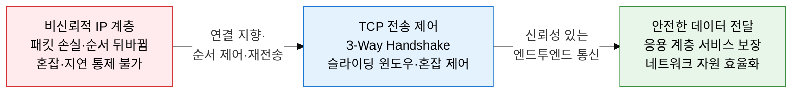
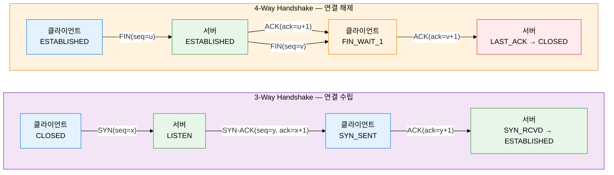
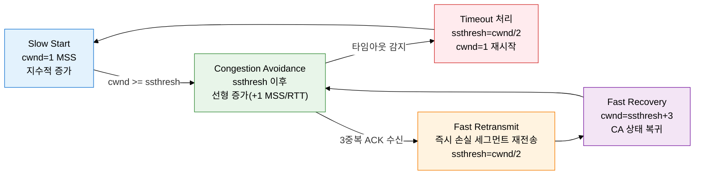

**Transport Layer — Transmission Control Protocol / User Datagram Protocol**

## 1. 엔드투엔드 신뢰성 보장의 핵심 전송 프로토콜, TCP/UDP의 개요

**정의**: TCP는 연결 지향·순서 보장·오류 제어·흐름 제어·혼잡 제어 메커니즘으로 신뢰성 있는 엔드투엔드 데이터 전달을 보장하는 L4 전송 프로토콜이다.
- TCP(Transmission Control Protocol)는 IP 계층의 비신뢰성을 보완하여 데이터 무결성 및 순서 일관성을 제공한다.
- UDP(User Datagram Protocol)는 연결 설정 없이 낮은 오버헤드로 빠른 전송이 필요한 실시간 서비스에 적합하다.
- 두 프로토콜은 포트 번호를 통해 동일 호스트 내 다중 응용 프로세스를 식별하는 멀티플렉싱을 지원한다.

**특징**:
- **연결 지향성**: TCP는 데이터 전송 전 3-Way Handshake를 통해 논리적 연결을 수립하고, 종료 시 4-Way Handshake로 안전하게 연결을 해제한다.
- **신뢰성 제어**: 시퀀스 번호와 ACK 번호로 패킷 순서를 관리하고, 타임아웃 및 중복 ACK 기반 재전송으로 손실된 데이터를 복구한다.
- **혼잡 제어**: Slow Start, Congestion Avoidance, Fast Retransmit, Fast Recovery 4단계로 네트워크 혼잡을 감지하고 전송률을 동적으로 조절한다.

---

## 2. TCP/UDP의 핵심 구성 체계

### 가. TCP vs UDP 비교 및 연결 수립·해제 절차

| 구분 | TCP | UDP |
|---|---|---|
| **연결 방식** | 연결 지향(Connection-Oriented) | 비연결(Connectionless) |
| **신뢰성** | 순서 보장·재전송·오류 복구 | 비보장 — 손실 허용 |
| **순서 보장** | 시퀀스 번호로 순서 재조립 | 미보장 |
| **흐름 제어** | 슬라이딩 윈도우(rwnd 기반) | 없음 |
| **혼잡 제어** | Slow Start·CA·Fast Retransmit | 없음 |
| **헤더 크기** | 20~60 Byte | 8 Byte 고정 |
| **주요 활용** | HTTP, FTP, SMTP, SSH | DNS(UDP 53), VoIP, 스트리밍, DHCP |

| TCP 헤더 필드 | 크기 | 역할 |
|---|---|---|
| **소스/목적지 포트** | 각 16 bit | 응용 프로세스 식별(멀티플렉싱) |
| **시퀀스 번호** | 32 bit | 송신 데이터 바이트 오프셋 지정, 순서 관리 |
| **ACK 번호** | 32 bit | 다음에 받을 바이트 번호 — 누적 확인 응답 |
| **윈도우 크기** | 16 bit | 수신 버퍼 여유 공간(rwnd) — 흐름 제어 기반 |
| **플래그(6bit)** | 각 1 bit | SYN·ACK·FIN·RST·PSH·URG 제어 비트 |
| **체크섬** | 16 bit | 헤더+데이터 오류 검출(의사 헤더 포함) |

TCP 상태 전이 순서: `CLOSED → LISTEN → SYN_SENT → SYN_RCVD → ESTABLISHED → FIN_WAIT_1 → FIN_WAIT_2 → TIME_WAIT(2MSL 대기) → CLOSED`. TIME_WAIT 상태는 지연 도착 패킷 처리와 중복 연결 방지를 위해 2×MSL(Maximum Segment Lifetime) 동안 유지된다.

---

### 나. TCP 흐름 제어·혼잡 제어 메커니즘

흐름 제어(Flow Control)는 수신측이 광고하는 rwnd(Receive Window) 값을 기준으로 송신측이 전송 속도를 조절하는 메커니즘이다. 슬라이딩 윈도우는 ACK 수신 시 윈도우를 앞으로 이동시켜 파이프라인 방식의 연속 전송을 가능하게 한다. 실제 전송 가능한 데이터 크기는 `min(cwnd, rwnd)`로 결정된다.

**Nagle 알고리즘**은 작은 데이터 세그먼트를 모아 하나의 큰 세그먼트로 전송하여 네트워크 효율을 높이는 방식으로, 인터랙티브 응용(SSH, 게임)에서는 `TCP_NODELAY` 옵션으로 비활성화한다. **Silly Window Syndrome**은 수신 버퍼가 부족한 상태에서 1~2 바이트 단위로 ACK를 반복 전송하는 비효율 현상으로, Clark 알고리즘(수신측)과 Nagle 알고리즘(송신측)으로 방지한다.

| 혼잡 제어 단계 | 트리거 조건 | cwnd 변화 | ssthresh 조정 | 다음 전환 상태 |
|---|---|---|---|---|
| **Slow Start** | 연결 시작 또는 타임아웃 후 재시작 | 1 MSS → 매 ACK마다 2배 증가(지수) | 변경 없음 | cwnd=ssthresh 도달 시 CA 전환 |
| **Congestion Avoidance** | cwnd가 ssthresh 이상 | 1 RTT마다 1 MSS 선형 증가 | 변경 없음 | 타임아웃→SS / 3중복ACK→FR |
| **Fast Retransmit** | 동일 ACK 3회 중복 수신 | ssthresh = cwnd/2 설정 | cwnd/2로 감소 | Fast Recovery 진입 |
| **Fast Recovery** | Fast Retransmit 직후 | cwnd = ssthresh + 3 MSS | 유지 | 새 ACK 수신 시 CA 복귀 |

---

## 3. TCP/UDP 적용의 기대효과 및 활용 방안

| 구분 | 주요 기대효과 | 활용 및 실무 적용 방안 |
|---|---|---|
| **신뢰성·무결성** | 시퀀스 번호·ACK·재전송으로 데이터 손실 없는 전달 보장 | 금융 트랜잭션, 파일 전송, API 통신 등 데이터 정확성이 중요한 서비스에 TCP 채택 |
| **네트워크 자원 보호** | 혼잡 제어(Slow Start·CA·Fast Retransmit)로 네트워크 붕괴(Congestion Collapse) 방지 | 데이터센터 트래픽 엔지니어링, BBR(Bottleneck Bandwidth and RTT) 등 최신 혼잡 제어 알고리즘 적용 |
| **실시간 서비스 최적화** | UDP의 낮은 오버헤드·지연으로 실시간 응답성 확보 | VoIP, 온라인 게임, 영상 스트리밍, DNS 조회 등 지연 민감 서비스에 UDP 적용 |
| **보안 연동** | TLS/SSL 핸드셰이크를 TCP 연결 위에 계층화하여 암호화 채널 수립 | HTTPS(TCP 443), SSH(TCP 22), FTPS 등 보안 전송 계층 구현 기반으로 활용 |

---

> **기술사 시험 포인트**
> - TCP 3-Way Handshake 각 단계별 플래그(SYN·SYN-ACK·ACK) 및 시퀀스·ACK 번호 변화 흐름을 설명할 수 있어야 한다.
> - TIME_WAIT 상태의 존재 이유(지연 패킷 처리, 연결 재사용 방지)를 이해해야 한다.
> - 혼잡 제어 4단계의 트리거 조건·cwnd 변화·ssthresh 재조정 로직을 정확히 구별해야 한다.
> - TCP vs UDP 선택 기준: 신뢰성 필요 서비스(HTTP·FTP·SMTP) vs 지연 민감 서비스(DNS·VoIP·스트리밍).
