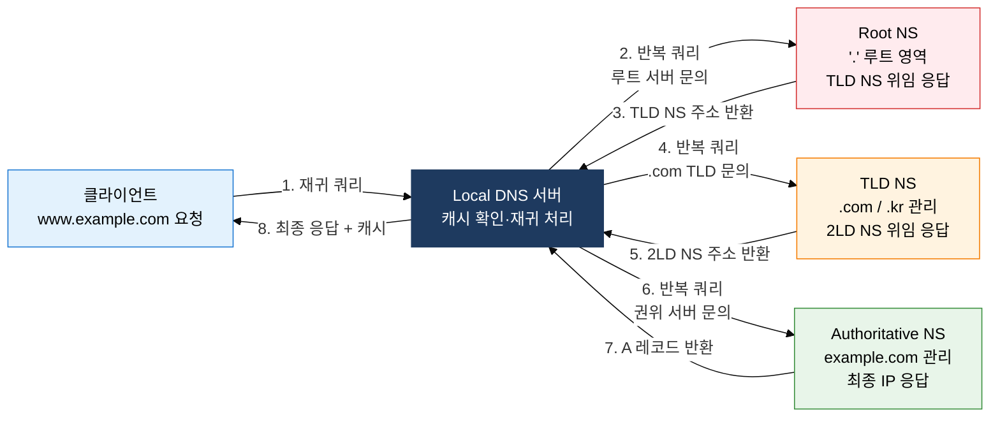
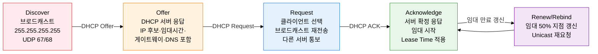

# DNS·DHCP 및 주요 응용 프로토콜
**Domain Name System / Dynamic Host Configuration Protocol**

## 1. 도메인 해석·주소 자동 할당으로 네트워크 편의성 실현, DNS·DHCP의 개요

**정의**: DNS는 도메인 이름을 IP 주소로 변환하는 분산 계층 데이터베이스 시스템이며, DHCP는 네트워크 접속 장치에 IP 주소·서브넷 마스크·게이트웨이·DNS 서버를 자동으로 할당하는 프로토콜이다.
- DNS는 Root → TLD → 2차 도메인 → 호스트 이름의 계층 구조로 전 세계 도메인 정보를 분산 관리하며, TTL(Time To Live) 기반 캐싱으로 쿼리 부하를 절감한다.
- DHCP는 브로드캐스트 기반 DORA(Discover-Offer-Request-Acknowledge) 4단계 교환으로 IP 임대(Lease) 방식의 주소 할당을 수행한다.
- 주요 응용 프로토콜(SMTP·FTP·SNMP 등)은 L4 포트 번호와 연계되어 응용 서비스별 독립적인 통신 채널을 제공한다.

**특징**:
- **분산·계층적 구조**: Root NS(13개 클러스터), TLD NS, Authoritative NS로 역할을 분리하여 단일 장애점 없는 글로벌 이름 해석 인프라를 구성한다.
- **쿼리 방식 이중화**: 재귀적 쿼리(클라이언트-Local DNS)와 반복적 쿼리(Local DNS-상위 NS)를 조합하여 클라이언트 부하를 최소화하면서 효율적 이름 해석을 수행한다.
- **동적 주소 관리**: DHCP는 임대 시간(Lease Time) 기반 주소 풀 재사용으로 한정된 IP 자원을 효율적으로 관리하며, Relay Agent를 통해 서로 다른 서브넷에도 단일 DHCP 서버를 공유할 수 있다.

---

## 2. DNS·DHCP의 핵심 구성 체계

### 가. DNS 계층 구조 및 쿼리 동작 원리

DNS 이름 해석 과정은 클라이언트가 Local DNS 서버에 재귀적 쿼리(Recursive Query)를 보내면 Local DNS가 클라이언트를 대신하여 Root NS → TLD NS → Authoritative NS로 반복적 쿼리(Iterative Query)를 수행하는 이중 쿼리 구조다. 캐시 우선 확인 순서는 **브라우저 캐시 → OS DNS 캐시(hosts 파일 포함) → Local DNS 캐시 → 재귀 쿼리 시작** 순이다. TTL이 만료되기 전까지 캐시된 응답을 재사용하므로 Root NS 부하가 대폭 경감된다. DNS over HTTPS(DoH) 및 DNS over TLS(DoT)는 DNS 쿼리 암호화로 도청·조작 공격을 방지하는 보안 확장이다.

**DNS 보안 위협 및 대응**: DNS Cache Poisoning은 공격자가 위조된 DNS 응답을 Local DNS 캐시에 주입하여 사용자를 악성 사이트로 유도하는 공격이다. **DNSSEC(DNS Security Extensions)**는 DNS 레코드에 디지털 서명(RRSIG)을 추가하고 공개 키 기반 신뢰 체인(DNSKEY·DS 레코드)으로 응답의 무결성을 검증한다. DNS Amplification 공격은 소형 쿼리로 대형 응답을 유발하는 DDoS 증폭 공격으로, ANY 쿼리 제한과 Response Rate Limiting(RRL)으로 방어한다.

| DNS 레코드 | 용도 | 예시 |
|---|---|---|
| **A** | 도메인 → IPv4 주소 매핑 | `www.example.com → 93.184.216.34` |
| **AAAA** | 도메인 → IPv6 주소 매핑 | `www.example.com → 2606:2800:220:1:248:1893:25c8:1946` |
| **CNAME** | 도메인 별칭 → 정식 도메인 연결 | `blog.example.com → example.github.io` |
| **MX** | 도메인 이메일 수신 서버 지정 | `example.com MX mail.example.com (우선순위 10)` |
| **NS** | 도메인 권위 네임서버 지정 | `example.com NS ns1.example.com` |
| **PTR** | IP 주소 → 도메인 역방향 조회 | `34.216.184.93.in-addr.arpa → www.example.com` |
| **SOA** | 영역 권한 정보(Serial·Refresh·Retry·Expire·TTL) | `example.com SOA ns1.example.com admin.example.com 2024010101 3600 900 604800 300` |
| **TXT** | 임의 텍스트 데이터(SPF·DKIM·도메인 소유권 검증) | `example.com TXT "v=spf1 include:_spf.google.com ~all"` |

---

### 나. DHCP DORA 절차 및 주요 응용 프로토콜

DHCP DORA 4단계: **Discover(브로드캐스트)** → **Offer(서버 제안)** → **Request(클라이언트 요청)** → **Acknowledge(서버 확정)**. 클라이언트는 처음 네트워크에 접속할 때 자신의 IP를 모르므로 소스 IP 0.0.0.0, 목적지 IP 255.255.255.255로 Discover 메시지를 브로드캐스트한다. DHCP Relay Agent는 브로드캐스트를 유니캐스트로 변환하여 원격 DHCP 서버로 전달함으로써 서브넷마다 별도 DHCP 서버를 두지 않아도 된다. 임대 기간의 50%가 경과하면 Renew, 87.5% 경과 시 Rebind를 통해 임대를 갱신한다.

**FTP Active vs Passive 모드**: Active 모드는 클라이언트가 제어 채널(21)로 PORT 명령을 전송하면 서버가 데이터 채널(20)에서 클라이언트로 연결을 시도한다. 방화벽 환경에서 서버의 외부 접속이 차단될 수 있어 **Passive 모드**가 권장된다. Passive 모드는 클라이언트가 PASV 명령을 보내면 서버가 임시 포트를 열고 클라이언트가 해당 포트로 연결하는 방식이다.

**SNMPv3 보안 강화**: SNMPv1/v2c는 커뮤니티 문자열(Community String)로 인증하는 평문 방식의 취약점이 있다. SNMPv3는 USM(User-based Security Model)으로 MD5/SHA 인증과 DES/AES 암호화를 제공하고, VACM(View-based Access Control Model)으로 OID 수준의 세분화된 접근 제어를 구현한다.

| 프로토콜 | 포트 | 전송 계층 | 주요 특징 | 보안 버전 |
|---|---|---|---|---|
| **SMTP** | 25(서버간) / 587(제출) | TCP | 메일 전송 프로토콜, STARTTLS 업그레이드 지원, 릴레이·수신자 검증 | SMTPS(465, TLS 필수) |
| **FTP** | 21(제어) / 20(데이터) | TCP | 제어 채널·데이터 채널 분리, Active(서버→클라이언트) / Passive(클라이언트→서버) 모드 | FTPS(TLS), SFTP(SSH 기반) |
| **SNMP** | 161(에이전트) / 162(트랩) | UDP | MIB(Management Information Base)/OID 계층 구조로 네트워크 장비 모니터링·설정 | SNMPv3(인증+암호화) |
| **DNS** | 53 | UDP(일반) / TCP(영역 전송) | 재귀·반복 쿼리, TTL 캐싱, 영역 전송(AXFR)은 TCP 사용 | DoH(443), DoT(853) |
| **DHCP** | 67(서버) / 68(클라이언트) | UDP | DORA 4단계 IP 자동 할당, Relay Agent 지원, DHCPv6(IPv6용) | DHCPv6+SLAAC 조합 |

---

## 3. DNS·DHCP 적용의 기대효과 및 활용 방안

| 구분 | 주요 기대효과 | 활용 및 실무 적용 방안 |
|---|---|---|
| **운영 자동화** | DHCP 기반 IP 자동 할당으로 수동 구성 오류 제거, 대규모 단말 온보딩 자동화 | 엔터프라이즈 환경에서 DHCP+802.1X 연동으로 접속 단말 식별 및 VLAN 자동 배정 구현 |
| **보안 강화** | DNSSEC로 DNS 응답 위변조(DNS Spoofing·Cache Poisoning) 방지, DoH/DoT로 DNS 쿼리 암호화 | Zero Trust 환경에서 DNS 필터링(Cisco Umbrella·Cloudflare Gateway) 도입으로 악성 도메인 차단 |
| **서비스 연속성** | DNS TTL 조정·다중 NS 구성으로 장애 시 신속 페일오버, DHCP 이중화(Active-Standby)로 주소 할당 고가용성 확보 | AWS Route 53 Health Check 기반 장애 자동 페일오버, DHCP Failover Protocol로 서버 이중화 구성 |
| **네트워크 가시성** | SNMP MIB/OID 기반 장비 상태 모니터링, DHCP 임대 로그로 단말 접속 이력 추적 | Zabbix·Nagios SNMP 폴링으로 네트워크 장비 실시간 모니터링, SIEM 연동을 통한 비인가 단말 탐지 |

---

> **기술사 시험 포인트**
> - DNS 재귀 쿼리(클라이언트-Local DNS)와 반복 쿼리(Local DNS-상위 NS) 역할 구분을 정확히 설명해야 한다.
> - DHCP DORA 각 단계의 목적지 IP(브로드캐스트/유니캐스트), 포트 번호(67/68), Relay Agent 동작 원리를 이해해야 한다.
> - DNS 레코드 유형(A·AAAA·CNAME·MX·NS·PTR·SOA·TXT) 목적과 예시를 구별할 수 있어야 한다.
> - FTP Active vs Passive 모드 차이점과 방화벽 환경에서 Passive 모드가 필요한 이유를 설명할 수 있어야 한다.
> - SNMPv1/v2c vs SNMPv3 보안 수준 차이(커뮤니티 문자열 vs USM 인증·암호화)를 비교 설명할 수 있어야 한다.
> - DNSSEC 신뢰 체인(RRSIG·DNSKEY·DS 레코드) 구조와 Cache Poisoning 방어 원리를 이해해야 한다.

---

### 참고: DNS 쿼리 유형 비교

| 구분 | 재귀적 쿼리(Recursive) | 반복적 쿼리(Iterative) |
|---|---|---|
| **주체** | 클라이언트 → Local DNS | Local DNS → Root/TLD/Auth NS |
| **서버 역할** | 최종 답변 또는 오류만 반환 | 다음 참조할 NS 주소 반환(위임) |
| **부하 위치** | Local DNS 서버가 전체 해석 부담 | Root NS는 최소 부하 유지 |
| **캐시 활용** | Local DNS 캐시 우선 확인 | 각 단계별 캐시 독립 적용 |
