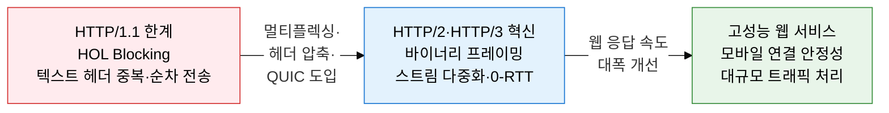
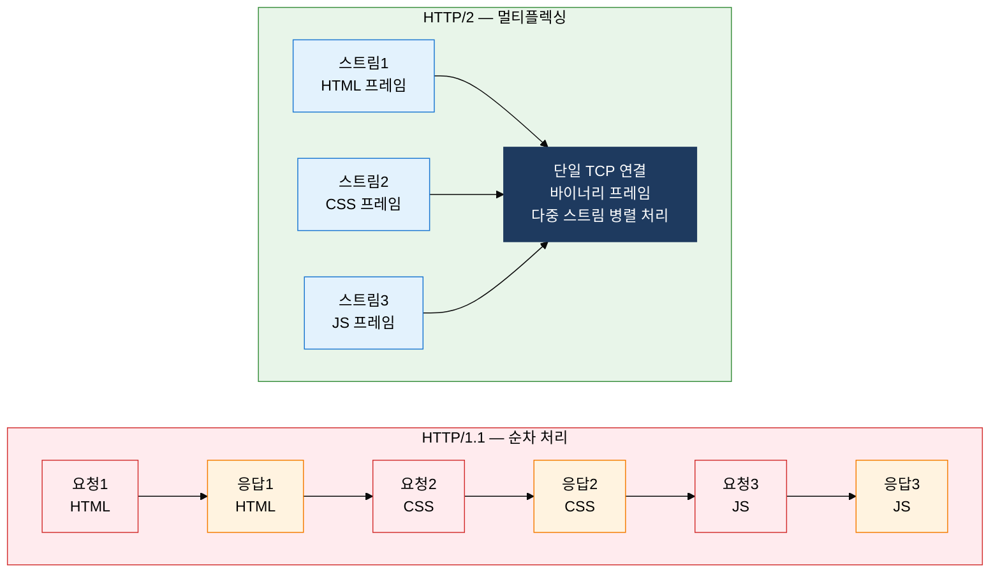
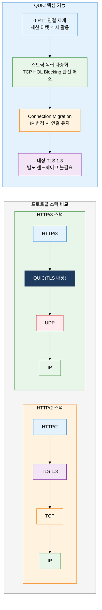

# HTTP 프로토콜의 진화
**HyperText Transfer Protocol — HTTP/1.1 → HTTP/2 → HTTP/3(QUIC)**

## 1. 웹 성능 한계 극복을 위한 HTTP 세대별 혁신, HTTP 프로토콜의 개요

**정의**: HTTP는 클라이언트-서버 간 하이퍼텍스트 문서 전송을 위한 응용 계층 프로토콜로, HTTP/1.1에서 HTTP/3까지 HOL Blocking 해소·연결 오버헤드 감소·보안 내재화 방향으로 세대별 혁신을 이루었다.
- HTTP/1.1은 Keep-Alive 지속 연결을 도입하였으나 요청-응답 순서에 따른 HOL Blocking과 헤더 중복 전송 문제를 내포한다.
- HTTP/2는 바이너리 프레이밍과 스트림 기반 멀티플렉싱으로 TCP 레벨 HOL Blocking을 제외한 응용 레벨 병렬 전송을 실현한다.
- HTTP/3는 UDP 기반 QUIC 프로토콜 위에서 동작하여 TCP의 구조적 HOL Blocking까지 완전히 해소하고 0-RTT 연결을 지원한다.

**특징**:
- **단계적 성능 진화**: HTTP/1.1(텍스트·순차) → HTTP/2(바이너리·병렬) → HTTP/3(QUIC·0-RTT)로 각 세대마다 전송 계층의 구조적 한계를 해결하는 방향으로 발전한다.
- **헤더 압축 혁신**: HTTP/2의 HPACK은 정적·동적 테이블 기반 헤더 압축으로 반복 전송 오버헤드를 80% 이상 절감하며, HTTP/3는 QPACK으로 동일 기능을 QUIC 스트림 독립성과 결합하여 제공한다.
- **연결 수립 최적화**: HTTP/2는 TCP+TLS 핸드셰이크로 2~3 RTT가 필요하나 HTTP/3의 QUIC은 첫 연결에서 1-RTT, 재연결에서 0-RTT로 연결 지연을 최소화한다.

---

## 2. HTTP 프로토콜의 핵심 구성 체계

### 가. HTTP/1.1 한계와 HTTP/2 멀티플렉싱 혁신

HTTP/2의 핵심 혁신은 **바이너리 프레이밍 계층**이다. 모든 HTTP 메시지를 고정 크기 바이너리 프레임으로 분할하여 단일 TCP 연결에서 여러 스트림을 동시에 인터리빙 전송한다. 스트림(Stream)은 양방향 바이트 흐름의 논리적 단위이고, 메시지(Message)는 하나의 요청/응답에 매핑되며, 프레임(Frame)은 최소 전송 단위다. **서버 푸시(Server Push)**는 클라이언트 요청 없이도 서버가 예상 리소스를 선제적으로 전송하는 기능으로 PUSH_PROMISE 프레임을 사용한다.

| 비교 항목 | HTTP/1.1 | HTTP/2 |
|---|---|---|
| **연결 방식** | 요청마다 연결 또는 Keep-Alive 재사용 | 단일 TCP 연결에서 다중 스트림 병렬 처리 |
| **전송 형식** | 텍스트 기반(ASCII) | 바이너리 프레이밍(Fixed-size Frame) |
| **헤더 처리** | 매 요청마다 전체 헤더 반복 전송 | HPACK 정적/동적 테이블로 중복 헤더 압축 |
| **HOL Blocking** | 응용 레벨·TCP 레벨 모두 발생 | 응용 레벨 해소 (TCP 레벨 여전히 존재) |
| **서버 기능** | 요청 기반 응답만 가능 | 서버 푸시(PUSH_PROMISE)로 선제적 전송 |
| **성능 개선** | 기준선 | 페이지 로드 약 50~80% 단축 |

---

### 나. HTTP/3 — QUIC 기반 차세대 전송 프로토콜

QUIC(Quick UDP Internet Connections)은 Google이 설계하고 IETF RFC 9000으로 표준화된 UDP 기반 전송 프로토콜이다. TCP의 연결 지향 신뢰성을 사용자 공간(User Space)에서 자체 구현하며, TLS 1.3을 프로토콜 내부에 통합하여 별도의 TLS 핸드셰이크를 제거한다. **Connection ID** 기반 연결 식별로 클라이언트 IP가 변경(Wi-Fi → LTE 전환)되어도 기존 연결을 유지하는 Connection Migration을 지원한다. HTTP/3에서 각 스트림은 독립적인 QUIC 스트림으로 처리되므로 특정 스트림의 패킷 손실이 다른 스트림에 영향을 미치지 않아 TCP 레벨 HOL Blocking을 근본적으로 해소한다.

| 비교 항목 | HTTP/1.1 | HTTP/2 | HTTP/3 |
|---|---|---|---|
| **기반 전송** | TCP | TCP | QUIC(UDP) |
| **HOL Blocking** | 응용+TCP 레벨 발생 | TCP 레벨 잔존 | 완전 해소 |
| **연결 설정** | TCP(1-RTT) + TLS(1-2 RTT) | TCP(1-RTT) + TLS(1 RTT) | QUIC 1-RTT / 재연결 0-RTT |
| **헤더 압축** | 없음 | HPACK | QPACK |
| **TLS 통합** | 별도 계층 | 별도 계층 | QUIC 내장(필수) |
| **특징 기능** | Keep-Alive | 멀티플렉싱·서버 푸시 | Connection Migration·0-RTT |

---

## 3. HTTP 프로토콜 진화 적용의 기대효과 및 활용 방안

| 구분 | 주요 기대효과 | 활용 및 실무 적용 방안 |
|---|---|---|
| **성능·응답성** | HTTP/2 멀티플렉싱으로 HOL Blocking 제거, 페이지 로드 시간 50% 이상 단축 | Nginx·Apache HTTP/2 활성화, CDN(Cloudflare·AWS CloudFront) HTTP/3 지원 설정으로 글로벌 서비스 응답 개선 |
| **네트워크 효율** | HPACK·QPACK 헤더 압축으로 반복 헤더 전송량 80% 절감, 대역폭 절약 | 모바일 환경 API 서버에 HTTP/2 적용, gRPC(HTTP/2 기반) 마이크로서비스 간 효율적 통신 구현 |
| **모바일·이동성** | QUIC Connection Migration으로 IP 변경 시 연결 재수립 없이 스트리밍·통화 유지 | 화상 회의(Zoom·Google Meet), 모바일 스트리밍 앱에 QUIC/HTTP/3 적용으로 핸드오프 끊김 방지 |
| **보안 내재화** | HTTP/3 QUIC의 TLS 1.3 필수 통합으로 암호화 기본값 보장, 다운그레이드 공격 방지 | ALPN(Application-Layer Protocol Negotiation) 협상으로 서버-클라이언트 간 HTTP 버전 자동 선택 및 보안 정책 적용 |
