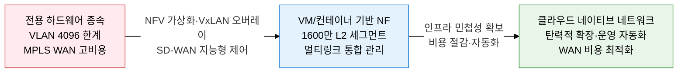
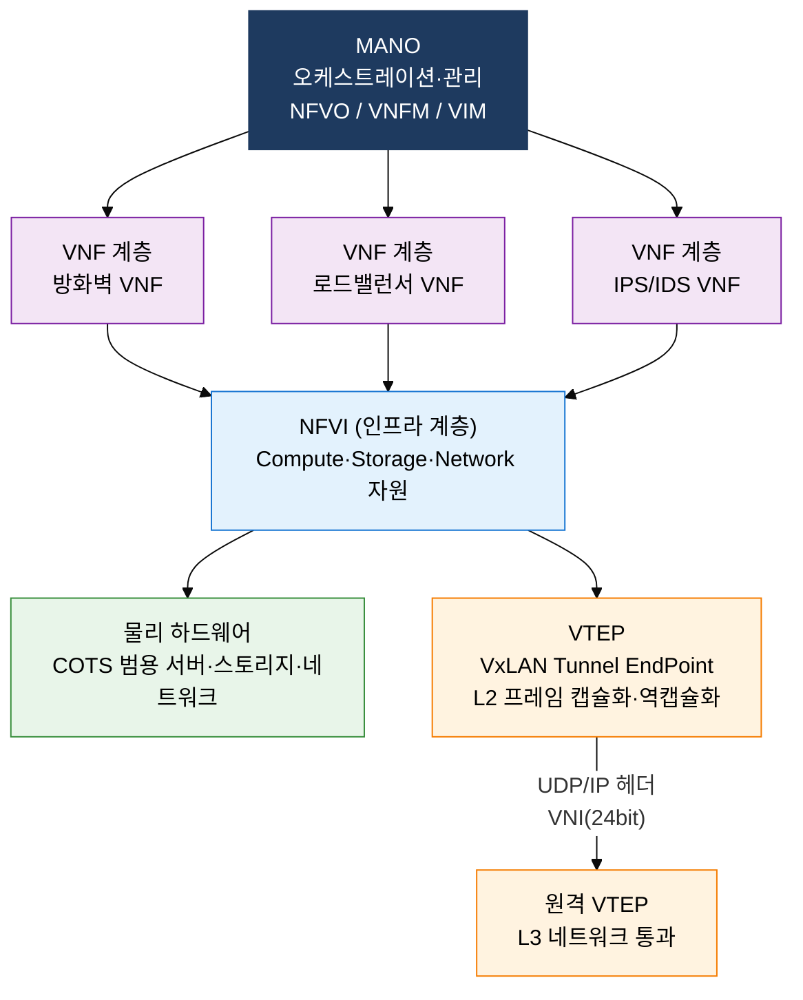
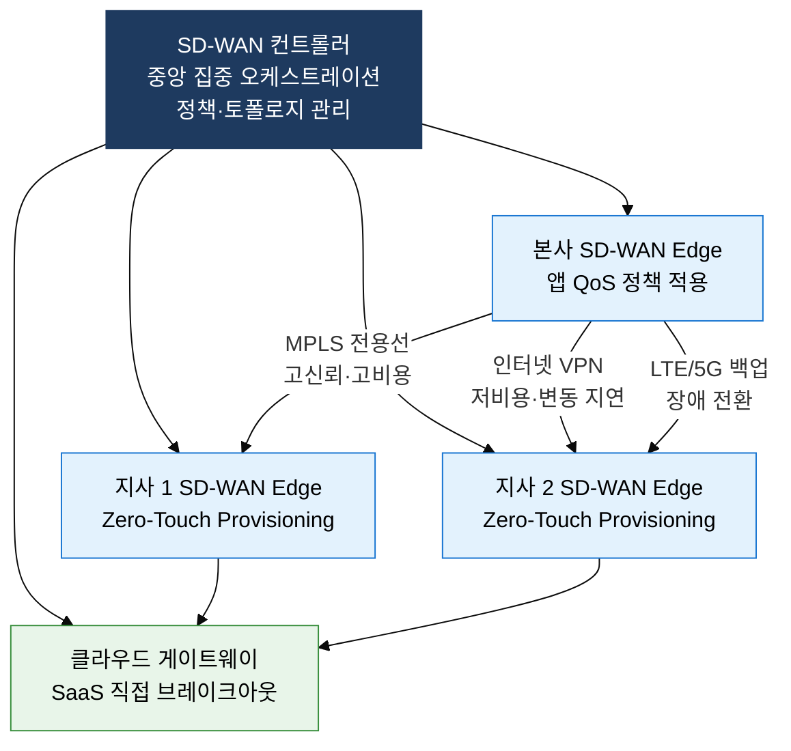

# NFV·VxLAN·SD-WAN

## 1. 하드웨어 종속 탈피·오버레이 확장·WAN 지능화, NFV·VxLAN·SD-WAN의 개요

**정의**: 네트워크 기능을 전용 하드웨어에서 분리하여 범용 서버 위 VM·컨테이너로 실행하는 NFV, L3 네트워크 위에 L2 오버레이를 구성하는 VxLAN, 복수 WAN 링크를 소프트웨어로 통합 제어하는 SD-WAN을 아우르는 소프트웨어 정의 인프라 기술군.
- NFV는 ETSI의 3계층 참조 아키텍처(VNF·NFVI·MANO)를 기반으로 표준화되었으며 SDN과 상호보완적으로 동작한다.
- VxLAN은 24비트 VNI(Virtual Network Identifier)로 최대 1,677만 개의 독립 L2 세그먼트를 UDP 캡슐화(포트 4789)로 구현한다.
- SD-WAN은 MPLS·인터넷·LTE 등 이종 링크를 앱 QoS 기반으로 통합 제어하며 Zero-Touch Provisioning으로 지사 배포를 자동화한다.

**특징**:
- **기능 가상화(NFV)**: 방화벽·라우터·로드밸런서 등 Physical Network Function을 VNF로 전환, 범용 COTS 서버에서 실행하여 하드웨어 갱신 없이 기능 확장·축소 가능
- **오버레이 확장(VxLAN)**: VLAN의 4,094개 세그먼트 한계를 24비트 VNI로 극복, L3 경계를 넘는 L2 연결로 데이터센터 간 VM 마이그레이션 지원
- **WAN 지능화(SD-WAN)**: 앱별 SLA 정책(지연·대역폭·패킷 손실)에 따라 최적 경로를 실시간 선택, 클라우드 트래픽을 MPLS 우회 없이 직접 브레이크아웃

---

## 2. NFV·VxLAN·SD-WAN의 핵심 구성 체계

### 가. NFV 아키텍처와 VxLAN 오버레이

**ETSI NFV MANO 3계층 구성**:

| 구성 요소 | 역할 | 주요 기능 |
|---|---|---|
| **NFVO** | NFV Orchestrator | 서비스 체이닝(SFC), VNF 생명주기 전체 오케스트레이션, 자원 글로벌 최적화 |
| **VNFM** | VNF Manager | 개별 VNF 인스턴스 생성·스케일링·힐링·삭제, VNFD(디스크립터) 기반 배포 |
| **VIM** | Virtualized Infrastructure Manager | NFVI 자원(VM·vNet·vStorage) 할당·모니터링 (OpenStack이 대표 VIM) |

**VxLAN vs VLAN 비교**:

| 비교 항목 | VLAN (IEEE 802.1Q) | VxLAN (RFC 7348) |
|---|---|---|
| **세그먼트 수** | 최대 4,094개 (12bit VID) | 최대 16,777,216개 (24bit VNI) |
| **캡슐화** | 이더넷 프레임 내 4B 태그 삽입 | L2 프레임을 UDP(4789)/IP/이더넷으로 캡슐화 |
| **L3 경계** | L3 라우터 통과 불가 (L2 종단) | L3 네트워크 통과 가능 (오버레이 터널) |
| **적용 범위** | 단일 데이터센터·캠퍼스 내부 | 데이터센터 간·하이브리드 클라우드 확장 |
| **오버헤드** | 4B (VLAN 태그) | 50B (VxLAN 헤더 8B + UDP 8B + IP 20B + 외부 이더넷 14B) |

> **유사 오버레이 기술 비교**: VxLAN(UDP, RFC 7348, 범용) vs NVGRE(GRE, MS 제안, HyperV) vs STT(TCP-like, 구 버전 호환) — 현재 업계 표준은 VxLAN이며 EVPN(BGP) 제어 평면과 결합하여 분산 게이트웨이 구현.

---

### 나. SD-WAN 아키텍처

**SD-WAN 핵심 기능**:
- **앱 인식 라우팅**: DPI(Deep Packet Inspection)로 애플리케이션 식별 후 SLA 정책(지연·지터·패킷 손실 임계값)에 따라 최적 링크 자동 선택
- **Zero-Touch Provisioning(ZTP)**: 지사 장비가 컨트롤러에 자동 등록·설정 수신, 현장 엔지니어 없이 신규 사이트 개통 가능
- **Link Aggregation**: MPLS·인터넷·LTE 복수 링크를 Active-Active로 통합, 장애 시 밀리초 단위 전환(링크 본딩·패킷 복제)
- **보안 통합**: NGFW·CASB·SWG 기능을 SD-WAN Edge에 통합 또는 SSE(Security Service Edge) 클라우드 연동

**MPLS vs SD-WAN 비교**:

| 비교 항목 | MPLS WAN | SD-WAN |
|---|---|---|
| **비용** | 전용선 계약, 대역폭 증설 비용 高 (수백만원/월) | 인터넷/LTE 결합, MPLS 대비 30~70% 절감 가능 |
| **유연성** | 설정 변경 통신사 의뢰, 수일~수주 소요 | 컨트롤러 정책 변경으로 즉시 전체 적용 |
| **클라우드 친화성** | SaaS 트래픽도 본사 허브 경유, 지연 증가 | 지사에서 SaaS 직접 인터넷 브레이크아웃 지원 |
| **관리** | 통신사 관리 범위 제한, 가시성 부족 | 단일 대시보드 전체 WAN 가시성·성능 모니터링 |
| **보안** | WAN 구간 격리, 추가 보안 장비 필요 | NGFW·ZTNA·SWG 통합 또는 SSE 클라우드 연계 |

> **주요 SD-WAN 솔루션**: Cisco SD-WAN(Viptela), VMware VeloCloud, Fortinet SD-WAN, HPE Aruba EdgeConnect, Palo Alto Prisma SD-WAN — 단순 WAN 최적화를 넘어 SASE(Secure Access Service Edge) 아키텍처로 진화 중.

---

## 3. NFV·VxLAN·SD-WAN 도입의 기대효과 및 활용 방안

| 구분 | 주요 기대효과 | 활용 및 실무 적용 방안 |
|---|---|---|
| **인프라 민첩성** | 전용 하드웨어 조달 기간(수개월) 제거, VNF 배포 수분 완료, 새로운 네트워크 서비스 Time-to-Market 단축 | NFVO 기반 서비스 체이닝 자동화, Kubernetes 위 CNF(Cloud-native NF) 배포로 마이크로서비스 네트워크 기능 구현 |
| **확장성·이식성** | VxLAN 24bit VNI로 멀티테넌트 데이터센터 무제한 확장, VM 마이그레이션 시 L2 연속성 보장 | EVPN-VxLAN 기반 데이터센터 패브릭 구성, 하이브리드·멀티 클라우드 간 일관된 L2 오버레이 확장 |
| **비용 최적화** | MPLS 전용선 의존도 감소, 인터넷·LTE 링크 활용으로 WAN 비용 30~70% 절감, CAPEX 절감 | SD-WAN 컨트롤러 기반 링크별 비용·성능 실시간 모니터링, SaaS 트래픽 직접 브레이크아웃으로 MPLS 대역폭 효율 향상 |
| **운영 자동화·보안** | ZTP·중앙 정책 관리로 네트워크 운영 인력 절감, 이상 트래픽 감지 시 VNF 즉각 삽입으로 보안 대응 자동화 | SASE 아키텍처로 SD-WAN+SSE 통합, DevNetOps 파이프라인에 NFV 프로비저닝 API 연동하여 네트워크 as Code 실현 |
