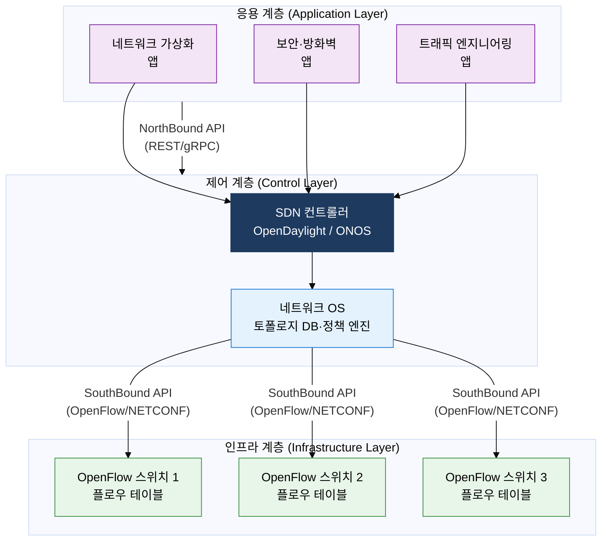
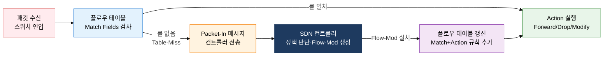

## 1. 제어부·전송부 분리로 네트워크를 소프트웨어로 제어, SDN의 개요

**정의**: 네트워크 제어 기능(Control Plane)을 데이터 전송 기능(Data Plane)으로부터 분리하고, 중앙화된 SDN 컨트롤러가 표준 API(OpenFlow 등)로 전체 네트워크를 프로그래밍 방식으로 제어하는 네트워크 아키텍처.
- 기존 네트워크 장비에 각각 내장되어 있던 라우팅·정책 결정 로직을 소프트웨어 컨트롤러로 분리한다.
- 응용 계층(비즈니스 의도)→제어 계층(컨트롤러)→인프라 계층(스위치/라우터)의 3계층 구조로 계층적 추상화를 실현한다.
- 2008년 Stanford 대학 McKeown 교수팀의 OpenFlow 논문에서 출발하여 ONF(Open Networking Foundation) 주도로 표준화되었다.

**특징**:
- **제어·전송 분리**: Control Plane(라우팅 결정·QoS 정책·보안 규칙)과 Data Plane(패킷 포워딩·매칭·액션)을 물리적으로 분리하여 각 계층의 독립적 진화 가능
- **중앙 집중 제어**: SDN 컨트롤러가 전체 네트워크 토폴로지를 전역(Global View)으로 파악하고 일관된 정책을 모든 장비에 일괄 적용
- **프로그래머블**: NorthBound API(REST/gRPC)로 상위 애플리케이션이 네트워크 동작을 코드로 정의, 자동화·오케스트레이션 연계 가능

---

## 2. SDN의 핵심 구성 체계

### 가. SDN 3계층 아키텍처

| 비교 항목 | 기존 네트워크 | SDN |
|---|---|---|
| **제어 방식** | 각 장비 분산 제어, 벤더별 CLI/API | 중앙 컨트롤러 집중 제어, 표준 REST API |
| **유연성** | 정적 설정, 변경 시 장비별 수작업 적용 | 소프트웨어 정책 정의, 전체 적용 자동화 |
| **확장성** | 장비 추가 시 수동 설정·테스트 필요 | 컨트롤러 정책 1회 정의 후 자동 배포 |
| **관리** | 장비별 분산 관리, 일관성 보장 어려움 | 단일 네트워크 뷰, 중앙 통합 정책 관리 |
| **벤더 종속** | 장비·OS·프로토콜 모두 벤더 의존 | 표준 SouthBound API(OpenFlow)로 멀티벤더 가능 |

> **주요 SDN 컨트롤러**: OpenDaylight(ODL, Java 기반, Linux Foundation), ONOS(Open Network OS, 통신사·대규모 WAN 최적화), Ryu(Python, 경량 연구용), Floodlight(Java, 오픈소스)

---

### 나. OpenFlow 동작 원리

**플로우 테이블 구성 요소**:
- **Match Fields**: In-Port, 이더넷 src/dst MAC, VLAN ID, IP src/dst, L4 포트, IP 프로토콜 등 12개 이상 필드
- **Priority**: 다수 룰 매칭 시 우선순위 결정 (0~65535, 높을수록 우선)
- **Counters**: 패킷 수·바이트 수·매칭 횟수 통계
- **Instructions/Actions**: Output(포트 전송), Drop(폐기), Modify(헤더 수정), Meter(속도 제한), Controller(컨트롤러 전송)
- **Timeout**: Hard Timeout(절대 만료), Idle Timeout(유휴 만료)

| 유형 | 방향 | 주요 메시지 | 용도 |
|---|---|---|---|
| **Controller→Switch** | 컨트롤러→스위치 | Flow-Mod, Packet-Out, Port-Mod, Stats-Request | 플로우 규칙 설치·수정·삭제, 패킷 전송 지시, 통계 요청 |
| **Switch→Controller** | 스위치→컨트롤러 | Packet-In, Flow-Removed, Port-Status, Stats-Reply | 미매칭 패킷 전달, 만료 룰 통보, 포트 상태 변경, 통계 응답 |
| **Symmetric** | 양방향 | Hello, Echo-Request/Reply, Error | 세션 수립·유지, 연결 상태 확인, 오류 통보 |

> **OpenFlow 채널**: 컨트롤러와 스위치 간 TCP 6633(구버전) 또는 TLS 6653(신버전) 포트 사용. OpenFlow 1.3이 현재 가장 널리 배포된 버전으로 다중 테이블·미터링·IPv6 지원.

---

## 3. SDN 도입의 기대효과 및 활용 방안

| 구분 | 주요 기대효과 | 활용 및 실무 적용 방안 |
|---|---|---|
| **운영 자동화** | 수작업 CLI 설정 제거, 정책 변경 시간 수일→수분 단축, 인적 오류 최소화 | Ansible·Terraform과 SDN REST API 연계, CI/CD 파이프라인에 네트워크 프로비저닝 통합 |
| **클라우드 연계** | VM 마이그레이션 시 네트워크 정책 자동 이동, 멀티테넌트 논리 격리 실현 | OpenStack Neutron·VMware NSX와 SDN 컨트롤러 연동, 오버레이 네트워크로 하이브리드 클라우드 확장 |
| **보안 강화** | 이상 트래픽 실시간 감지 후 컨트롤러에서 즉각 차단 룰 전역 배포, Zero-Trust 구현 용이 | 보안 분석 플랫폼(SIEM)과 NorthBound API 연동, 감염 호스트 격리 Flow-Mod 자동 생성 |
| **트래픽 최적화** | 전역 토폴로지 뷰 기반 최적 경로 계산, ECMP·로드밸런싱 중앙 집중 제어 | 데이터센터 East-West 트래픽 최적화, SR-MPLS·Segment Routing과 SDN 결합으로 TE(Traffic Engineering) 자동화 |
