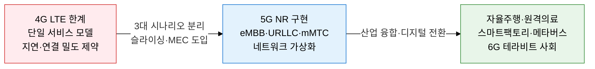
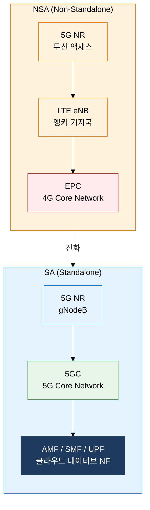

# 5G / 차세대 6G 이동 통신

## 1. 초고속·초저지연·초연결 실현하는 5G 핵심 기술, 5G/6G 이동 통신의 개요



**정의**: ITU-R IMT-2020이 정의한 5세대 이동통신으로, eMBB·URLLC·mMTC 세 가지 시나리오를 단일 무선 인프라에서 네트워크 슬라이싱으로 분리 제공하는 초고속·초저지연·초연결 통신 표준.
- 3GPP Release 15(2018)에서 5G NR(New Radio) 표준 제정, Release 17/18로 지속 진화
- 주파수 범위 FR1(Sub-6GHz, 450MHz~7.125GHz)과 FR2(mmWave, 24.25~52.6GHz) 두 대역 활용
- 네트워크 가상화(SDN/NFV) 기반의 5GC(5G Core)는 클라우드 네이티브 마이크로서비스 아키텍처로 구현

**특징**:
- **3대 시나리오 병렬 지원**: eMBB(초고속)·URLLC(초저지연)·mMTC(초연결)를 네트워크 슬라이싱으로 QoS를 분리하여 하나의 물리 인프라에서 서비스별 최적화된 SLA 보장
- **클라우드 네이티브 코어**: 5GC는 NF(Network Function) 기반 마이크로서비스로 분리되어 독립 스케일링·업데이트 가능하며 NFV/SDN과 완전 통합
- **mmWave 대규모 MIMO**: 밀리미터파 대역(28GHz 등)에서 수백 안테나 Beamforming으로 공간 다중화, 주파수 자원의 밀도를 극대화하여 단위 면적당 용량 획기적 증대

---

## 2. 5G/6G 이동 통신의 핵심 구성 체계

### 가. 5G 3대 핵심 시나리오와 무선 핵심 기술

```mermaid
%%{init: { 'theme': 'base', 'themeVariables': { 'edgeLabelBackground': '#fff' }}}%%
flowchart TD
    subgraph R1["초고속 vs 초저지연"]
        direction LR
        A["eMBB<br/>Enhanced Mobile Broadband<br/>최대 20Gbps<br/>AR/VR·홀로그램·4K"] B["URLLC<br/>Ultra-Reliable Low Latency<br/>지연 1ms 미만<br/>자율주행·원격수술"]
    end
    subgraph R2["초연결 vs 핵심 무선 기술"]
        direction LR
        C["mMTC<br/>Massive Machine Type Comm.<br/>km² 당 100만 기기<br/>스마트시티·산업 IoT"] D["핵심 무선 기술<br/>밀리미터파·Massive MIMO<br/>Beamforming·빔 트래킹<br/>NOMA·D2D"]
    end
    style R1 fill:none,stroke:none
    style R2 fill:none,stroke:none
    style A fill:#E3F2FD,stroke:#1976D2,color:#000
    style B fill:#FFEBEE,stroke:#D32F2F,color:#000
    style C fill:#E8F5E9,stroke:#388E3C,color:#000
    style D fill:#1E3A5F,stroke:#1E3A5F,color:#fff
```

| 시나리오 | 목표 | 최대 속도 | 지연 | 연결 밀도 | 주요 응용 서비스 |
|---|---|---|---|---|---|
| **eMBB** | 초고속 데이터 서비스 | 하향 20Gbps / 상향 10Gbps | 4ms | 보통 | AR/VR, 홀로그램, 4K/8K 스트리밍, 클라우드 게임 |
| **URLLC** | 초저지연·고신뢰 | 수백Mbps | 1ms 미만 / 신뢰도 99.9999% | 중간 | 자율주행, 원격수술, 스마트그리드 제어, 산업 자동화 |
| **mMTC** | 대량 기기 연결 | 수십kbps~수Mbps | 수초 허용 | km² 당 100만 기기 | 스마트미터, 환경 센서, 농업 IoT, 스마트시티 |

**핵심 무선 기술 상세**

- **밀리미터파 (mmWave)**: 28GHz·39GHz 등 고주파 대역으로 광대역 확보. 직진성 강하고 회절 약해 소출력 소형 셀(Small Cell) 고밀도 배치 필요
- **Massive MIMO**: 기지국에 64~256개 이상의 안테나 배열로 다수 사용자에게 동시에 독립 공간 스트림 전송. 3D 빔포밍으로 수직/수평 방향 모두 제어
- **Beamforming**: 안테나 배열의 위상 차이를 조정하여 특정 방향으로 전파 에너지를 집중, 수신 SNR 개선 및 간섭 저감
- **빔 트래킹 (Beam Tracking)**: 이동 단말의 위치 변화에 따라 실시간으로 빔 방향을 추적·전환하여 mmWave의 이동성 문제 해결

---

### 나. 5G 핵심 인프라 기술 (슬라이싱·MEC) 및 NSA/SA 아키텍처와 6G 전망



**네트워크 슬라이싱 (Network Slicing)**
- 단일 물리 인프라를 SDN/NFV로 논리적으로 분리하여 각 슬라이스마다 독립된 QoS·보안·격리 환경 제공
- eMBB 슬라이스(고대역폭), URLLC 슬라이스(저지연 우선), mMTC 슬라이스(다중 연결)를 동일 기지국에서 운용
- E2E 슬라이싱: RAN(무선 접속망) → 전송망 → 코어망까지 수직 통합 슬라이스 관리

**MEC (Multi-Access Edge Computing)**
- 기지국 또는 집선 장비 근처에 컴퓨팅 자원을 배치하여 코어망까지 왕복 없이 로컬 처리
- URLLC 서비스에서 왕복 지연을 1ms 이하로 낮추는 핵심 인프라
- 모바일 엣지 클라우드(MEC 서버)에서 AR 렌더링·자율주행 의사결정·실시간 영상 분석 수행

| 구분 | NSA (Non-Standalone) | SA (Standalone) |
|---|---|---|
| **무선 액세스** | 5G NR + LTE 이중 연결 | 5G NR 단독 |
| **코어망** | 4G EPC (기존 코어) | 5GC (5G 전용 코어) |
| **배포 목적** | LTE 투자 활용, 빠른 초기 배포 | 완전한 5G 기능 구현 |
| **슬라이싱** | 미지원 | 완전 지원 |
| **URLLC** | 제한적 | 완전 지원 |
| **진화 경로** | 5G 도입 초기 단계 | 5G 완숙 단계 목표 |

**5G vs 6G 비교**

| 구분 | 5G (IMT-2020) | 6G (IMT-2030 전망) |
|---|---|---|
| **최대 속도** | 20Gbps | 1Tbps (목표) |
| **지연** | 1ms | 0.1ms 이하 |
| **주파수** | Sub-6GHz / mmWave (최대 100GHz) | 테라헤르츠(THz, 0.1~10THz) |
| **핵심 기술** | Massive MIMO, 슬라이싱, MEC | AI 네이티브, NTN 위성 융합, RIS |
| **연결 밀도** | 100만 기기/km² | 1,000만 기기/km² |
| **AI 역할** | 부분 적용 (자동화) | AI 네이티브 (설계 내재화) |

**6G 핵심 전망 기술**
- **테라헤르츠(THz) 대역**: 0.1~10THz 활용으로 테라비트급 전송, 수십 미터 단위 초소형 셀 필요
- **RIS (Reconfigurable Intelligent Surface)**: 반사면을 소프트웨어로 제어하여 전파 경로 최적화, 음영 지역 해소
- **NTN (Non-Terrestrial Network)**: 저궤도(LEO) 위성과 지상 5G/6G 망의 완전 융합, 전 지구 커버리지
- **AI 네이티브**: 네트워크 자체에 AI를 내재화하여 자율 최적화·자가 치유·예측적 자원 관리 수행

---

## 3. 5G/6G 이동 통신 도입의 기대효과 및 활용 방안

| 구분 | 주요 기대효과 | 활용 및 실무 적용 방안 |
|---|---|---|
| **산업 디지털 전환** | eMBB 기반 20Gbps 초고속으로 AR/VR 협업·홀로그램 회의 실현, 스마트팩토리 무선 자동화 가속화 | 제조업 5G 특화망(NPN) 구축, MEC 기반 실시간 영상 품질 검사, 무선 AGV·로봇 원격 제어 |
| **공공 안전·의료** | URLLC 1ms 초저지연으로 원격수술 지원, 실시간 재난 현장 영상 전송, 응급 드론 통신 신뢰성 확보 | 병원 내 5G 특화망 구축, 구급차 원격 진단 시스템, 재난 대응 임시 5G 기지국 배치 |
| **스마트시티·IoT** | mMTC 100만 기기/km² 연결 밀도로 도시 전체 센서망 통합, 에너지·교통·환경 실시간 모니터링 | 스마트파킹·스마트조명 원격 관제, 수도·전력 AMI(자동 계량 인프라), 대기질 실시간 관측 |
| **6G 미래 준비** | THz 대역 Tbps급 전송으로 몰입형 XR·홀로그램 사회 구현, AI 네이티브 자율 네트워크로 운영비용 절감 | 6G 테스트베드 선제 구축, 위성-지상 통합 망 설계 검토, AI 기반 RAN 지능화(O-RAN) 도입 |
