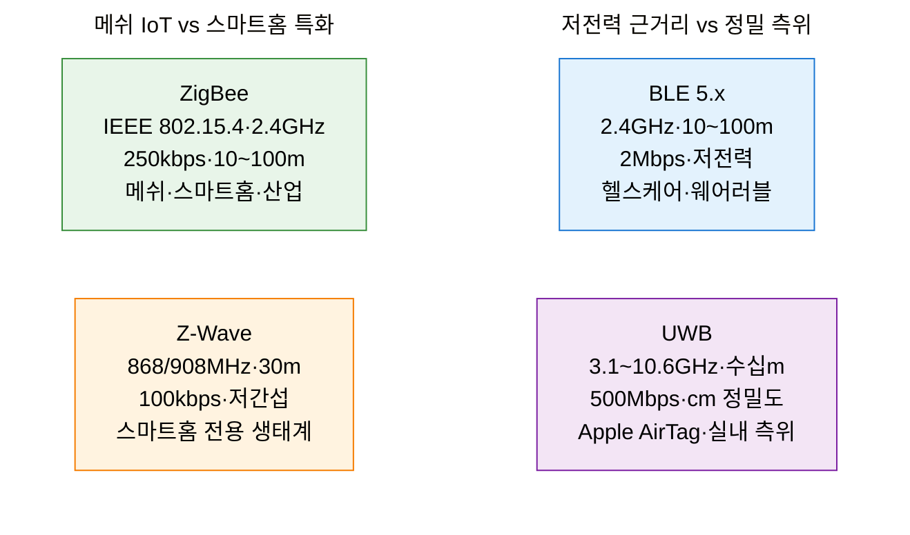
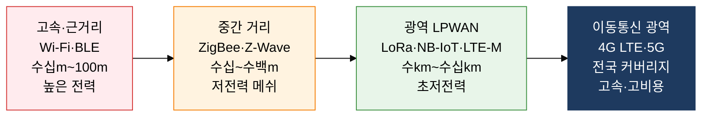
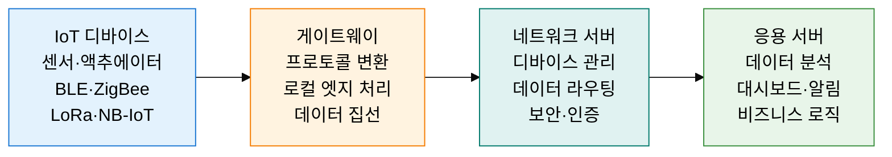

## 1. 저전력·저비용으로 사물을 연결하는 IoT 무선 기술, 근거리 무선 통신 및 IoT 네트워크의 개요


**정의**: 배터리 기반 사물 기기를 저전력·저비용으로 연결하기 위해 전송 거리·속도·전력·주파수를 각각 최적화한 다양한 무선 통신 프로토콜 집합으로, 근거리(수~수백 미터)부터 광역(수십 킬로미터)까지 계층화된 IoT 연결 생태계.
- 전송 거리와 데이터 속도는 반비례 트레이드오프를 가지며, 용도(웨어러블·스마트홈·산업·농업 등)에 따라 최적 기술 선택이 핵심
- 근거리 무선(BLE·ZigBee·Z-Wave·UWB)과 LPWAN(LoRa·NB-IoT·LTE-M)으로 크게 이분화되어 커버리지와 데이터 특성에 따라 역할 분담
- IoT 아키텍처는 디바이스 → 게이트웨이 → 네트워크 서버 → 응용 서버의 4계층 구조로 데이터가 수집·처리·제공됨

**특징**:
- **저전력 설계 우선**: 코인셀 배터리로 수년 동작을 목표로 슬립 사이클·듀티 사이클·TWT 등 전력 관리 기법을 기술 설계 핵심 요소로 내재화
- **메쉬 네트워크 지원**: ZigBee·Z-Wave·BLE Mesh는 중계 노드를 통해 직접 통신 불가 구간을 우회하는 자가 치유 메쉬 토폴로지로 커버리지 확장
- **면허·비면허 대역 이원화**: BLE·ZigBee·LoRa는 비면허 ISM 대역, NB-IoT·LTE-M은 이동통신사 면허 대역을 사용하여 QoS 보장 수준과 비용 구조가 상이

---

## 2. 근거리 무선 통신 및 IoT 네트워크의 핵심 구성 체계

### 가. 근거리 무선 통신 기술 (BLE·ZigBee·Z-Wave·UWB)



**근거리 무선 기술 상세 설명**

- **BLE (Bluetooth Low Energy)**: Bluetooth 4.0에서 분리된 저전력 프로파일. 광고(Advertising) 모드로 브로드캐스트, 연결(Connection) 모드로 1:1 통신. 코인셀 배터리로 수년 동작 가능하며 스마트워치·체온계·혈당계 등 헬스케어 기기 표준 연결 기술.
- **ZigBee (IEEE 802.15.4)**: 2.4GHz ISM 대역 기반 저속 메쉬 네트워크. 코디네이터(1개)·라우터·엔드 디바이스 3계층 구조. 최대 65,000개 노드 수용 가능하며 Zigbee Alliance(현 CSA)가 Matter 표준으로 진화 주도.
- **Z-Wave**: 868MHz(유럽)/908MHz(미국) 비면허 대역 사용으로 2.4GHz 혼잡 회피. ITU-T G.9959 표준 기반. 인터페로런스 적어 신뢰성 높고 최대 232개 노드 지원. Silicon Labs가 주도하는 스마트홈 전용 생태계.
- **UWB (Ultra-Wideband)**: 500MHz 이상 초광대역을 사용한 임펄스 무선 기술. 멀티패스 환경에서도 비행 시간(ToF) 측정으로 10~30cm 정밀 측위. Apple(AirDrop·AirTag)·Samsung·NXP가 상용화 주도.

| 기술 | 주파수 | 전송 거리 | 데이터 속도 | 소비 전력 | 주요 용도 |
|---|---|---|---|---|---|
| **BLE 5.x** | 2.4GHz | 10~100m (Long Range: 400m) | 최대 2Mbps | 매우 낮음 (수 mW) | 웨어러블, 헬스케어, 비콘, 스마트잠금장치 |
| **ZigBee** | 2.4GHz / 868/915MHz | 10~100m (메쉬 확장) | 250kbps | 낮음 | 스마트홈 자동화, 산업 센서망, 스마트 조명 |
| **Z-Wave** | 868/908MHz | 30m (메쉬 100m 이상) | 100kbps | 낮음 | 스마트홈 전용 (도어락, 조명, 에너지 관리) |
| **UWB** | 3.1~10.6GHz | 10~50m | 27~500Mbps | 중간 | 실내 정밀 측위, 분실물 추적, 보안 접근 제어 |

---

### 나. LPWAN IoT 통신 기술 (LoRa·NB-IoT·LTE-M)



**LPWAN (Low Power Wide Area Network) 핵심 기술**

- **LoRa (Long Range)**: Semtech의 독점 변조 방식인 CSS(Chirp Spread Spectrum)를 사용. 확산 인자(SF, Spreading Factor)를 SF7(빠른 속도·짧은 거리)에서 SF12(느린 속도·긴 거리)까지 조절 가능. 동일 채널에서 SF가 다른 신호는 직교성으로 동시 수신 가능.

  ```
  SF7 → 최대 5.5kbps, ~2km 도달
  SF12 → 최대 250bps, ~15km 도달 (시야 확보 시)
  ```

- **LoRaWAN**: LoRa PHY 위에 올라가는 MAC 계층 표준. LoRa Alliance가 관리. Class A(단말 주도 업링크)·Class B(주기적 하향링크)·Class C(항시 수신) 세 가지 디바이스 클래스. 게이트웨이→네트워크 서버→앱 서버 3계층 구조.

- **NB-IoT (Narrowband IoT)**: 3GPP Release 13(2016)에서 정의. LTE 주파수 대역 내 180kHz 협대역 사용. 이동통신사 기존 셀타워 소프트웨어 업그레이드로 배포 가능. 심층 실내 커버리지(164dBm MCL), PSM·eDRX로 10년 이상 배터리 수명.

- **LTE-M (LTE-MTC)**: 3GPP Release 13. 1.4MHz 대역폭. NB-IoT 대비 고속(1Mbps)·이동성 지원·Voice 가능. 웨어러블·자산 추적 등 이동성이 필요한 IoT에 적합.

**IoT 네트워크 아키텍처**



| 구분 | LoRa / LoRaWAN | NB-IoT | LTE-M |
|---|---|---|---|
| **주파수 대역** | Sub-GHz 비면허 (920MHz 등) | LTE 면허 대역 | LTE 면허 대역 |
| **대역폭** | 125/250/500kHz | 180kHz | 1.4MHz |
| **최대 속도** | 5.5kbps (SF7) | 250kbps (하향) | 1Mbps |
| **커버리지** | 2~15km (시야 확보) | 수km (깊은 실내 침투) | 수km |
| **배터리 수명** | 10년 이상 가능 | 10년 이상 (PSM) | 수년 (PSM/eDRX) |
| **이동성** | 제한적 (낮은 속도) | 제한적 | 지원 (최대 100km/h) |
| **비용 구조** | 비면허 (게이트웨이 자체 구축) | 이동통신사 월정 요금 | 이동통신사 월정 요금 |
| **주요 용도** | 스마트 미터, 농업·환경 IoT | 스마트미터, 주차, 트래커 | 웨어러블, 자산 추적, 원격검침 |

---

## 3. 근거리 무선 통신 및 IoT 네트워크 도입의 기대효과 및 활용 방안

| 구분 | 주요 기대효과 | 활용 및 실무 적용 방안 |
|---|---|---|
| **스마트홈·빌딩** | BLE·ZigBee·Z-Wave 연동으로 조명·잠금·에너지 기기 통합 제어, 거주자 편의와 에너지 효율 15~30% 향상 | Matter 표준 기반 멀티벤더 스마트홈 플랫폼 구축, BACnet/Zigbee 통합 BMS(빌딩 관리 시스템) 도입 |
| **산업·물류 IoT** | LoRaWAN으로 공장·창고 전체 센서망 자체 구축(비면허), UWB 정밀 측위로 재고 추적 정확도 99% 이상 달성 | 스마트팩토리 진동·온도 예지보전 센서망, 창고 자산 UWB 실시간 추적, AGV 고정밀 항법 |
| **스마트시티·농업** | NB-IoT 기반 전국 이동통신망 활용 원격검침·환경 모니터링, LoRa 농업 IoT로 관개·기상 데이터 수집 | AMI(자동검침 인프라) 국가 단위 배포, 스마트파킹·대기질 관제 시스템, 정밀 농업 드론-센서 통합 |
| **헬스케어·웨어러블** | BLE 기반 의료용 웨어러블로 실시간 생체신호 모니터링, 배터리 수명 연장으로 지속 착용 가능 | 병원 환자 실시간 바이탈 모니터링 시스템, 실버케어 낙상 감지 단말, 스포츠 퍼포먼스 분석 기기 |
