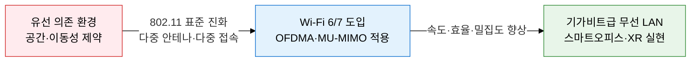
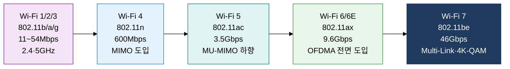
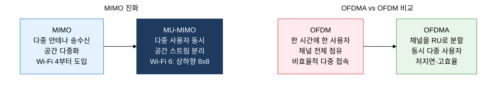

## 1. 802.11 표준 진화로 무선 대역폭·효율 극대화, 무선 LAN 기술 표준의 개요

**정의**: IEEE 802.11 표준 계열로 정의된 무선 LAN 기술로, 주파수 대역·변조 방식·다중 접속 기법의 세대별 진화를 통해 전송 속도와 주파수 효율을 극대화하는 근거리 무선 통신 표준.
- 2.4GHz·5GHz·6GHz 세 가지 주파수 대역을 활용하며 세대마다 채널 폭과 변조 방식이 향상됨
- Wi-Fi Alliance가 브랜딩(Wi-Fi 4/5/6/6E/7)을 통해 소비자 가시성을 제공하고 상호 인증 수행
- 밀집 환경(Dense Deployment)에서의 간섭 회피와 다중 사용자 동시 서비스가 최신 세대 핵심 과제

**특징**:
- **세대별 속도 진화**: 802.11b 11Mbps에서 802.11be(Wi-Fi 7) 46Gbps까지 약 4,000배 증가하며 각 세대마다 변조 방식(BPSK→QAM-4096) 및 채널 본딩 기술이 핵심 성능 지렛대로 작용
- **다중 접속 혁신**: OFDM(단일 사용자) → OFDMA(다중 사용자 동시 접속)로 전환하여 밀집 환경에서 지연과 충돌을 획기적으로 감소시키며, MU-MIMO로 공간 스트림 병렬 활용
- **주파수 다양화**: Wi-Fi 6E의 6GHz 신규 대역(1.2GHz 폭) 개방으로 채널 혼잡 해소, Wi-Fi 7의 Multi-Link Operation으로 2.4/5/6GHz 대역 동시 활용

---

## 2. 무선 LAN 기술 표준의 핵심 구성 체계

### 가. IEEE 802.11 표준 진화와 Wi-Fi 세대

| Wi-Fi 세대 | 표준 | 주파수 | 최대 속도 | 핵심 기술 |
|---|---|---|---|---|
| **Wi-Fi 4** | IEEE 802.11n (2009) | 2.4 / 5GHz | 600Mbps | MIMO, 채널 본딩(40MHz), STBC |
| **Wi-Fi 5** | IEEE 802.11ac (2013) | 5GHz | 3.5Gbps | MU-MIMO(하향), 80/160MHz, 256-QAM |
| **Wi-Fi 6** | IEEE 802.11ax (2019) | 2.4 / 5GHz | 9.6Gbps | OFDMA, MU-MIMO(상하향), BSS Coloring, TWT |
| **Wi-Fi 6E** | 802.11ax 확장 (2021) | 2.4 / 5 / 6GHz | 9.6Gbps | 6GHz 대역 추가, 1.2GHz 채널 폭 |
| **Wi-Fi 7** | IEEE 802.11be (2024) | 2.4 / 5 / 6GHz | 46Gbps | Multi-Link Operation, 4096-QAM, 320MHz |

**주파수 대역 특성 비교**

| 대역 | 커버리지 | 채널 수 | 간섭 | 적합 환경 |
|---|---|---|---|---|
| **2.4GHz** | 넓음 (벽 투과 우수) | 3개 (비중복) | 높음 (전자레인지·BT 혼재) | 넓은 면적, IoT 기기 |
| **5GHz** | 중간 | 25개 이상 | 낮음 | 고밀도 오피스, 고속 전송 |
| **6GHz** | 좁음 | 59개 (20MHz 기준) | 매우 낮음 | XR/AR·초고속·혼잡 밀집지 |

---

### 나. Wi-Fi 6/7 핵심 기술 — OFDMA·MU-MIMO·채널 본딩

**핵심 기술 상세 설명**

- **OFDMA (Orthogonal Frequency Division Multiple Access)**: 채널을 소단위 자원 유닛(RU, Resource Unit)으로 분할하여 여러 사용자에게 동시에 할당. OFDM 대비 오버헤드 감소 및 짧은 패킷 처리 효율 크게 향상.
- **MU-MIMO**: 802.11ac는 하향링크 4 스트림, 802.11ax(Wi-Fi 6)는 상향·하향 모두 최대 8 스트림 동시 전송으로 AP 처리 용량 대폭 증대.
- **BSS Coloring**: 인접 BSS(Basic Service Set) 간 색상(Color) 값을 부여하여 다른 색상의 신호는 무시하도록 설계, 공간 재사용(Spatial Reuse) 향상 및 hidden node 문제 완화.
- **TWT (Target Wake Time)**: 디바이스가 AP와 송수신 스케줄을 협상하여 불필요한 대기 시간에 슬립 진입 → IoT·배터리 기기의 전력 소모 획기적 감소.
- **채널 본딩 (Channel Bonding)**: 인접 20MHz 채널을 결합하여 40·80·160·320MHz(Wi-Fi 7)로 대역폭 확대, 최대 속도 선형 증가.
- **Multi-Link Operation (Wi-Fi 7)**: 2.4/5/6GHz 대역을 동시에 사용하여 대역폭 집계 및 지연 최소화, 링크 장애 시 자동 전환.

| 구분 | Wi-Fi 6 (802.11ax) | Wi-Fi 7 (802.11be) |
|---|---|---|
| **표준 제정** | 2019년 | 2024년 |
| **OFDMA** | 상향·하향 모두 지원 | 향상된 RU 할당(다중 RU) |
| **MU-MIMO** | 상하향 8x8 스트림 | 상하향 16x16 스트림 |
| **최대 채널 폭** | 160MHz | 320MHz |
| **변조 방식** | 1024-QAM | 4096-QAM |
| **Multi-Link** | 미지원 | MLO 지원 (동시 3대역) |
| **최대 속도** | 9.6Gbps | 46Gbps |
| **핵심 개선** | 밀집 환경 효율, IoT 절전 | 초고속, 초저지연, MLO |

---

## 3. 무선 LAN 기술 표준 도입의 기대효과 및 활용 방안

| 구분 | 주요 기대효과 | 활용 및 실무 적용 방안 |
|---|---|---|
| **성능·속도** | Wi-Fi 7 46Gbps 달성으로 기가비트 유선 대체 가능, 4K/8K 스트리밍·XR 콘텐츠 무선 전송 지원 | 스마트오피스 유선 인프라 최소화, AR/VR 협업 솔루션 도입, 무선 워크스테이션 환경 구축 |
| **밀집 환경** | OFDMA·BSS Coloring으로 수백 기기 동시 접속 시에도 충돌·지연 최소화 | 컨퍼런스센터·공항·스타디움 등 대형 공공 Wi-Fi 인프라, 스마트 캠퍼스 구축 |
| **IoT·절전** | TWT 기술로 배터리 기기 수명 10배 이상 연장, 스마트홈·산업 IoT 기기 대량 연결 | 스마트빌딩 센서망, 의료용 웨어러블 기기, 물류창고 RFID·태그 시스템 통합 |
| **보안·관리** | WPA3 기반 개인화 암호화(OWE), 기업망 802.1X 인증 강화, RF 환경 자동 최적화 | SASE 아키텍처 내 무선 보안 통합, AI 기반 무선 네트워크 관리 시스템(WNMS) 도입 |
