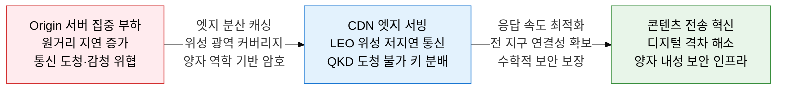
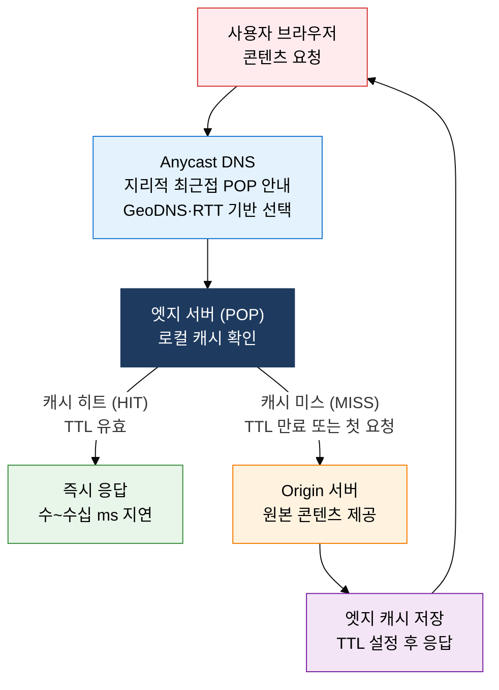
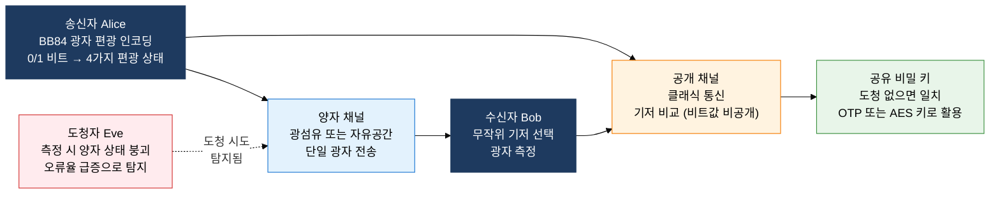

## 1. 콘텐츠 전송 최적화·위성 광역망·양자 보안 통신, CDN·위성·QKD의 개요

**정의**: 지리적으로 분산된 엣지 서버 캐싱(CDN), 저궤도 위성 군집(LEO), 양자 역학 기반 키 분배(QKD)를 결합하여 전송 지연 최소화, 전 지구적 연결성, 수학적으로 증명된 보안을 동시에 달성하는 차세대 네트워크 인프라 기술.
- CDN은 Origin 서버의 콘텐츠를 사용자 근처 엣지 POP(Point of Presence)에 캐싱하여 RTT(Round-Trip Time)를 수십 ms 수준으로 단축한다.
- LEO 위성 통신은 기존 GEO(정지궤도) 대비 궤도 고도를 1/18로 낮춰 전파 지연을 20~40ms로 감소시키며, Starlink·OneWeb 등이 수천~수만 기 위성 군집을 구성 중이다.
- QKD(Quantum Key Distribution)는 양자 중첩·얽힘·불확정성 원리로 도청 시 양자 상태가 붕괴되어 반드시 탐지되는 물리적 보안 특성을 제공하며, PQC(Post-Quantum Cryptography)와 상호 보완 관계를 형성한다.

**특징**:
- **분산 엣지 아키텍처**: CDN은 Anycast DNS 기반 지리적 근접 서버 선택, 동적 콘텐츠 가속(ESI·API 캐싱), DDoS 흡수 능력으로 Origin 서버를 보호
- **저궤도 군집 위성**: Starlink 위성 간 레이저 링크(ISL, Inter-Satellite Link)로 지상 중계국 의존 없이 위성 간 직접 라우팅, 오지·해상·항공 등 지상망 미도달 지역 광대역 서비스 가능
- **양자 보안 이중 방어**: QKD로 현재 키 교환을 양자 내성화하고, PQC 알고리즘(CRYSTALS-Kyber, CRYSTALS-Dilithium 등)으로 소프트웨어 레벨 양자 내성을 병행 적용하여 계층적 보안 구현

---

## 2. CDN·위성 통신·양자 암호 통신의 핵심 구성 체계

### 가. CDN (Content Delivery Network) 아키텍처

| 구분 | CDN 적용 전 | CDN 적용 후 | 주요 CDN 서비스 |
|---|---|---|---|
| **응답 지연** | Origin까지 RTT 100~300ms (해외 Origin 시) | 최근접 엣지 POP RTT 5~30ms | Cloudflare (전 세계 300개 이상 POP) |
| **Origin 부하** | 전체 요청이 Origin 서버에 집중, 피크 시 병목 | 캐시 히트율 90% 이상 시 Origin 트래픽 90% 감소 | Akamai (2만개 이상 서버, 최대 CDN) |
| **DDoS 대응** | Origin IP 노출, 직접 공격 취약 | 엣지 POP에서 공격 트래픽 흡수·차단, Origin IP 은닉 | AWS CloudFront (S3·ALB 연동, Lambda@Edge) |
| **HTTPS 가속** | Origin에서 TLS 핸드셰이크 처리, 부하 집중 | 엣지에서 TLS 종료, HTTP/2·QUIC 적용, OCSP 스테이플링 | Fastly (실시간 캐시 퍼지, Edge Compute 지원) |

> **정적 CDN vs 동적 CDN**: 정적 CDN은 이미지·CSS·JavaScript·폰트 등 변경이 없는 자산을 캐싱하여 TTL 기간 동안 서빙한다. 동적 CDN은 ESI(Edge Side Includes), Edge Computing(Cloudflare Workers·Lambda@Edge), API 가속을 통해 개인화 콘텐츠도 엣지에서 처리하여 Origin 의존도를 낮춘다.

---

### 나. LEO 위성 통신 및 양자 암호 통신 (QKD)

| 비교 항목 | GEO (정지궤도) | MEO (중궤도) | LEO (저궤도) |
|---|---|---|---|
| **궤도 고도** | 35,786km | 2,000~20,000km | 200~2,000km |
| **전파 지연** | 약 600ms (왕복) | 40~200ms | 20~40ms (Starlink 기준) |
| **커버리지** | 위성 3기로 극지방 제외 전 지구 커버 | 중간 커버리지, GPS용 최적 | 단일 위성 커버리지 작음, 군집 필요 |
| **주요 용도** | 방송·기상·기존 위성 인터넷 | GPS/GNSS, O3b(해양) | Starlink, OneWeb, Project Kuiper |
| **단점** | 높은 지연으로 실시간 통신 부적합 | 밴앨런 방사선대 영향 | 수천~수만 기 군집 필요, 우주 쓰레기 우려 |

| 비교 항목 | QKD (Quantum Key Distribution) | PQC (Post-Quantum Cryptography) |
|---|---|---|
| **원리** | 양자 역학(BB84 등) 기반 물리적 보안 | 수학적 난제(격자·해시·코드 기반) 기반 계산 보안 |
| **보안 근거** | 물리 법칙 위반 불가 — 정보이론적 완전 보안 | 양자컴퓨터로도 풀기 어려운 수학 문제 (증명되지 않음) |
| **인프라** | 전용 양자 채널(광섬유·자유공간), 특수 장비 필요 | 기존 인터넷·소프트웨어 라이브러리로 구현 가능 |
| **거리 한계** | 광섬유 100~150km (양자 중계기로 확장 연구 중) | 거리 제한 없음, 인터넷 전구간 적용 가능 |
| **표준** | ITU-T Y.3800, ETSI QKD 표준 | NIST 2024 표준화 완료 (ML-KEM, ML-DSA, SLH-DSA) |

> **BB84 프로토콜 핵심**: Alice는 광자를 4가지 편광 상태(수평·수직·45도·135도)로 인코딩하여 전송하고, Bob은 무작위로 직선 또는 대각선 기저를 선택해 측정한다. 공개 채널에서 기저 일치 여부만 비교하고 비트값은 공개하지 않아 일치한 비트만 키로 사용한다. 도청자 Eve가 측정하면 하이젠베르크의 불확정성 원리에 의해 양자 상태가 붕괴되어 비트 오류율(QBER)이 25% 이상으로 급증하므로 도청을 반드시 탐지할 수 있다.

---

## 3. CDN·위성 통신·양자 암호 통신 도입의 기대효과 및 활용 방안

| 구분 | 주요 기대효과 | 활용 및 실무 적용 방안 |
|---|---|---|
| **성능·사용자 경험** | 콘텐츠 응답 시간 80% 이상 단축, 페이지 로딩 2초 이내 달성, Core Web Vitals 개선으로 SEO 순위 향상 | CDN 캐시 히트율 95% 목표로 TTL·캐시 키 최적화, Edge Computing(Lambda@Edge)으로 A/B 테스트·개인화 엣지 처리, QUIC/HTTP3 프로토콜 적용으로 모바일 환경 성능 강화 |
| **연결성·포용성** | 지상망 미도달 지역 100Mbps급 브로드밴드 제공, 디지털 격차 해소, 재난·분쟁 지역 긴급 통신망 구성 | Starlink/LEO 위성 인터넷을 도서 산간 지역 학교·의료시설에 연결, 해상 선박·항공기 in-flight WiFi 서비스, 재난 대응 이동식 위성 통신 기지 운용 |
| **보안·암호 내성** | 현재 RSA·ECC 키 교환의 양자컴퓨터 취약점 사전 대응, 국가 기밀·금융 데이터 장기 보안 확보 | QKD 전용 광섬유망으로 금융 결제망·정부 기관 핵심 통신 구간 보호, PQC CRYSTALS-Kyber로 TLS 1.3 키 교환 교체, 하이브리드 암호(QKD+PQC) 이중 방어 구현 |
| **비용·운영 효율** | Origin 서버 트래픽·서버 비용 절감, 위성 통신 전용선 대비 OPEX 80% 절감, 보안 사고 예방으로 막대한 침해 비용 회피 | CDN 캐시 무효화 자동화(Cache Invalidation API)로 운영 공수 절감, 위성-지상망 하이브리드 구성으로 링크 이중화 및 비용 최적화, NIST PQC 라이브러리(liboqs) 오픈소스 적용으로 전환 비용 최소화 |
