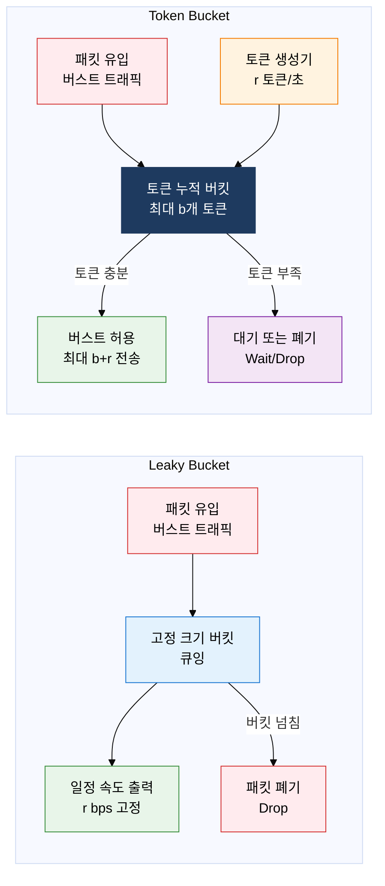
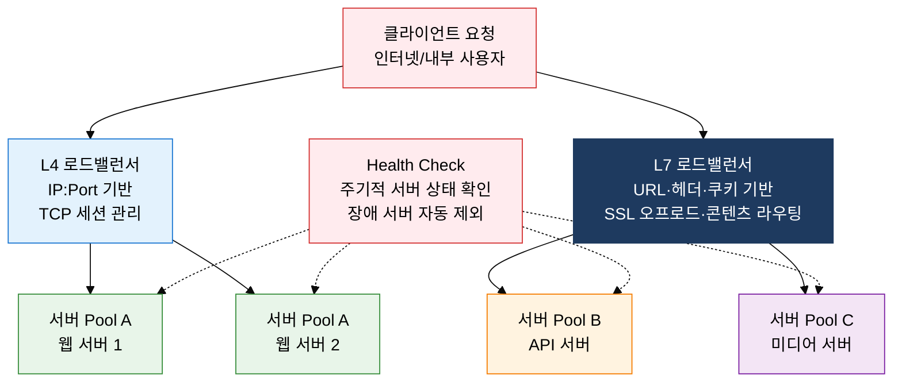

# QoS 및 트래픽 관리

## 1. 대역폭·지연·손실을 보장하는 트래픽 품질 제어, QoS의 개요

**정의**: 네트워크 트래픽을 분류·마킹·큐잉하여 대역폭(Bandwidth), 지연(Latency), 손실률(Packet Loss) 등 품질 파라미터를 서비스별로 차별 보장하는 트래픽 제어 메커니즘.
- 음성(VoIP)·영상 스트리밍·실시간 게임 등 지연에 민감한 서비스에 높은 우선순위를 부여하고, 파일 전송·이메일 등 지연에 둔감한 서비스는 남은 대역폭을 사용한다.
- IETF RFC 2475(DiffServ), RFC 2210(IntServ/RSVP) 등 표준 프로토콜을 기반으로 엣지~코어 전 구간에 적용한다.
- 클라우드·SD-WAN·5G 코어 네트워크에서 슬라이싱 기술과 결합되어 서비스별 격리된 품질 보장의 핵심 기반이 된다.

**특징**:
- **트래픽 차별화**: DSCP/IP Precedence 마킹으로 서비스 클래스를 구분하고, 라우터·스위치가 이를 인식하여 클래스별 큐잉·스케줄링을 수행
- **혼잡 제어**: WRED(Weighted Random Early Detection)·TailDrop 등으로 큐 포화 전 선제적 패킷 폐기, TCP 백오프 유도로 버퍼 블로트 방지
- **단대단(End-to-End) 보장**: 출발지~목적지 모든 구간의 네트워크 장비가 동일한 QoS 정책을 인식해야 SLA 품질이 보장되는 협력적 메커니즘

---

## 2. QoS 및 트래픽 관리의 핵심 구성 체계

### 가. QoS 보장 모델 및 트래픽 쉐이핑

| 비교 항목 | IntServ (Integrated Services) | DiffServ (Differentiated Services) |
|---|---|---|
| **자원 예약** | 연결별 RSVP 시그널링으로 경로상 모든 라우터에 대역폭·버퍼 예약 | 사전 자원 예약 없음, DSCP 마킹 기반 Per-Hop Behavior(PHB)만 정의 |
| **확장성** | 연결 수에 비례한 상태 정보 유지, 코어 확장 어려움 | 트래픽 클래스(6~8개)만 관리, 인터넷 규모 확장 용이 |
| **복잡도** | RSVP PATH·RESV 메시지 교환, 경로상 모든 장비 IntServ 지원 필요 | 엣지 라우터 마킹·분류, 코어는 DSCP만 읽으면 됨 |
| **RSVP** | 핵심 시그널링 프로토콜, 연결 설정·해제 시 명시적 시그널 필요 | 사용 안 함, DS 도메인 내 정적 정책으로 운영 |
| **적용 환경** | 기업 내부 소규모 네트워크, VoIP 보장이 필요한 MPLS TE | ISP 백본, CDN, 엔터프라이즈 WAN, 인터넷 규모 서비스 |

> **트래픽 쉐이핑 비교**: Leaky Bucket은 버스트를 완전히 제거하고 일정 속도(r bps)로 평탄화하는 반면, Token Bucket은 누적 토큰(최대 b개)만큼 순간 버스트를 허용하여 실제 애플리케이션 트래픽 패턴에 더 유연하게 대응한다. 실무에서는 Token Bucket 변형인 **srTCM**(Single-rate Three Color Marker)·**trTCM**(Two-rate Three Color Marker) 방식을 주로 사용한다.

---

### 나. 로드 밸런싱 (Load Balancing)

| 알고리즘 | 분산 기준 | 특징 | 적합 케이스 |
|---|---|---|---|
| **Round Robin** | 서버 순번 순환 | 구현 단순, 서버 성능 차이 무시 | 동일 스펙 서버, 단순 웹 서비스 |
| **Weighted Round Robin** | 서버별 가중치 비율 | 고성능 서버에 더 많은 요청 배분 | 이기종 서버 혼합 운영 환경 |
| **IP Hash** | 클라이언트 IP 해시값 | 동일 IP는 항상 같은 서버로 라우팅, 세션 유지 | 쇼핑몰 장바구니, 세션 기반 서비스 |
| **Least Connection** | 현재 활성 연결 수 최소 서버 | 처리 시간 긴 요청에 효과적, 동적 부하 반영 | API 서버, 처리 시간 가변적인 서비스 |
| **Least Response Time** | 응답 시간+연결 수 복합 지표 | 가장 빠르게 응답하는 서버 우선 선택 | 고가용성 금융·결제 서비스 |

> **L4 vs L7 비교**: L4 로드밸런서는 OSI 전송 계층(IP/포트)에서 동작하여 처리 속도가 빠르고 SSL 핸드셰이크 부하가 없으나, 콘텐츠 기반 라우팅이 불가능하다. L7 로드밸런서는 HTTP 헤더·URL·쿠키를 파싱하여 마이크로서비스 API 게이트웨이, A/B 테스팅, 블루-그린 배포 등 고급 라우팅이 가능하며 SSL/TLS 오프로드로 백엔드 서버 암호화 부담을 제거한다.

---

## 3. QoS 및 트래픽 관리 도입의 기대효과 및 활용 방안

| 구분 | 주요 기대효과 | 활용 및 실무 적용 방안 |
|---|---|---|
| **서비스 품질** | VoIP·영상회의 지터 50ms 이내 보장, 패킷 손실률 1% 미만 유지, 실시간 서비스 SLA 충족 | DiffServ DSCP EF(Expedited Forwarding) 클래스를 VoIP에 할당, WRED로 TCP 혼잡 선제 제어, 엔터프라이즈 WAN·MPLS 구간 QoS 정책 연동 |
| **가용성·확장성** | 서버 장애 시 자동 트래픽 우회, 무중단 서비스 제공, 피크 트래픽 처리 능력 수평 확장 | L7 로드밸런서 Health Check 주기 5초 설정, 장애 서버 30초 내 자동 제외, Auto Scaling 그룹과 로드밸런서 API 연동으로 탄력적 증설 |
| **보안·안정성** | DDoS 트래픽 Rate Limiting으로 서버 보호, 이상 트래픽 쉐이핑으로 네트워크 안정성 확보 | Token Bucket 기반 Rate Limiting으로 클라이언트 IP별 초당 요청 제한, L7 로드밸런서 WAF 통합, QoS 정책으로 공격 트래픽 우선순위 강등 |
| **비용 최적화** | 트래픽 패턴 가시성 확보로 과투자 방지, 링크 활용률 극대화, 클라우드 전송 비용 절감 | SD-WAN QoS 정책으로 저가 인터넷 링크 활용 극대화, 중요 트래픽은 MPLS, 일반 트래픽은 브로드밴드로 분리 라우팅, 월별 QoS 보고서로 대역폭 최적화 |
