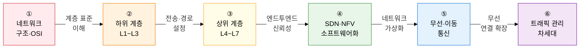

네트워크는 **"데이터를 어떻게 안전하고 빠르게 전달할 것인가"** 라는 질문에 대한 체계적 답변입니다.  
OSI 7계층의 수학적 기반부터 5G·SDN·양자 암호 통신의 최신 패러다임까지, 데이터 전송 전 과정을 다룹니다.

## 학습 로드맵 — 6단계 흐름

---

## ① 네트워크 구조 및 OSI 7 참조 모델

> **"모든 네트워크 이론의 표준이자 기본 뼈대"** 입니다.  
> 각 계층의 역할·PDU·대표 프로토콜·장비를 연계하여 암기하고, 캡슐화 흐름을 한 눈에 그릴 수 있어야 합니다.

| 순서 | 토픽 | 핵심 키워드 | 중요도 |
|:---:|---|---|:---:|
| 1 | [네트워크 아키텍처 기초](01-osi-model/network-architecture) | 회선 교환 vs 패킷 교환, 가상회선 vs 데이터그램, Mesh/Star/Bus/Ring/Tree 토폴로지 | ★★☆ |
| 2 | [OSI 7계층 및 TCP/IP](01-osi-model/osi-tcpip) | 7계층 기능·PDU·프로토콜·장비 매핑, TCP/IP 4계층, 캡슐화·역캡슐화 | ★★★ |

**→ 핵심 학습법**: OSI 7계층 표(계층번호·PDU·프로토콜·장비)를 7행 완전히 암기하고, 캡슐화 단계별 헤더 추가 과정을 손으로 그려보세요.

---

## ② 하위 계층 (L1~L3) 프로토콜 및 기술

> **"물리 전송부터 경로 배정까지"** 를 다룹니다.  
> CSMA/CD와 CSMA/CA의 차이, STP 포트 역할, OSPF Area 개념, ARP 동작은 시험 빈출 영역입니다.

| 순서 | 토픽 | 핵심 키워드 | 중요도 |
|:---:|---|---|:---:|
| 3 | [L1/L2 MAC 및 에러·흐름 제어](02-lower-layers/l1-l2-mac-error) | CSMA/CD(유선) vs CSMA/CA(무선), Stop-and-Wait, Go-Back-N, Selective Repeat ARQ | ★★★ |
| 4 | [L2 스위치·VLAN·STP](02-lower-layers/l2-switch-vlan-stp) | MAC 5동작(Learning/Forwarding/Filtering/Flooding/Aging), IEEE 802.1Q, STP/RSTP/MSTP | ★★★ |
| 5 | [L3 IP 주소 체계](02-lower-layers/l3-ip-addressing) | Classful vs CIDR, 서브네팅·슈퍼네팅, IPv4 vs IPv6, 듀얼스택·터널링·변환, NAT/PAT | ★★★ |
| 6 | [L3 라우팅 프로토콜](02-lower-layers/l3-routing) | IGP vs EGP, RIP(Bellman-Ford), OSPF(Dijkstra·Area), BGP(AS Path), ARP·ICMP·IGMP | ★★★ |

**→ 핵심 학습법**: 라우팅 프로토콜 3종(RIP/OSPF/BGP)의 **알고리즘·메트릭·적용 범위·수렴 속도**를 비교 표로 정리하고, ARP Request/Reply 흐름을 MAC 테이블 관점에서 추적하세요.

---

## ③ 상위 계층 (L4~L7) 프로토콜 및 전송 제어

> **"엔드-투-엔드 신뢰성 있는 데이터 전송과 애플리케이션 서비스"** 를 처리합니다.  
> TCP 3-Way Handshake와 혼잡 제어 4단계, HTTP/3 QUIC는 최빈출 서술형 주제입니다.

| 순서 | 토픽 | 핵심 키워드 | 중요도 |
|:---:|---|---|:---:|
| 7 | [L4 전송 계층 (TCP/UDP)](03-upper-layers/l4-tcp-udp) | TCP vs UDP, 3-Way/4-Way Handshake, 상태 전이, 슬라이딩 윈도우, Slow Start·CA·Fast Retransmit | ★★★ |
| 8 | [HTTP 프로토콜의 진화](03-upper-layers/l7-http-evolution) | HTTP/1.1(Keep-Alive·Pipelining·HOL Blocking), HTTP/2(멀티플렉싱·HPACK), HTTP/3(QUIC·0-RTT) | ★★★ |
| 9 | [DNS·DHCP 및 응용 프로토콜](03-upper-layers/l7-dns-dhcp) | DNS 재귀/반복 쿼리·레코드 8종, DHCP DORA, FTP Active/Passive, SMTP, SNMP | ★★☆ |

**→ 핵심 학습법**: TCP 혼잡 제어의 **cwnd 그래프**(Slow Start→CA→Fast Retransmit 사이클)를 시간축으로 직접 그리고, HTTP/1.1 vs HTTP/2 vs HTTP/3의 **HOL Blocking 해결 방식** 차이를 한 문장으로 설명할 수 있어야 합니다.

---

## ④ 차세대 소프트웨어 정의 네트워크 (SDN/NFV)

> **"클라우드 컴퓨팅 인프라의 핵심이 되는 현대 네트워크 패러다임"** 입니다.  
> SDN의 Control/Data Plane 분리와 OpenFlow 동작 원리는 출제 빈도가 매우 높습니다.

| 순서 | 토픽 | 핵심 키워드 | 중요도 |
|:---:|---|---|:---:|
| 10 | [SDN 및 OpenFlow](04-sdn-nfv/sdn-openflow) | Control Plane·Data Plane 분리, 3계층 아키텍처(NorthBound/SouthBound API), 플로우 테이블 | ★★★ |
| 11 | [NFV·VxLAN·SD-WAN](04-sdn-nfv/nfv-vxlan-sdwan) | ETSI NFV(VNF/NFVI/MANO), VxLAN 24비트 VNI, SD-WAN vs MPLS | ★★★ |

**→ 핵심 학습법**: SDN 3계층 아키텍처를 TD 다이어그램으로 그리고, OpenFlow Packet-In/Flow-Mod 메시지 흐름을 순서대로 설명하세요. VxLAN이 VLAN 4096 한계를 어떻게 극복하는지(24비트 VNI) 핵심 근거를 암기하세요.

---

## ⑤ 무선 및 이동 통신 기술

> **"모바일·IoT 환경을 지탱하는 무선 통신 기술 표준"** 입니다.  
> 5G 3대 시나리오(eMBB/URLLC/mMTC)와 네트워크 슬라이싱, Wi-Fi 6의 OFDMA는 최신 출제 트렌드입니다.

| 순서 | 토픽 | 핵심 키워드 | 중요도 |
|:---:|---|---|:---:|
| 12 | [무선 LAN (Wi-Fi) 기술 표준](05-wireless-mobile/wifi-standards) | IEEE 802.11 세대별 진화, MIMO·Massive MIMO, OFDMA, MU-MIMO, BSS Coloring | ★★☆ |
| 13 | [5G / 차세대 6G](05-wireless-mobile/5g-6g) | eMBB·URLLC·mMTC, 네트워크 슬라이싱, MEC, NSA vs SA, 6G(THz·NTN·RIS) | ★★★ |
| 14 | [근거리 무선 통신 및 IoT](05-wireless-mobile/iot-wireless) | BLE·ZigBee·Z-Wave·UWB, LoRa(SF·LoRaWAN), NB-IoT, LTE-M | ★★☆ |

**→ 핵심 학습법**: 5G 3대 시나리오의 **목표 속도·지연·연결 밀도·응용 분야**를 표로 외우고, NSA(5G NR + LTE Core)와 SA(5G NR + 5GC)의 차이를 아키텍처 다이어그램으로 설명하세요.

---

## ⑥ 트래픽 관리 및 차세대 네트워크 아키텍처

> **"대규모 트래픽 제어와 신기술 연계 차세대 네트워크"** 를 다룹니다.  
> QoS 모델 비교, CDN 동작 원리, QKD 양자 암호는 실무·최신 트렌드 출제 영역입니다.

| 순서 | 토픽 | 핵심 키워드 | 중요도 |
|:---:|---|---|:---:|
| 15 | [QoS 및 트래픽 관리](06-traffic-management/qos-traffic) | IntServ(RSVP) vs DiffServ(DSCP), Leaky Bucket vs Token Bucket, L4/L7 로드밸런싱 알고리즘 | ★★☆ |
| 16 | [CDN·위성 통신·양자 암호](06-traffic-management/cdn-satellite-quantum) | CDN Anycast DNS·엣지 캐싱, LEO(Starlink·저지연), QKD BB84·PQC | ★★☆ |

**→ 핵심 학습법**: Leaky Bucket과 Token Bucket의 **버스트 허용 여부**가 핵심 차이입니다. QKD BB84 프로토콜의 도청 탐지 원리(양자 상태 붕괴)를 한 문장으로 설명할 수 있어야 합니다.

---

## 기술사 시험 전략

| 출제 패턴 | 핵심 대응 전략 |
|---|---|
| **흐름 추적 서술** | "URL 입력 시 일어나는 일"을 DNS→ARP→TCP 3-Way→HTTP 순으로 레이어별 도해 |
| **비교 문제** | CSMA/CD vs CSMA/CA, TCP vs UDP, RIP vs OSPF vs BGP, IntServ vs DiffServ, NSA vs SA 비교표 암기 |
| **헤더 구조 서술** | TCP 헤더(시퀀스번호·ACK·윈도우·플래그), IP 헤더(TTL·프로토콜·주소), IEEE 802.1Q(VID 필드) |
| **최신 트렌드** | HTTP/3 QUIC 원리, SDN OpenFlow 동작, 5G 네트워크 슬라이싱, QKD BB84, LEO 위성 |
| **정의 + 특징** | 각 토픽 정의(한 문장) + 특징 3개를 **키워드** 볼드 형식으로 서술하는 연습 |
