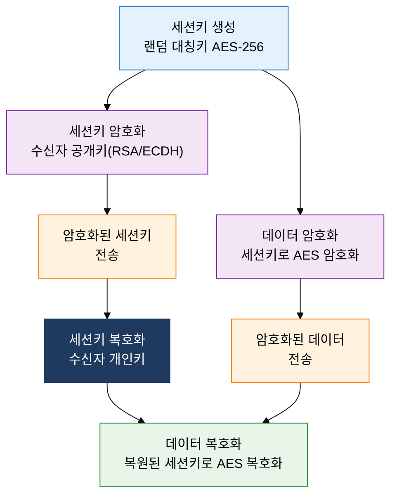

## 1. 공개키·개인키 쌍으로 키 배송 문제를 해결, 비대칭키 암호화의 개요

**정의**: 수학적으로 연관된 공개키와 개인키 쌍을 사용하여 키 배송 문제를 해결하고 기밀성·인증·부인방지를 보장하는 암호화 방식.
- 공개키는 누구에게나 공개하고, 개인키는 소유자만 보유하는 비대칭 구조
- RSA(소인수 분해), DH(이산 대수), ECC(타원곡선 이산 대수) 등 수학적 난제 기반
- 속도가 느려 대용량 데이터 암호화보다 키 교환·전자서명·인증에 주로 활용

**특징**:
- **키 배송 해결**: 공개키를 사전 공유하면 별도의 비밀 채널 없이도 안전한 통신 세션 수립 가능
- **다용도 보안 속성**: 암호화(공개키→개인키)와 서명(개인키→공개키) 방향에 따라 기밀성·부인방지 동시 지원
- **수학적 안전성**: 소인수 분해·이산 대수 문제의 계산 복잡도에 의존, 양자 컴퓨팅 위협 대응을 위한 PQC 전환 진행 중

---

## 2. 비대칭키 암호화의 핵심 구성 체계

### 가. RSA·DH·ECC 알고리즘 원리 및 비교

| 알고리즘 | 수학적 기반 | 주요 용도 | 권장 키 길이 | 성능 특성 |
|---|---|---|---|---|
| **RSA** | 소인수 분해 어려움 | 암호화, 전자서명, 키 교환 | 2048 / 4096비트 | 느림, 범용 표준 |
| **DH / ECDH** | 이산 대수 문제 | 키 교환 전용 (암호화 아님) | DH 2048비트, ECDH 256비트 | 중간, TLS 세션키 교환 |
| **ECC / ECDSA** | 타원곡선 이산 대수 | 전자서명, 키 교환 | 256비트 (RSA 3072비트 동등) | 빠름, 모바일·IoT 적합 |

---

### 나. 하이브리드 암호 시스템 구조

| 비교 항목 | 대칭키 암호화 | 비대칭키 암호화 |
|---|---|---|
| **키 수** | 통신 쌍마다 별도 비밀키 필요 | 공개키·개인키 1쌍으로 다자 통신 가능 |
| **속도** | 매우 빠름 (AES: 수 Gbps) | 느림 (RSA: 수 Kbps 수준) |
| **키 배송** | 안전한 키 전달 채널 별도 필요 | 공개키 공개로 키 배송 문제 해결 |
| **용도** | 대용량 데이터 암호화 | 키 교환, 전자서명, 인증서 |
| **대표 예시** | AES, SEED, ARIA, LEA | RSA, ECC, DH, ECDSA |

---

## 3. 비대칭키 암호화 도입의 기대효과 및 활용 방안

| 구분 | 주요 기대효과 | 활용 및 실무 적용 방안 |
|---|---|---|
| **키 관리** | 공개키 배포만으로 안전한 통신 세션 수립, 키 배송 위험 제거 | PKI 기반 공개키 인프라 구축, TLS 1.3 ECDHE로 전방 비밀성 확보 |
| **인증·서명** | 개인키 서명으로 신원 증명 및 부인방지 법적 효력 확보 | 전자계약·전자세금계산서 ECDSA 서명, 코드 서명 인증 |
| **하이브리드 최적화** | RSA/ECDH로 세션키 교환 후 AES로 데이터 처리, 성능·보안 균형 | HTTPS·SSH·VPN 모두 하이브리드 구조 적용, API 인증 JWT RS256 |
| **미래 대응** | ECC 전환으로 RSA 대비 키 길이 단축, PQC 이행 준비 단계 확보 | NIST PQC 표준(CRYSTALS-Kyber) 병행 검토, HSM 기반 키 보호 |
