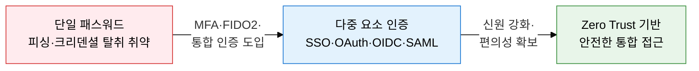
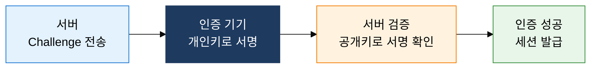
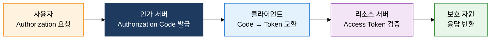

## 1. 다중 요소·생체·통합 인증으로 신원 검증 강화, 사용자 인증 기술의 개요

**정의**: 지식·소유·존재·행위 4대 요소를 단독 또는 조합하여 사용자 신원을 검증하는 인증 기술 체계.
- MFA는 2개 이상의 인증 요소를 결합하여 단일 요소 탈취 시에도 보안을 유지
- FIDO2/WebAuthn·Passkey는 비밀번호 없는 인증으로 피싱 공격을 원천 차단
- OAuth 2.0·OIDC·SAML은 다중 서비스 환경에서 신원 연합과 권한 위임을 표준화

**특징**:
- **다중 요소 결합**: 지식·소유·생체 요소 조합으로 단일 요소 침해 시에도 계정 보호
- **비밀번호 탈피**: FIDO2·Passkey로 기기 내 개인키 기반 인증, 피싱·리플레이 공격 불가
- **연합 인증**: SSO·OIDC·SAML로 1회 인증 후 다수 서비스 접근, 사용자 경험 향상

---

## 2. 사용자 인증 기술의 핵심 구성 체계

### 가. 인증 4대 요소, MFA, FIDO2·Passkey

| 인증 요소 | 예시 | 장점 | 단점 |
|---|---|---|---|
| **지식 (Know)** | 패스워드, PIN, 보안 질문 | 구현 단순, 비용 최소 | 피싱·브루트포스 취약 |
| **소유 (Have)** | OTP, 스마트카드, 보안 토큰 | 물리적 탈취 필요 → 보안 강화 | 분실·도난 시 접근 불가 |
| **존재 (Are)** | 지문, 홍채, 얼굴, 정맥 인식 | 복제 어려움, 편의성 우수 | 생체 정보 변경 불가, 프라이버시 |
| **행위 (Do)** | 서명 패턴, 걸음걸이, 타이핑 리듬 | 지속적 인증 가능 | 환경 변화에 민감, 정확도 편차 |

---

### 나. 통합 인증 (SSO·OAuth 2.0·OIDC·SAML)

| 프로토콜 | 목적 | 형식 | 사용 환경 | 핵심 특징 |
|---|---|---|---|---|
| **SSO** | 1회 인증·다중 서비스 | 세션·토큰 기반 | 기업 내부 포털 | 중앙 인증, UX 향상 |
| **OAuth 2.0** | 권한 위임·리소스 접근 | Access Token (Bearer) | 소셜 로그인, API | 신원 인증 미포함, 권한 위임 전용 |
| **OIDC** | 신원 인증 + 권한 위임 | JWT (ID Token) | 웹·모바일 서비스 | OAuth 2.0 상위 레이어, 표준 클레임 |
| **SAML 2.0** | 기업 연합 인증 (SSO) | XML Assertion | 기업·교육·공공 | IdP·SP 연합, 레거시 호환성 우수 |

---

## 3. 사용자 인증 기술 도입의 기대효과 및 활용 방안

| 구분 | 주요 기대효과 | 활용 및 실무 적용 방안 |
|---|---|---|
| **보안성** | MFA·FIDO2로 크리덴셜 기반 공격 대폭 감소 | 관리자 계정 MFA 의무화, Passkey 기반 비밀번호리스 전환 |
| **편의성** | SSO·OIDC로 1회 로그인 후 다중 서비스 원활 접근 | Azure AD·Okta 연동 SSO 구축, 직원 경험 향상 |
| **표준화** | OAuth 2.0·OIDC·SAML로 이기종 시스템 인증 통합 | 사내 SaaS·온프레미스 통합 IdP 운영, API 보안 표준화 |
| **규제 준수** | 전자금융감독규정·개인정보보호법 인증 요건 충족 | 금융 서비스 2FA 의무화, 공공기관 FIDO 인증 연계 적용 |
