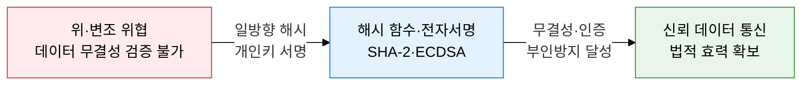
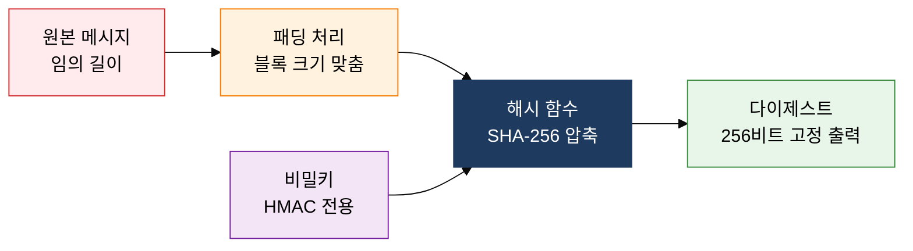
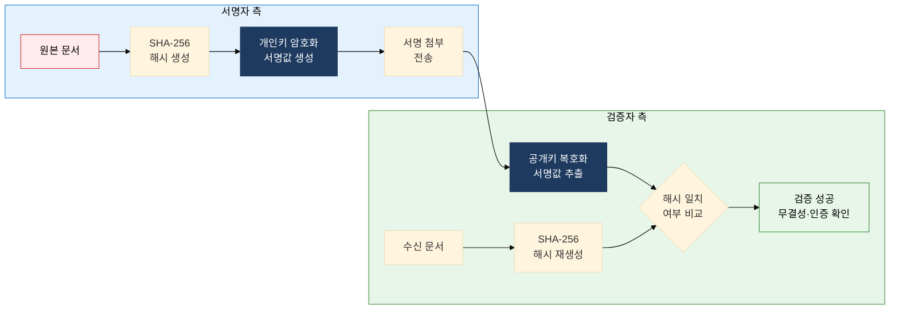

## 1. 일방향 해시와 서명으로 무결성·부인방지 보장, 해시 함수 및 디지털 서명의 개요

**정의**: 임의 길이의 입력을 고정 길이 다이제스트로 변환하는 일방향 함수로, 데이터 무결성·인증·부인방지를 보장하는 암호 기술.
- 해시 함수는 역산 불가, 동일 입력→동일 출력, 충돌 저항성의 세 가지 핵심 특성을 가짐
- HMAC은 해시 함수에 비밀키를 결합하여 무결성과 인증을 동시에 보장
- 전자서명은 개인키로 해시값을 암호화하여 법적 부인방지 효력을 제공

**특징**:
- **일방향성**: 다이제스트에서 원문 복원 불가능, 비밀번호 저장·파일 무결성 검증에 활용
- **충돌 저항성**: 동일 다이제스트를 생성하는 두 입력값 탐색이 계산적으로 불가능해야 함
- **부인방지 법적 효력**: 전자서명법에 의해 공인 전자서명은 자필 서명과 동등한 법적 효력 인정

---

## 2. 해시 함수 및 디지털 서명의 핵심 구성 체계

### 가. 해시 함수 구조 및 MAC·HMAC

| 알고리즘 | 출력 길이 | 보안 강도 | 충돌 취약 여부 | 주요 용도 |
|---|---|---|---|---|
| **MD5** | 128비트 | 취약 | 충돌 발견됨 | 레거시, 체크섬 한정 (보안 용도 사용 금지) |
| **SHA-1** | 160비트 | 취약 | 충돌 발견됨 | 구형 TLS·코드서명 (단계적 폐기) |
| **SHA-2** | 256/384/512비트 | 강함 | 발견 없음 | TLS 1.3, JWT, 전자서명, 파일 무결성 |
| **SHA-3** | 224/256/384/512비트 | 매우 강함 | 발견 없음 | 차세대 표준, Keccak 스펀지 구조 |

---

### 나. 전자서명 생성·검증 메커니즘

| 보안 속성 | 보장 방법 | 적용 메커니즘 |
|---|---|---|
| **무결성** | 해시값 불일치 시 위변조 탐지 | 수신측 SHA-256 재계산 후 서명 복호화 해시와 비교 |
| **인증** | 공개키 인증서로 서명자 신원 확인 | CA 발급 X.509 인증서로 공개키 소유자 신원 증명 |
| **부인방지** | 개인키 소유자만 서명 생성 가능 | TSA(Time Stamp Authority) 타임스탬프로 서명 시각 증명 강화 |

---

## 3. 해시 함수 및 디지털 서명 도입의 기대효과 및 활용 방안

| 구분 | 주요 기대효과 | 활용 및 실무 적용 방안 |
|---|---|---|
| **데이터 무결성** | SHA-256 해시 비교로 파일·메시지 위변조 즉시 탐지 | 소프트웨어 배포 체크섬 검증, 블록체인 트랜잭션 무결성 보장 |
| **인증 강화** | HMAC 적용으로 메시지 인증과 무결성 동시 보장 | API 인증 HMAC-SHA256, TLS MAC, JWT HS256 서명 적용 |
| **법적 부인방지** | 전자서명법 기반 공인 전자서명으로 계약 분쟁 방지 | 전자계약·전자세금계산서·공공 전자문서 ECDSA 서명 적용 |
| **알고리즘 현대화** | MD5·SHA-1 폐기 후 SHA-2/SHA-3 전환으로 충돌 공격 차단 | TLS 인증서 SHA-256 의무화, 코드서명 정책 SHA-2 마이그레이션 |
