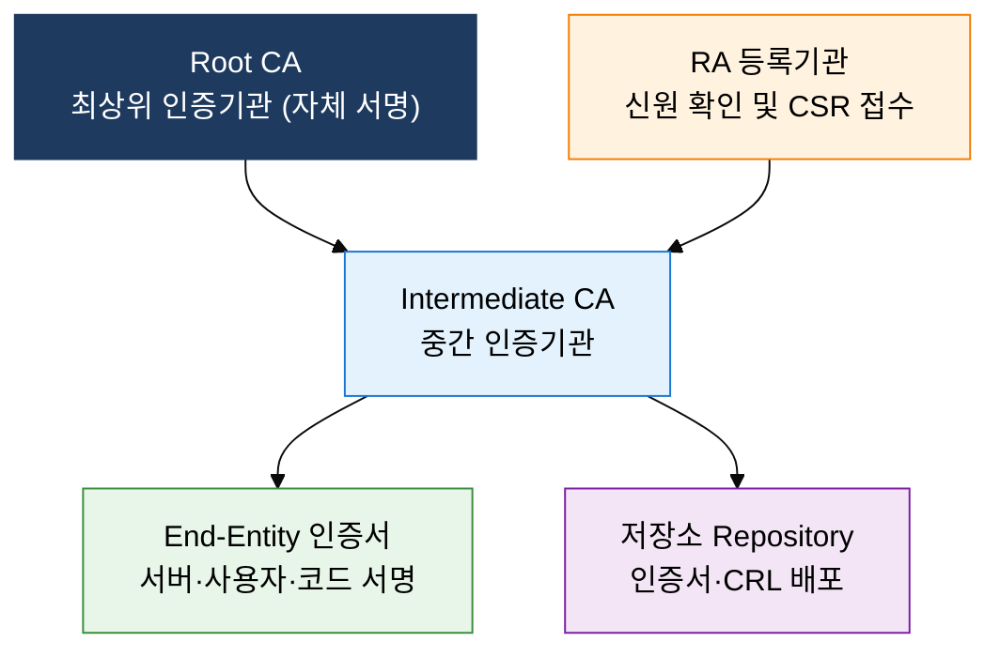
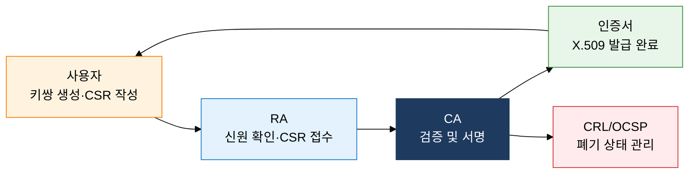

## 1. 공개키 신뢰 보증을 위한 인증서 관리 인프라, PKI의 개요

**정의**: 공개키 암호 기반으로 디지털 인증서를 발급·관리·폐기하여 안전한 신원 보증을 제공하는 신뢰 인프라.
- CA·RA·사용자·저장소 4대 요소로 구성되며 X.509 표준 인증서를 사용
- 인증서 유효기간, CRL, OCSP를 통해 인증서 생애주기 전체를 관리
- TLS/SSL, 전자서명, 전자정부 등 광범위한 인증 서비스의 기반 기술

**특징**:
- **신뢰 계층**: Root CA → Intermediate CA → End-Entity 인증서로 이어지는 계층적 신뢰 연쇄(Chain of Trust)
- **비대칭 검증**: 개인키로 서명하고 공개키로 검증하여 부인방지와 무결성을 동시에 보장
- **생애주기 관리**: 발급·갱신·폐기까지 CRL·OCSP로 실시간 상태 추적 가능

---

## 2. PKI의 핵심 구성 체계

### 가. PKI 구성 요소 및 신뢰 모델

| 구성 요소 | 역할 | 핵심 기능 |
|---|---|---|
| **CA (인증기관)** | 인증서 서명·발급 주체 | X.509 인증서 생성, CRL 발행, 정책 관리 |
| **RA (등록기관)** | 신청자 신원 확인 대행 | CSR 검토, CA에 발급 요청 전달 |
| **사용자 (개체)** | 인증서 보유·활용 주체 | 키쌍 생성, CSR 제출, 인증서 사용 |
| **저장소** | 인증서·CRL 배포 서버 | LDAP·HTTP 기반 CRL/인증서 공개 배포 |

---

### 나. 인증서 발급 및 폐기 프로세스

| 폐기 방식 | 실시간성 | 트래픽 부하 | 주요 단점 |
|---|---|---|---|
| **CRL** | 낮음 (주기적 배포) | 중간 (파일 다운로드) | 최신성 부족, 파일 비대화 |
| **OCSP** | 높음 (요청 시 조회) | 높음 (CA 서버 집중) | CA 가용성 의존, 프라이버시 노출 |
| **OCSP Stapling** | 높음 (서버 캐싱 제공) | 낮음 (서버가 응답 첨부) | 캐시 만료 시 최신성 저하 가능 |

---

## 3. PKI 도입의 기대효과 및 활용 방안

| 구분 | 주요 기대효과 | 활용 및 실무 적용 방안 |
|---|---|---|
| **보안성** | 공개키 기반 신원 검증으로 위·변조·사칭 원천 차단 | TLS 인증서 발급, S/MIME 이메일 서명·암호화 적용 |
| **신뢰성** | CA 계층 구조로 검증 가능한 신뢰 연쇄 확립 | 기업 내부 Private CA 구축, 코드 서명 인증서 운영 |
| **운영 효율** | CRL·OCSP Stapling으로 폐기 상태 자동 관리 | 인증서 만료 모니터링 자동화, ACME 프로토콜 자동 갱신 |
| **규제 준수** | 전자서명법·개인정보보호법 등 법적 요건 충족 | 전자정부 공인인증 연계, 금융 공개키 기반 인프라 적용 |
