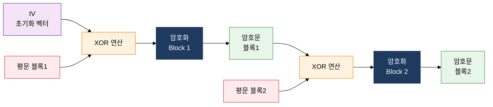
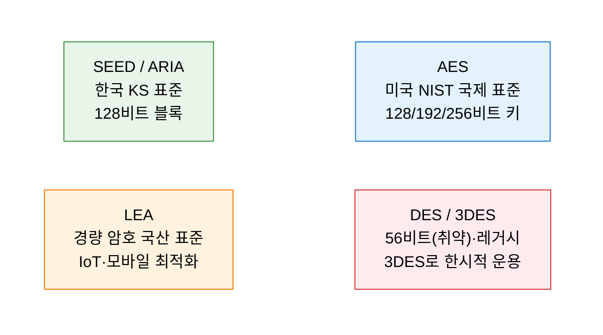

## 1. 동일 키로 암·복호화하는 고속 대칭 암호 체계, 대칭키 암호화의 개요

**정의**: 암호화와 복호화에 동일한 비밀키를 사용하여 데이터 기밀성을 보장하는 암호화 방식.
- 블록 단위 처리(블록 암호)와 비트/바이트 단위 처리(스트림 암호)로 구분됨
- AES·SEED·ARIA·LEA 등 국제 표준 및 국산 알고리즘이 다양하게 표준화됨
- 비대칭키 대비 10~100배 빠른 처리 속도로 대용량 데이터 암호화에 적합

**특징**:
- **고속성**: 단순한 XOR·치환·순열 연산 기반으로 하드웨어·소프트웨어 구현 모두 고속 처리 가능
- **키 관리 복잡성**: n명이 서로 통신 시 n(n-1)/2개의 키가 필요하여 키 관리 부담 증가
- **운영 모드 다양성**: ECB·CBC·CFB·OFB·CTR 등 운영 모드로 보안 강도와 성능 조절 가능

---

## 2. 대칭키 암호화의 핵심 구성 체계

### 가. 블록 암호 구조 및 운영 모드

| 운영 모드 | 병렬 처리 | IV 필요 | 에러 전파 | 주요 특징 |
|---|---|---|---|---|
| **ECB** | 가능 | 불필요 | 없음 | 블록 독립 처리, 동일 평문→동일 암호문, 패턴 노출 취약 |
| **CBC** | 불가 | 필요 | 1블록 | 이전 암호문 XOR 체이닝, 가장 일반적으로 사용 |
| **CFB** | 불가 | 필요 | 제한적 | 스트림 암호 방식 동작, 실시간 처리 적합 |
| **OFB** | 불가 | 필요 | 없음 | 키스트림 독립 생성, 에러 전파 없음 |
| **CTR** | 가능 | 불필요 | 없음 | 카운터 값 암호화, 병렬·랜덤 접근 지원 |

---

### 나. 주요 알고리즘 분류 및 비교

| 알고리즘 | 블록 크기 | 키 크기 | 개발 기관 | 주요 특징 |
|---|---|---|---|---|
| **AES** | 128비트 | 128/192/256비트 | NIST (미국) | Rijndael 기반, 현재 글로벌 표준 |
| **SEED** | 128비트 | 128비트 | KISA (한국) | 국내 전자금융·공공 분야 의무 적용 |
| **ARIA** | 128비트 | 128/192/256비트 | NSR (한국) | AES 대응 국산 표준, TLS 지원 |
| **LEA** | 128비트 | 128/192/256비트 | ETRI (한국) | 32비트 연산 기반, 소프트웨어 구현 고속 |

---

## 3. 대칭키 암호화 도입의 기대효과 및 활용 방안

| 구분 | 주요 기대효과 | 활용 및 실무 적용 방안 |
|---|---|---|
| **데이터 보호** | AES-256 적용으로 대용량 파일·DB 암호화 고속 처리 | 전자금융·의료기록 저장 암호화, 디스크 전체 암호화(FDE) |
| **표준 준수** | SEED·ARIA 사용으로 국내 법적 요구사항(개인정보보호법) 충족 | 금융 결제 시스템, 공공기관 전자문서 암호화 적용 |
| **성능 최적화** | CTR 모드 병렬 처리로 TLS 1.3 스트리밍 암호화 고속화 | CDN·API Gateway 계층 암호화, IoT 환경 LEA 경량 암호 적용 |
| **보안 강도** | 운영 모드 적절 선택으로 패턴 노출·에러 전파 위험 제거 | CBC→GCM 마이그레이션, AEAD 인증 암호화로 무결성 동시 보장 |
