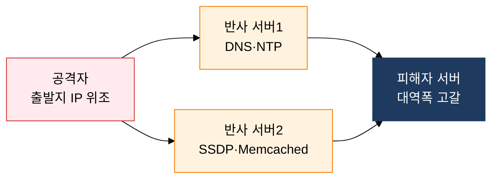

## 1. 창과 방패: 공격 메커니즘과 계층별 방어 전략, 네트워크 및 시스템 공격 기법의 개요

**정의**: 네트워크 프로토콜 구조 및 시스템 구현 취약점을 악용하여 가용성·기밀성·무결성을 침해하는 공격 기법과 그에 대응하는 계층별 방어 체계.
- 공격 계층에 따라 네트워크 계층(L3/L4) 공격과 애플리케이션 계층(L7) 공격으로 구분
- DoS/DDoS·IP 스푸핑·스니핑·세션 하이재킹·버퍼 오버플로우 등이 핵심 공격 유형
- 공격 원리 이해를 기반으로 IPS·WAF·ASLR·Stack Canary 등 다층 방어 적용

**특징**:
- **복합 공격**: 단일 기법보다 IP 스푸핑+DRDoS, ARP 스푸핑+스니핑처럼 기법 조합으로 탐지 우회
- **증폭 효과**: DRDoS의 경우 DNS·NTP 반사를 통해 원래 트래픽의 수십~수백 배 증폭 가능
- **메모리 안전성**: 버퍼 오버플로우 계열 공격은 ASLR·DEP·Stack Canary 삼중 방어로 완화

---

## 2. 네트워크 및 시스템 공격 기법의 핵심 구성 체계

### 가. DoS/DDoS 공격 유형 및 DRDoS 흐름

| 공격명 | 계층 | 원리 | 대응 방안 |
|---|---|---|---|
| **SYN Flooding** | L4 (TCP) | 대량 SYN 전송→Half-Open 연결 소진 | SYN Cookie, 연결 타임아웃 단축 |
| **UDP/ICMP Flooding** | L3/L4 | 대용량 패킷으로 대역폭 포화 | ISP 레벨 업스트림 필터링, 속도 제한 |
| **DRDoS** | L3/L4 | IP 위조+반사 서버 증폭으로 피해자 집중 | BCP38 ingress 필터링, Anti-DDoS 스크러빙 |
| **HTTP GET Flooding** | L7 | 정상 HTTP 요청 대량 전송으로 서버 과부하 | WAF 요청 속도 제한, CAPTCHA |
| **Slowloris** | L7 | 불완전 HTTP 요청으로 웹서버 연결 자원 소진 | 연결 타임아웃 설정, 동시 연결 수 제한 |

---

### 나. 시스템·네트워크 취약점 공격 기법

| 공격명 | 계층 | 원리 | 방어 대책 |
|---|---|---|---|
| **IP Spoofing** | L3 | 출발지 IP 위조로 신뢰 관계 악용·필터링 우회 | BCP38 ingress 필터링, RFC 2827 |
| **ARP Spoofing** | L2 | 위조 ARP Reply로 MAC 테이블 오염, 트래픽 도청 | DAI(Dynamic ARP Inspection), 정적 ARP |
| **Sniffing** | L2/L3 | 패킷 캡처로 평문 데이터 도청 | 전구간 TLS 암호화, 스위치 Port Security |
| **Session Hijacking** | L4/L7 | 세션 쿠키·토큰 탈취로 인증 우회 | HttpOnly·Secure 쿠키, CSRF 토큰, 세션 재생성 |
| **Stack Overflow** | L7/App | 스택 경계 초과→리턴 주소 덮어쓰기→셸코드 실행 | ASLR, DEP/NX, Stack Canary, strncpy 사용 |
| **Race Condition** | App | 공유 자원 TOCTOU(Time-of-check Time-of-use) 경쟁 | Mutex·Semaphore, 원자적 연산, 권한 최소화 |

---

## 3. 네트워크 및 시스템 공격 기법 대응의 기대효과 및 활용 방안

| 구분 | 주요 기대효과 | 활용 및 실무 적용 방안 |
|---|---|---|
| **가용성 보장** | Anti-DDoS 적용으로 볼류메트릭 공격 시에도 서비스 연속성 유지 | CDN 스크러빙 센터 연동, ISP 블랙홀 라우팅·BGP FlowSpec 적용 |
| **네트워크 위협 차단** | BCP38·DAI·Port Security로 스푸핑·스니핑 공격 차단 | 스위치 계층 ingress 필터, VLAN 분리, 802.1X 포트 인증 적용 |
| **시스템 견고성** | ASLR·DEP·Stack Canary 삼중 적용으로 메모리 취약점 악용 차단 | 컴파일 옵션 강화(PIE·Stack Protector), 퍼징 테스트 자동화 |
| **사고 대응력** | 공격 유형별 분류 지식으로 SIEM 탐지 규칙 정밀화·대응 시간 단축 | 공격 시그니처 기반 IPS 룰셋 갱신, Red Team 모의 침투 훈련 주기화 |
