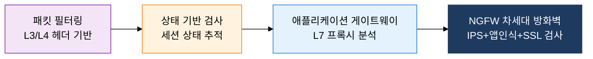
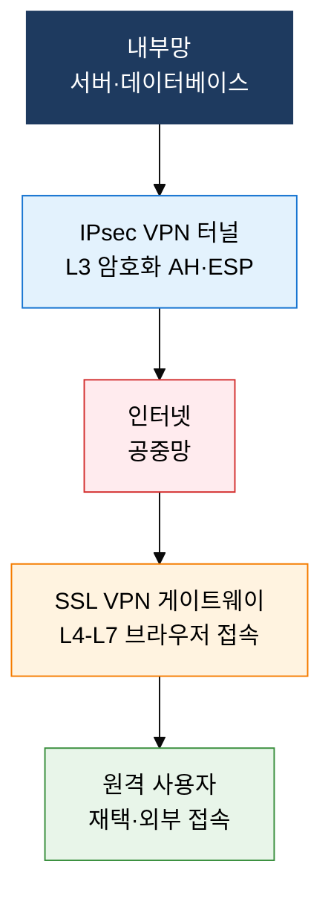

## 1. 경계 보안의 핵심 네트워크 보안 장비 체계, 방화벽·IDS·WAF·VPN의 개요

**정의**: 네트워크 경계에 방화벽·IDS/IPS·WAF·VPN을 계층적으로 배치하여 외부 위협을 탐지·차단하고 안전한 통신을 보장하는 보안 장비 체계.
- 방화벽은 트래픽 허용·차단의 1차 경계 통제, WAF는 웹 애플리케이션 전용 L7 방어
- IDS는 탐지·경보 역할, IPS는 인라인 배치로 실시간 차단까지 수행
- VPN은 공중망에서 암호화 터널로 안전한 원격 접속 및 사이트 간 연결 제공

**특징**:
- **심층 방어**: 방화벽→IPS→WAF 다계층 배치로 단일 장비 우회 시에도 추가 방어선 유지
- **가시성 확보**: IDS/IPS 로그·WAF 이벤트·VPN 접속 기록으로 위협 분석 및 포렌식 지원
- **원격 접근 보안**: IPsec·SSL VPN으로 외부에서 내부망 접근 시 기밀성·무결성 보장

---

## 2. 방화벽·IDS·WAF·VPN의 핵심 구성 체계

### 가. 방화벽 유형 진화와 IDS·IPS

| 방화벽 방식 | OSI 계층 | 장점 | 단점 |
|---|---|---|---|
| **패킷 필터링** | L3/L4 | 처리 속도 빠름, 구현 단순 | 애플리케이션 레이어 분석 불가 |
| **상태 기반 (Stateful)** | L3/L4 | 세션 추적, 동적 포트 제어 가능 | 세션 테이블 메모리 부담 |
| **애플리케이션 게이트웨이** | L7 | 콘텐츠 수준 정밀 분석 | 처리 지연, 성능 병목 |
| **NGFW** | L3~L7 | IPS·앱 인식·사용자 인증 통합 | 고비용, 설정 복잡성 |

---

### 나. WAF와 VPN

| 비교 항목 | IPsec VPN | SSL VPN |
|---|---|---|
| **동작 계층** | L3 (네트워크 계층) | L4~L7 (전송~애플리케이션) |
| **주요 프로토콜** | AH(인증), ESP(암호화+인증), IKE | TLS/DTLS |
| **클라이언트** | 전용 VPN 클라이언트 필수 | 브라우저 또는 경량 에이전트 |
| **보안 수준** | 전체 IP 패킷 암호화, 강력한 무결성 | 애플리케이션 레이어 선택 암호화 |
| **적합 환경** | 사이트 간 연결 (S2S), 전사 인프라 | 원격 근무자 개별 접속, BYOD |

---

## 3. 방화벽·IDS·WAF·VPN 도입의 기대효과 및 활용 방안

| 구분 | 주요 기대효과 | 활용 및 실무 적용 방안 |
|---|---|---|
| **경계 보안** | NGFW 기반 다계층 방어로 외부 침입 및 악성 트래픽 차단 강화 | DMZ 구성에 NGFW 배치, 인바운드·아웃바운드 정책 세분화 운영 |
| **웹 보안** | WAF의 OWASP Top 10 방어로 SQLi·XSS·CSRF 등 웹 공격 차단 | 클라우드 WAF(AWS WAF·CloudFlare) 연동, 시그니처 주기적 업데이트 |
| **침입 탐지** | IDS/IPS 이상 탐지로 알려진·미지 위협의 조기 식별 및 차단 | SIEM 연동 IPS 로그 분석, 오탐 최소화 튜닝 프로세스 수립 |
| **원격 접속** | IPsec·SSL VPN으로 재택·출장 시 내부망 수준 보안 접속 보장 | ZTNA로 VPN 대체 전환 로드맵 수립, 조건부 접근 정책 적용 |
