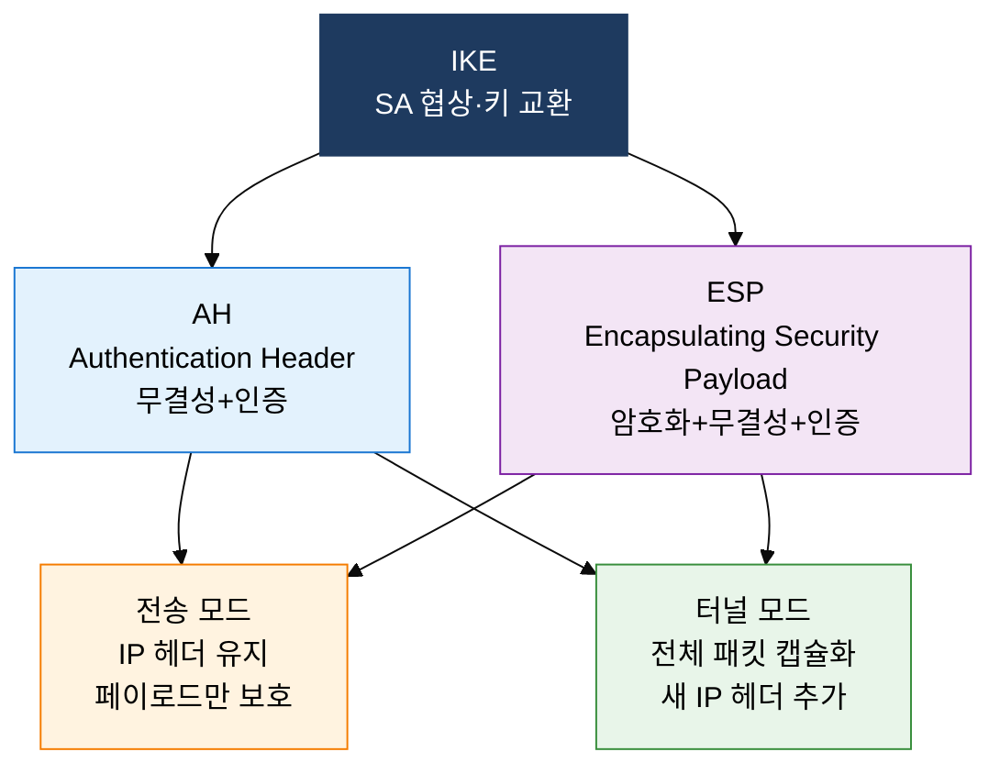

## 1. 전송·네트워크 계층 암호화로 통신 경로 보안, SSL/TLS 및 IPsec의 개요

**정의**: 전송 계층(TLS)과 네트워크 계층(IPsec)에서 암호화·무결성·인증을 제공하여 통신 경로 보안을 실현하는 네트워크 보안 프로토콜 체계.
- TLS는 TCP 위에서 동작하며 HTTPS·SMTP·IMAP 등 애플리케이션 프로토콜 보호에 적용
- IPsec은 IP 패킷 단위로 보호하며 VPN·원격 접속·사이트 간 연결에 사용
- TLS 1.3은 1-RTT 핸드셰이크와 순방향 기밀성(PFS)으로 이전 버전 취약점을 대폭 제거

**특징**:
- **계층적 보안**: L4(TLS)와 L3(IPsec)의 이중 보호로 애플리케이션·인프라 양 계층 동시 방어 가능
- **순방향 기밀성**: ECDHE 기반 임시 키 교환으로 세션 키 노출 시에도 과거 트래픽 보호 보장
- **상호 운용성**: 국제 표준(RFC) 기반으로 벤더 무관하게 이기종 장비·플랫폼 간 보안 통신 지원

---

## 2. SSL/TLS 및 IPsec의 핵심 구성 체계

### 가. SSL/TLS 핸드셰이크 및 TLS 1.3 개선 사항

| 구분 | TLS 1.2 | TLS 1.3 | 비고 |
|---|---|---|---|
| **RTT 수** | 2-RTT | 1-RTT | 50% 지연 단축 |
| **키 교환** | RSA·DHE·ECDHE 선택 | ECDHE 필수 | PFS 의무화 |
| **순방향 기밀성** | 선택적 적용 | 항상 보장 | 세션 키 독립성 |
| **지원 알고리즘** | RC4·DES·3DES·MD5·SHA-1 허용 | 취약 알고리즘 전면 제거 | 공격 표면 축소 |
| **0-RTT 재연결** | 미지원 | 세션 재개 지원 | 반복 접속 고속화 |

---

### 나. IPsec 구조 및 동작 모드

| 구분 | AH | ESP | 비고 |
|---|---|---|---|
| **암호화** | 미제공 | AES·3DES 제공 | ESP 우선 권장 |
| **무결성·인증** | HMAC으로 제공 | HMAC으로 제공 | IP 헤더 포함 여부 상이 |
| **헤더 위치** | IP 헤더 뒤 삽입 | IP 헤더 뒤·페이로드 앞 | 프로토콜 번호 51/50 |
| **적용 상황** | 무결성만 필요한 내부 통신 | 기밀성+무결성 모두 필요 | VPN은 ESP 터널 모드 표준 |

---

## 3. SSL/TLS 및 IPsec 도입의 기대효과 및 활용 방안

| 구분 | 주요 기대효과 | 활용 및 실무 적용 방안 |
|---|---|---|
| **전송 보안** | TLS 1.3 적용으로 HTTPS 도청·위변조 원천 차단 | 웹 서비스 TLS 1.3 강제 전환, HSTS·HPKP 헤더 적용 |
| **VPN 인프라** | IPsec ESP 터널 모드로 사이트 간 암호화 전용선 구성 | 본사-지사 간 IPsec VPN, 원격 근무자 클라이언트 VPN 적용 |
| **인증 강화** | 상호 인증서 검증으로 피싱·MITM 공격 사전 차단 | mTLS 기반 API Gateway 인증, 제로 트러스트 클라이언트 인증 |
| **규정 준수** | TLS 1.2 이상 의무화로 PCI-DSS·개인정보보호법 충족 | 금융·의료 시스템 TLS 버전 감사, 취약 암호 스위트 비활성화 |
