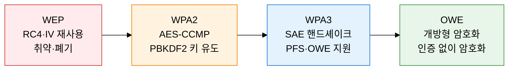
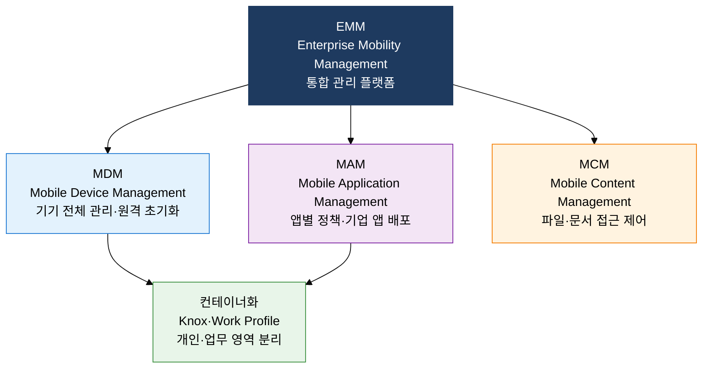

## 1. 무선·모바일 환경의 접근 제어와 단말 관리 보안, 무선 및 모바일 보안의 개요

**정의**: 무선 LAN 암호화 표준(WPA2/WPA3)과 모바일 단말 관리(MDM·MAM·컨테이너화)를 결합하여 무선·BYOD 환경의 기밀성과 접근 통제를 실현하는 보안 체계.
- WPA3 SAE 핸드셰이크는 오프라인 사전 공격을 원천 차단하고 순방향 기밀성을 보장
- MDM은 기기 전체를 관리하고, MAM은 앱 단위로 정책을 적용하여 개인정보 보호와 균형 유지
- EMM(Enterprise Mobility Management)은 MDM·MAM·MCM을 통합하여 기업 이동성 전반 관리

**특징**:
- **SAE 인증**: WPA3의 Dragonfly 핸드셰이크로 패스워드 기반 오프라인 사전 공격 불가
- **컨테이너 분리**: Knox·Android Work Profile로 개인 영역과 업무 영역을 완전 분리하여 데이터 유출 차단
- **동적 신뢰 평가**: Zero Trust 연동 시 기기 상태·위치·행동 기반 신뢰 점수로 접근 권한 실시간 조정

---

## 2. 무선 및 모바일 보안의 핵심 구성 체계

### 가. 무선 LAN 보안 표준 (WPA2/WPA3) 비교

| 구분 | WEP | WPA2 | WPA3 |
|---|---|---|---|
| **암호화** | RC4 스트림 암호 | AES-CCMP (128비트) | AES-GCMP (128/256비트) |
| **키 교환** | 정적 키·IV 재사용 | PBKDF2 PSK·4-Way Handshake | SAE Dragonfly 핸드셰이크 |
| **오프라인 사전 공격** | 취약 | 취약 (PMKID 공격 가능) | 방어 (각 세션 독립 증명) |
| **순방향 기밀성** | 미지원 | 미지원 | 지원 (임시 세션 키) |

---

### 나. BYOD 환경 모바일 보안 관리 체계

| 구분 | MDM | MAM | 컨테이너화 |
|---|---|---|---|
| **관리 범위** | 기기 전체 (OS·설정·앱) | 기업 앱 및 데이터만 | 업무 영역 논리적 분리 |
| **개인정보 보호** | 낮음 (전체 기기 접근) | 높음 (개인 영역 불간섭) | 매우 높음 (완전 분리) |
| **적용 환경** | 법인 소유 단말(COBO) | BYOD·개인 소유 단말 | BYOD·보안 요구 높은 환경 |

---

## 3. 무선 및 모바일 보안 도입의 기대효과 및 활용 방안

| 구분 | 주요 기대효과 | 활용 및 실무 적용 방안 |
|---|---|---|
| **무선 구간 보안** | WPA3 전환으로 무선 도청·Evil Twin·KRACK 공격 원천 차단 | 기업 Wi-Fi WPA3-Enterprise(EAP-TLS) 전환, 802.1X 인증 서버 연동 |
| **단말 관리** | MDM 원격 초기화로 분실·도난 시 기업 데이터 즉시 보호 | 업무 단말 전수 MDM 등록, 탈옥·루팅 감지 자동 격리 정책 적용 |
| **데이터 보호** | 컨테이너화로 개인 앱과 업무 데이터 간 복사·공유 차단 | Knox·Android Work Profile 배포, 기업 앱 내 DRM 암호화 적용 |
| **접근 통제** | Zero Trust 연동으로 기기 신뢰 점수 기반 동적 접근 권한 부여 | SASE·ZTNA 솔루션과 MDM 통합, 취약 기기 자동 제한 망 격리 |
