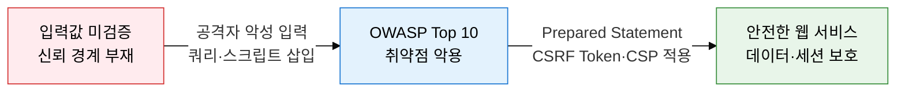
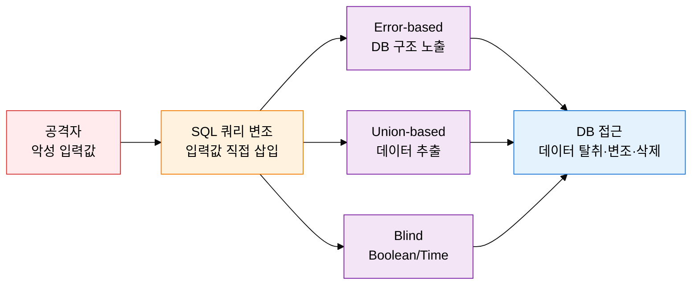
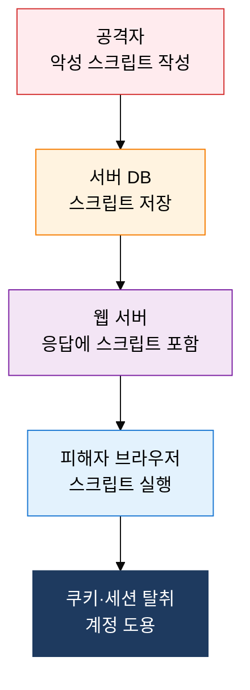

## 1. 웹 애플리케이션 대표 취약점과 방어 대책, OWASP의 개요

**정의**: 웹 애플리케이션의 입력 처리·인증·접근 제어 결함을 유형화하여 공격 원리와 방어 대책을 제시하는 OWASP 기반 취약점 관리 체계.
- OWASP(Open Web Application Security Project)가 매 3~4년 주기로 갱신하는 Top 10 취약점 목록이 국제 표준으로 활용됨
- SQL Injection·XSS·CSRF는 발생 빈도와 영향도 모두 높은 3대 핵심 취약점으로 시험 필수 항목
- 방어는 입력 검증·출력 인코딩·세션 관리·토큰 기반 검증의 4개 축으로 구성됨

**특징**:
- **위험도 기반 분류**: CVSS 점수와 실제 악용 빈도를 결합하여 Top 10을 선정, 보안 우선순위 결정에 직접 활용 가능
- **공격·방어 이중 관점**: 각 취약점에 대해 공격 원리(How)와 방어 기법(What)을 대칭 구조로 제시
- **개발 단계 통합**: 코딩 규칙·프레임워크 설정·서버 구성 전 계층에서 대응 가능한 다층 방어 체계 제공

---

## 2. OWASP 웹 취약점의 핵심 구성 체계

### 가. OWASP Top 10(2021) 및 SQL Injection

| 유형 | 원리 | 탐지 방법 | 방어 대책 |
|---|---|---|---|
| **Error-based** | 의도적 문법 오류로 DB 오류 메시지에서 구조 추출 | 비정상 오류 응답·에러 메시지 모니터링 | 에러 메시지 숨김, Prepared Statement |
| **Union-based** | UNION SELECT로 타 테이블 데이터를 결과에 병합 | 컬럼 수 불일치·추가 데이터 탐지 | 입력값 화이트리스트 검증, ORM 사용 |
| **Blind** | 참/거짓 응답 차이 또는 응답 지연으로 데이터 유추 | 반복 요청 패턴·응답 시간 이상 탐지 | 파라미터 바인딩, 최소 권한 DB 계정 |

**OWASP Top 10 (2021) 주요 항목**

| 순위 | 항목 | 주요 취약 유형 |
|---|---|---|
| A01 | Broken Access Control | 수평·수직 권한 상승, IDOR |
| A02 | Cryptographic Failures | 평문 전송, 약한 암호화 알고리즘 |
| A03 | Injection | SQL·OS·LDAP Injection |
| A05 | Security Misconfiguration | 기본 계정, 불필요한 기능 활성화 |
| A07 | Identification & Authentication Failures | 세션 고정, 브루트포스 |
| A10 | SSRF | 내부 서버 요청 위조 |

---

### 나. XSS 및 CSRF

| XSS 유형 | 저장 위치 | 실행 시점 | 위험도 | 방어 |
|---|---|---|---|---|
| **Stored XSS** | DB에 영구 저장 | 피해자 페이지 접근 시 | 최고 | HTML 인코딩, 입력 검증, CSP |
| **Reflected XSS** | URL 파라미터 | 악성 링크 클릭 시 즉시 | 중간 | 출력 인코딩, 사용자 입력 이스케이프 |
| **DOM-based XSS** | DOM 조작 (서버 미개입) | 클라이언트 스크립트 실행 시 | 중간 | innerHTML 대신 textContent 사용 |

| 구분 | XSS | CSRF |
|---|---|---|
| **공격 목표** | 피해자 브라우저에서 스크립트 실행 | 피해자 세션으로 의도치 않은 요청 실행 |
| **악용 자원** | 피해자의 브라우저 DOM | 피해자의 인증된 세션·쿠키 |
| **방어 핵심** | 출력 인코딩·CSP | CSRF Token·SameSite Cookie(Strict/Lax)·Referer 검증 |

---

## 3. OWASP 웹 취약점 대응의 기대효과 및 활용 방안

| 구분 | 주요 기대효과 | 활용 및 실무 적용 방안 |
|---|---|---|
| **보안성** | SQL Injection·XSS·CSRF 차단으로 데이터 유출·세션 탈취 위험 제거 | Prepared Statement 전면 도입, HTML 인코딩 라이브러리 표준화, CSRF Token 공통 필터 적용 |
| **규정 준수** | OWASP Top 10 대응으로 개인정보보호법·ISMS-P 기술적 보호조치 요건 충족 | 연 1회 이상 OWASP 기반 취약점 진단 수행, 결과를 개발 가이드라인에 반영 |
| **개발 품질** | 보안 결함을 코딩 단계에서 조기 제거하여 운영 중 패치 비용 절감 | 코드 리뷰 체크리스트에 OWASP 항목 통합, SAST 도구 CI/CD 파이프라인 연동 |
| **대응 역량** | 공격 원리 이해 기반 탐지 규칙 작성으로 WAF·IDS 탐지 정확도 향상 | WAF에 SQL Injection·XSS 시그니처 최신화, 모의 침투 테스트로 방어 효과 검증 |
