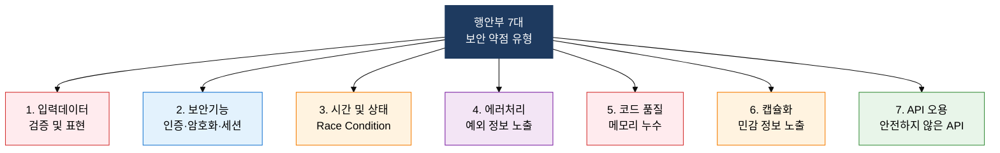
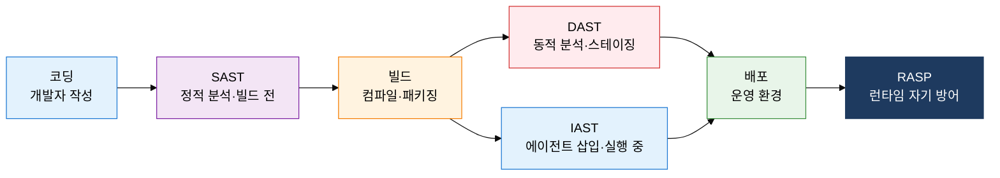

## 1. 코드 레벨 보안 약점 탐지와 자동화 분석 도구, 시큐어 코딩·SAST/DAST의 개요

**정의**: 행안부 7대 보안 약점 기준으로 소스코드를 작성하고 SAST·DAST·IAST 자동화 도구로 취약점을 탐지·제거하는 코드 수준 보안 체계.
- 행안부 '소프트웨어 개발보안 가이드'는 공공기관 SW 개발 시 의무 준수 사항으로 7대 취약점 유형을 정의
- SAST(정적)·DAST(동적)·IAST(대화형)·RASP(자기 방어)의 4가지 도구는 탐지 시점·방식이 달라 상호 보완적으로 활용
- DevSecOps 환경에서 CI/CD 파이프라인에 각 도구를 통합하여 보안 분석 자동화

**특징**:
- **다층 탐지**: 빌드 전(SAST)·실행 중(DAST)·런타임(IAST·RASP) 세 시점에서 다른 유형의 취약점을 탐지하는 다층 구조
- **자동화 통합**: CI/CD 파이프라인 내 보안 분석 도구 삽입으로 인력 의존 없이 지속적 보안 검증 가능
- **피드백 루프**: 탐지된 취약점을 개발자에게 즉시 피드백하여 코딩 단계에서 수정·학습 효과 동시 달성

---

## 2. 시큐어 코딩 및 보안 분석 도구의 핵심 구성 체계

### 가. 행안부 시큐어 코딩 7대 취약점

| 유형 | 대표 취약점 | 발생 원인 | 대응 방안 |
|---|---|---|---|
| **입력데이터 검증·표현** | SQL Injection, XSS, 경로 조작, OS 명령 삽입 | 외부 입력값을 검증 없이 쿼리·명령어에 직접 사용 | Prepared Statement, 입력 화이트리스트 검증, 인코딩 |
| **보안기능** | 취약한 암호 알고리즘, 세션 고정, 하드코딩 비밀번호 | 미검증 암호 라이브러리 사용, 세션 ID 미갱신 | AES-256·SHA-256 이상 사용, 로그인 후 세션 재발급 |
| **시간 및 상태** | TOCTOU(Time-of-check Time-of-use), Race Condition | 파일 확인과 사용 시점 사이 상태 변경 | 원자적(atomic) 연산, 동기화 락, 임시 파일 보안 처리 |
| **에러처리** | 에러 메시지 내 스택 트레이스·DB 정보 노출 | 예외를 그대로 사용자에게 반환 | 사용자용 일반 오류 메시지, 내부 로그 분리 저장 |
| **코드 품질** | 널 포인터 역참조, 메모리 누수, 사용 후 해제 | 포인터·메모리 관리 부주의 | 정적 분석 도구, 코드 리뷰, 메모리 안전 언어 사용 |
| **캡슐화** | private 필드 직접 노출, 디버그 정보 배포 | 접근 제어 설계 미흡, 빌드 설정 오류 | 접근 제어자 최소화, 운영 빌드 디버그 정보 제거 |
| **API 오용** | 취약한 버전 라이브러리, 안전하지 않은 난수 함수 | 오래된 의존성 관리 미흡, 위험 함수 무분별 사용 | SCA(소프트웨어 구성 분석), 안전 API 목록 관리 |

---

### 나. SAST/DAST/IAST/RASP 보안 분석 도구 비교

| 도구 | 탐지 시점 | 분석 방식 | 오탐률 | 장점 | 대표 도구 |
|---|---|---|---|---|---|
| **SAST** | 빌드 전 (소스코드) | 소스·바이트코드 정적 분석 (화이트박스) | 높음 | 빠른 피드백, CI 통합 용이, 전체 코드 커버리지 | SonarQube, Checkmarx, Fortify |
| **DAST** | 실행 중 (런타임) | 외부에서 HTTP 요청 공격 시뮬레이션 (블랙박스) | 낮음 | 실제 실행 환경 테스트, 인증·세션 취약점 탐지 | OWASP ZAP, Burp Suite, Nessus |
| **IAST** | 실행 중 (에이전트) | 앱 내 에이전트로 코드 흐름 추적 (그레이박스) | 매우 낮음 | SAST+DAST 장점 결합, 정밀 취약점 위치 식별 | Contrast Security, Seeker |
| **RASP** | 런타임 (프로덕션) | 실행 컨텍스트 분석 후 공격 탐지·즉시 차단 | 낮음 | 패치 전 실시간 자기 방어, 0-day 대응 가능 | Sqreen, Hdiv Security, OpenRASP |

---

## 3. 시큐어 코딩·SAST/DAST 도입의 기대효과 및 활용 방안

| 구분 | 주요 기대효과 | 활용 및 실무 적용 방안 |
|---|---|---|
| **취약점 조기 제거** | SAST 자동화로 코딩 단계 보안 약점을 배포 전 100% 스캔, 운영 중 패치 비용 대폭 절감 | CI 파이프라인 빌드 단계에 SonarQube·Fortify 연동, 임계 취약점 발견 시 빌드 자동 중단 설정 |
| **규정·의무 준수** | 행안부 소프트웨어 개발보안 가이드 의무 적용 대상 공공기관의 진단 결과 제출 요건 충족 | 7대 취약점 기준 시큐어 코딩 진단 도구(SPARROW 등) 도입, 연 1회 이상 결과 보고서 산출 |
| **DevSecOps 통합** | SAST(빌드)→DAST(스테이징)→IAST(런타임) 자동화 체계로 보안을 개발 속도 저하 없이 내재화 | GitHub Actions·Jenkins 파이프라인에 단계별 보안 분석 단계 삽입, 취약점 티켓 자동 생성 연동 |
| **보안 역량 향상** | 개발자에게 즉각적인 취약점 위치·원인·수정 방안 피드백 제공으로 보안 지식 축적 | 주간 시큐어 코딩 세션 운영, SAST 결과 기반 개인별 취약점 패턴 분석 및 맞춤 교육 제공 |
