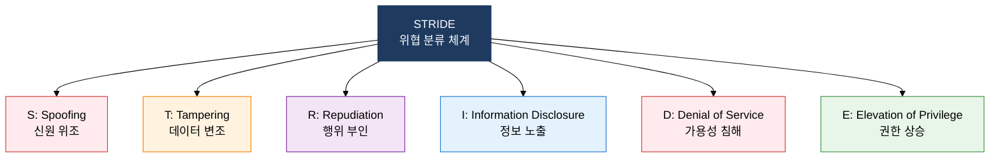

## 1. 설계 단계부터 보안을 내재화하는 Secure SDLC, Secure SDLC의 개요

**정의**: 소프트웨어 개발 전 단계에 보안 활동을 체계적으로 통합하여 취약점을 조기 식별·제거하는 보안 중심 개발 생명주기 프레임워크.
- 보안 취약점은 요구사항 단계에서 발견 시 수정 비용이 1이라면 운영 중 발견 시 100배에 달하는 1:10:100 법칙이 적용됨
- MS-SDL·Seven Touchpoints·CLASP 세 가지 방법론이 대표적이며 조직 규모·환경에 따라 선택 또는 혼용 가능
- 위협 모델링(STRIDE)을 설계 단계에 수행하여 아키텍처 수준의 보안 결함을 사전 제거

**특징**:
- **선제적 보안**: 개발 착수 전 보안 요구사항 정의·위협 모델링을 의무화하여 설계 결함을 초기 단계에서 제거
- **프로세스 통합**: 기존 SDLC 단계별로 보안 게이트(Security Gate)를 설치하여 릴리스 조건으로 관리
- **반복 개선**: 배포 후 취약점 대응(Response) 단계를 포함하여 피드백을 다음 개발 사이클에 반영하는 순환 구조

---

## 2. Secure SDLC의 핵심 구성 체계

### 가. Secure SDLC 3대 방법론

| 방법론 | 접근법 | 강점 | 적합 환경 |
|---|---|---|---|
| **MS-SDL** | 7단계 게이트 기반 순차 보안 통합, Microsoft 공식 프로세스 | 단계별 명확한 보안 산출물 요구, 감사 추적 용이 | 대규모 엔터프라이즈, 규제 준수 환경 |
| **Seven Touchpoints** | 코드 검토·취약점 테스트 등 7개 보안 활동을 SDLC에 삽입 (McGraw) | 기존 개발 프로세스에 최소 침습적으로 보안 추가 가능 | 기존 프로세스 변경 최소화 필요 조직 |
| **CLASP** | 24개 보안 활동 체크리스트 기반 경량화 프로세스 | 역할별 보안 책임 명확화, Agile·소규모 팀 적용 용이 | 스타트업·Agile 팀·중소 개발 조직 |

---

### 나. 위협 모델링 — STRIDE 및 DREAD

| 위협명 | 설명 | 위반 보안 속성 | 대응 방안 |
|---|---|---|---|
| **Spoofing** | 다른 사용자·시스템으로 신원 위조 | 인증(Authentication) | MFA, 강력한 인증 토큰, 디지털 서명 |
| **Tampering** | 전송 중·저장 데이터 무결성 침해 | 무결성(Integrity) | 전자서명, HMAC, 암호화 전송(TLS) |
| **Repudiation** | 수행한 행위를 부인 | 부인 방지(Non-repudiation) | 감사 로그, 타임스탬프, 디지털 서명 |
| **Information Disclosure** | 권한 없는 자에게 정보 노출 | 기밀성(Confidentiality) | 암호화, 접근 제어, 최소 권한 원칙 |
| **Denial of Service** | 정상 사용자의 서비스 접근 차단 | 가용성(Availability) | Rate Limiting, 부하 분산, 장애 허용 |
| **Elevation of Privilege** | 낮은 권한으로 높은 권한 획득 | 권한 부여(Authorization) | RBAC, 최소 권한, 권한 분리 원칙 |

**DREAD 위험도 점수화**: Damage(피해 규모)·Reproducibility(재현성)·Exploitability(공격 용이성)·Affected Users(영향 사용자)·Discoverability(발견 용이성) 5개 항목을 각 1~10점으로 평가하여 위협 우선순위 산정

---

## 3. Secure SDLC 도입의 기대효과 및 활용 방안

| 구분 | 주요 기대효과 | 활용 및 실무 적용 방안 |
|---|---|---|
| **비용 절감** | 설계·구현 단계 취약점 조기 제거로 운영 중 패치 비용 최대 100분의 1 수준으로 감소 | 요구사항·설계 단계에 보안 게이트 의무화, 취약점 발견 단계별 비용 측정 체계 구축 |
| **보안 품질** | STRIDE 위협 모델링으로 아키텍처 수준 보안 결함을 설계 단계에서 사전 제거 | 설계 리뷰 시 DFD(데이터 흐름도) 작성 후 STRIDE 분류 수행, DREAD 점수 기반 우선순위 관리 |
| **규정 준수** | MS-SDL·CLASP 적용으로 ISO 27001·ISMS-P·개인정보보호법 개발 보안 요건 충족 | 방법론별 산출물(위협 모델·보안 요구사항·테스트 결과)을 감사 증적으로 보관 |
| **조직 역량** | 개발팀 전체의 보안 인식 제고 및 보안 내재화 문화 형성 | 연 2회 이상 Secure SDLC 교육 시행, 보안 챔피언(Security Champion) 제도 도입으로 팀 내 보안 거점 육성 |
