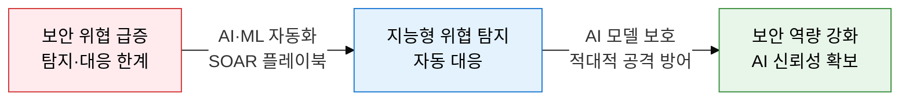
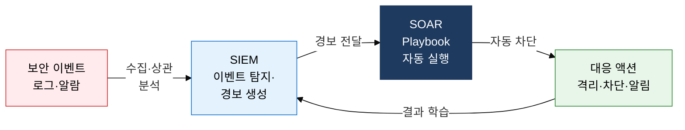
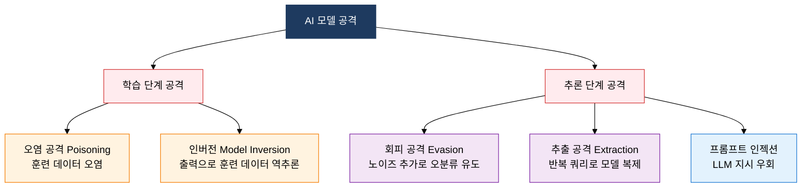

## 1. AI로 보안을 강화하고, AI 모델 자체도 방어, AI와 보안의 개요

**정의**: AI·ML을 보안 탐지·자동 대응에 활용(방어적 AI)하는 동시에 AI 모델 자체를 적대적 공격으로부터 보호하는 양방향 보안 체계.
- SOAR·UEBA로 대규모 보안 이벤트를 자동 분류·대응하여 SOC 운영 효율 극대화
- Adversarial Attack(회피·오염·추출·인버전)은 AI 모델의 판단을 조작하거나 훈련 데이터를 탈취
- LLM 보급에 따라 프롬프트 인젝션·RAG 오염 등 생성형 AI 고유 보안 위협이 새롭게 부상

**특징**:
- **자동화 대응**: SOAR 플레이북 기반 반복 대응 자동화로 평균 탐지·대응 시간(MTTD/MTTR) 단축
- **행동 분석**: UEBA로 사용자·기기 행동 이상 패턴을 ML로 탐지, 제로데이·내부자 위협 조기 포착
- **AI 신뢰성**: 적대적 공격 방어 기술(입력 검증·차분 프라이버시·모델 워터마킹)로 AI 모델 무결성 보장

---

## 2. AI와 보안의 핵심 구성 체계

### 가. AI 활용 보안 (방어 관점)

| 구분 | SIEM | SOAR |
|---|---|---|
| **기능** | 로그 수집·상관 분석·경보 생성 | 경보 분류·플레이북 기반 자동 대응 |
| **자동화** | 탐지 규칙 기반 알람, 수동 대응 | 반복 업무 자동화, 티켓·격리·차단 |
| **대응 방식** | 분석가 판단 후 수동 처리 | 플레이북 실행으로 수초 내 자동 처리 |
| **활용** | 위협 인텔리전스 연계, 감사 로그 | SOC 운영 효율화, MTTD·MTTR 단축 |

---

### 나. AI 모델 공격 및 LLM 보안

| 공격 유형 | 공격 시점 | 대상 | 목표 | 방어 방법 |
|---|---|---|---|---|
| **회피 Evasion** | 추론 단계 | 입력 데이터 | 미세 노이즈로 오분류 유도 | 입력 검증·적대적 훈련 |
| **오염 Poisoning** | 학습 단계 | 훈련 데이터셋 | 모델 편향·백도어 삽입 | 데이터 무결성 검증·클렌징 |
| **추출 Extraction** | 추론 단계 | 모델 API | 반복 쿼리로 모델 복제 | 쿼리 제한·출력 노이즈 추가 |
| **인버전 Inversion** | 추론 단계 | 모델 출력 | 출력으로 훈련 데이터 역추론 | 차분 프라이버시·출력 제한 |

---

## 3. AI와 보안 도입의 기대효과 및 활용 방안

| 구분 | 주요 기대효과 | 활용 및 실무 적용 방안 |
|---|---|---|
| **탐지 고도화** | ML 기반 이상 탐지로 제로데이·알려지지 않은 위협 조기 포착 | UEBA 도입, 네트워크 트래픽 ML 분석, NDR 솔루션 연계 |
| **대응 자동화** | SOAR 플레이북으로 MTTD·MTTR 수십 분에서 수초로 단축 | SOC 반복 업무 자동화, SIEM-SOAR 통합 티켓 연계 |
| **AI 모델 보안** | 적대적 공격 방어로 AI 기반 보안 시스템의 신뢰성·무결성 확보 | 적대적 훈련 적용, 차분 프라이버시, 모델 워터마킹 |
| **LLM 거버넌스** | 프롬프트 인젝션·RAG 오염 대응으로 생성형 AI 서비스 안전 운영 | 입력 필터링·출력 검증 적용, OWASP LLM Top 10 기반 점검 |
