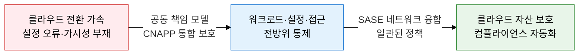
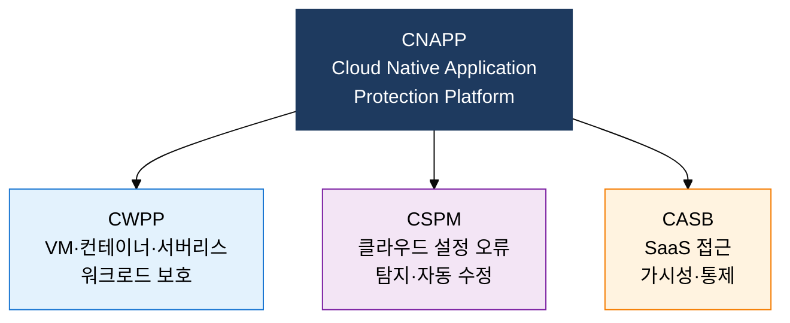
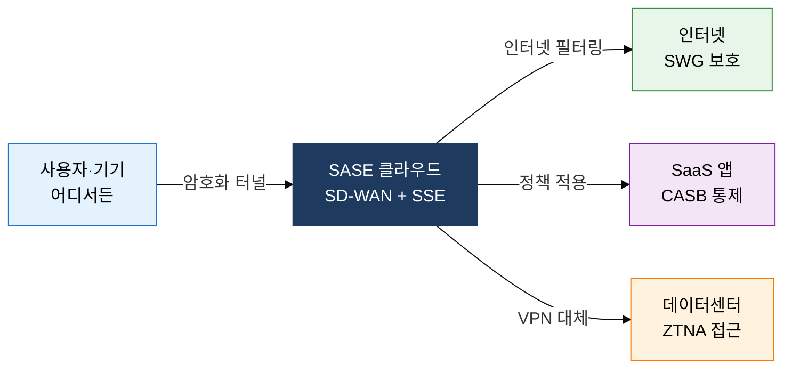

## 1. 공동 책임과 CNAPP으로 클라우드 자산 전방위 보호, 클라우드 보안 아키텍처의 개요

**정의**: CSP와 고객의 공동 책임 모델을 기반으로 CWPP·CSPM·CASB를 통합한 CNAPP 및 SASE 아키텍처로 클라우드 자산을 전방위 보호하는 보안 체계.
- 클라우드 서비스 유형(IaaS·PaaS·SaaS)에 따라 CSP와 고객 간 보안 책임 분계가 달라짐
- 가트너 주도로 분산된 클라우드 보안 도구를 CNAPP으로 통합하는 추세
- 원격근무·멀티클라우드 환경에서 SASE로 네트워크와 보안을 클라우드에서 융합 제공

**특징**:
- **공동 책임 명확화**: IaaS→PaaS→SaaS 순으로 고객 책임 범위가 축소되며 각 모델별 보안 역할 분명히 구분
- **CNAPP 통합**: 워크로드 보호(CWPP)와 형상 관리(CSPM)를 단일 플랫폼으로 통합하여 보안 사각지대 제거
- **SASE 융합**: SD-WAN과 SSE(CASB·SWG·ZTNA)를 클라우드에서 통합 제공, 분산 환경에 일관된 정책 적용

---

## 2. 클라우드 보안 아키텍처의 핵심 구성 체계

### 가. 공동 책임 모델 및 가트너 클라우드 보안 솔루션

| 솔루션 | 보호 대상 | 주요 기능 | 적용 시점 |
|---|---|---|---|
| **CWPP** | VM·컨테이너·서버리스 워크로드 | 취약점 스캔, 런타임 보호, 악성코드 탐지 | 워크로드 배포 시 |
| **CSPM** | 클라우드 인프라 설정 | 잘못된 설정 탐지, 자동 수정, 컴플라이언스 감사 | 지속적 모니터링 |
| **CASB** | SaaS 애플리케이션 접근 | 섀도 IT 탐지, DLP, 접근 제어 | SaaS 사용 시 |
| **CNAPP** | 클라우드 네이티브 앱 전체 | CWPP+CSPM 통합, 코드-런타임 일관 보호 | 개발~운영 전 단계 |

---

### 나. SASE 및 SSE 아키텍처

| 구분 | 전통 네트워크 보안 | SASE |
|---|---|---|
| **위치** | 데이터센터 중심 장비 | 클라우드 엣지 분산 |
| **정책 관리** | 장비별 개별 설정 | 단일 클라우드 콘솔 통합 |
| **확장성** | 하드웨어 증설 필요 | 탄력적 클라우드 스케일 |
| **원격근무** | VPN 병목·성능 저하 | ZTNA로 최적 경로 보장 |

---

## 3. 클라우드 보안 아키텍처 도입의 기대효과 및 활용 방안

| 구분 | 주요 기대효과 | 활용 및 실무 적용 방안 |
|---|---|---|
| **가시성** | 멀티클라우드 자산 전체 가시성 확보, 설정 오류 자동 탐지 | CSPM 도입으로 AWS·Azure·GCP 통합 형상 관리 |
| **워크로드 보호** | 컨테이너·서버리스 런타임 위협 실시간 차단 | CWPP 기반 쿠버네티스 런타임 보안, CI/CD 이미지 스캔 |
| **접근 통제** | SaaS 섀도 IT 탐지·차단, 데이터 유출 방지 | CASB 연동 DLP 정책, ZTNA로 원격 접근 VPN 대체 |
| **컴플라이언스** | 클라우드 환경 규정 준수 자동 증적, 감사 부담 감소 | CNAPP 기반 CIS Benchmark·ISO 27017 자동 점검 |
