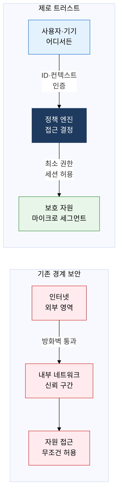
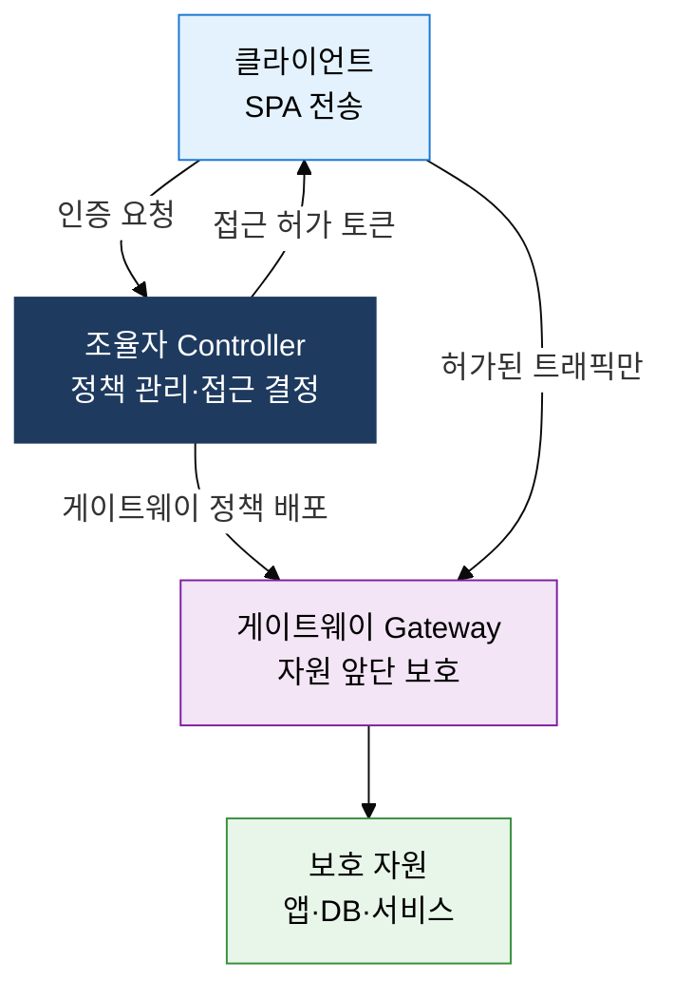

## 1. 절대 신뢰 말고 항상 검증하는 경계 없는 보안, 제로 트러스트의 개요

**정의**: "Never Trust, Always Verify" 원칙 아래 내부·외부 모든 접근을 지속 검증하여 내부자 위협과 측면 이동을 차단하는 경계 없는 보안 모델.
- 존 킨더바그(포레스터)가 2010년 제안, 과기정통부 5대 핵심 가이드라인으로 국내 확산
- 클라우드·원격근무 환경에서 VPN 기반 경계 보안의 내부 신뢰 전제 문제를 근본 해소
- 사용자·기기·네트워크·데이터·애플리케이션 5개 영역별 세분화된 통제 적용

**특징**:
- **명시적 검증**: 위치·네트워크 무관하게 ID·기기 상태·컨텍스트를 매 요청마다 인증·인가
- **최소 권한**: 업무 수행에 필요한 최소 자원만 시간 제한적으로 부여, 권한 남용 차단
- **침해 가정**: 내부 네트워크도 이미 침해되었다고 가정하여 모든 트래픽을 암호화·로깅

---

## 2. 제로 트러스트의 핵심 구성 체계

### 가. 제로 트러스트 개념 및 3대 원칙

| 구분 | 기존 경계 보안 (VPN) | 제로 트러스트 |
|---|---|---|
| **신뢰 모델** | 내부 네트워크 자동 신뢰 | 내부·외부 모두 검증 |
| **접근 기준** | 네트워크 위치(IP) | ID·기기·컨텍스트 |
| **내부자 위협** | 탐지 어려움, 측면 이동 허용 | 마이크로 세그멘테이션으로 차단 |
| **클라우드 적합성** | 경계 불명확으로 한계 | 클라우드 네이티브 환경에 최적 |

---

### 나. SDP (Software Defined Perimeter) 구현 모델

| 구성 | 역할 | 기능 | 특징 |
|---|---|---|---|
| **조율자 (Controller)** | 인증 정책 관리 | 사용자·기기 검증, 접근 결정 | 정책 중앙 집중, PEP·PDP 분리 |
| **게이트웨이 (Gateway)** | 자원 앞단 보호 | 허가된 트래픽만 통과, 포트 비공개 | SPA 수신 전 포트 스캔 불가 |
| **클라이언트 (Client)** | 사용자 단말 에이전트 | SPA 전송, 조율자 인증 요청 | ZTNA 앱으로 VPN 대체 |

---

## 3. 제로 트러스트 도입의 기대효과 및 활용 방안

| 구분 | 주요 기대효과 | 활용 및 실무 적용 방안 |
|---|---|---|
| **보안 강화** | 내부자 위협 및 측면 이동 차단, 침해 사고 확산 범위 최소화 | 마이크로 세그멘테이션 적용, 모든 트래픽 암호화·로깅 |
| **접근 통제** | 최소 권한 원칙으로 과도한 권한 남용 방지 | IAM 통합 RBAC·ABAC 정책, JIT(Just-In-Time) 권한 부여 |
| **클라우드 대응** | 경계 없는 환경에서 일관된 보안 정책 적용 | ZTNA로 VPN 대체, CASB·CSPM 연계 클라우드 접근 통제 |
| **규정 준수** | 접근 이력 전수 로깅으로 감사·컴플라이언스 증적 확보 | 과기정통부 제로 트러스트 가이드라인 5대 영역별 단계적 도입 |
