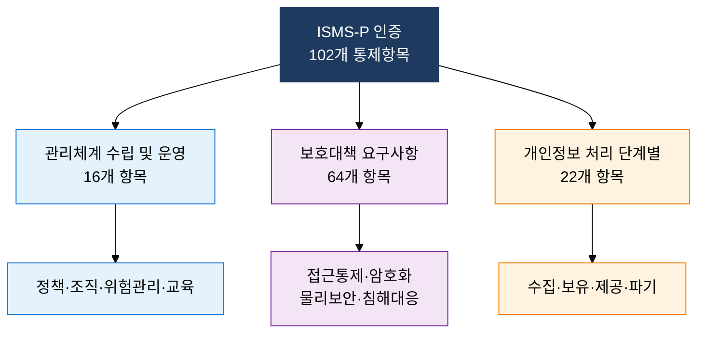
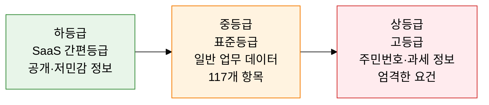

## 1. 국내 정보보호 인증의 두 축, ISMS-P와 CSAP의 개요

**정의**: 국내 정보보호 관리체계(ISMS)와 개인정보보호(PIMS)를 통합한 ISMS-P 인증 및 공공 클라우드 보안을 위한 CSAP 등급제를 기반으로 보안 수준을 공인하는 인증 체계.
- ISMS-P는 2019년 ISMS와 PIMS를 통합하여 중복 심사 부담을 해소한 국내 대표 인증
- CSAP는 공공기관의 클라우드 서비스 도입 시 데이터 민감도에 따라 상·중·하 3등급 적용
- 두 인증 모두 한국인터넷진흥원(KISA)이 인증 기관으로 참여하며 3년 유효기간 부여

**특징**:
- **통합 관리**: ISMS-P는 기술·관리·물리 보안과 개인정보 처리 전 과정을 단일 체계로 심사
- **등급 차등화**: CSAP는 데이터 민감도에 따라 보안 요건을 차등 적용하여 도입 부담 경감
- **의무 인증**: 특정 규모 이상의 정보통신서비스 사업자에게 ISMS-P 인증이 법적 의무 부과

---

## 2. ISMS-P 및 CSAP의 핵심 구성 체계

### 가. ISMS-P 인증 체계

| 인증 영역 | 통제항목 수 | 주요 내용 |
|---|---|---|
| **관리체계 수립 및 운영** | 16개 | 정보보호 정책·조직 구성, 위험 관리, 보안 교육·훈련, 법적 요구사항 준수 |
| **보호대책 요구사항** | 64개 | 접근통제, 암호화, 물리적 보안, 침해사고 탐지·대응, 공급망 보안 |
| **개인정보 처리 단계별** | 22개 | 개인정보 수집·이용, 보유·파기, 제3자 제공, 정보주체 권리 보장 |

---

### 나. CSAP 클라우드 보안인증 등급제

| 등급 | 대상 데이터 | 보안 요건 수 | 주요 특징 |
|---|---|---|---|
| **하(간편등급)** | 민감도 낮은 공개 정보, 행정 보조 업무 | 최소 요건 | SaaS 중심, 빠른 인증 취득으로 공공 진입 장벽 완화 |
| **중(표준등급)** | 일반 업무 데이터, 내부 행정 정보 | 117개 항목 | IaaS·SaaS 포함, 대부분의 공공기관 업무에 적용 |
| **상(고등급)** | 주민등록번호·과세 정보·국가 중요 데이터 | 117개 초과, 추가 요건 | 물리적 망분리·보안구역 요건, 국가 핵심 시스템 적용 |

---

## 3. ISMS-P 및 CSAP 인증 도입의 기대효과 및 활용 방안

| 구분 | 주요 기대효과 | 활용 및 실무 적용 방안 |
|---|---|---|
| **법적 의무** | 정보통신서비스 매출 100억·이용자 100만 이상 의무 이행 | ISMS-P 인증 로드맵 수립, 의무 대상 여부 연 1회 자가 점검 |
| **신뢰 확보** | 인증 마크로 고객·파트너·규제 기관 신뢰 제고 | 인증서 공개 및 갱신 관리, B2G 입찰 가점 활용 |
| **공공 클라우드** | CSAP 등급별 인증으로 공공기관 클라우드 시장 진입 | 취급 데이터 민감도 분석 후 적정 등급 선택, 심사 비용 최적화 |
| **내부 역량** | 인증 준비 과정에서 보안 통제 전반 강화 | 102개 통제항목 Gap 분석, 취약 영역 집중 개선 및 전담 조직 구성 |
