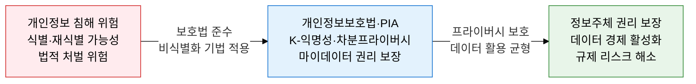
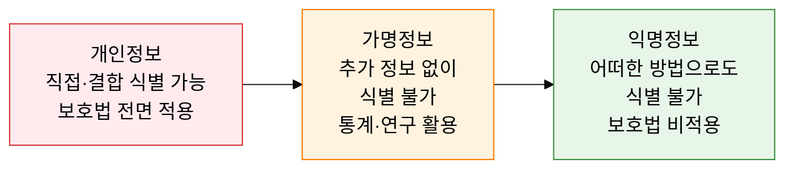
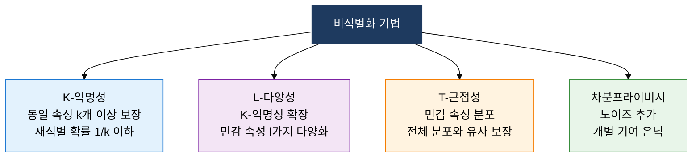

## 1. 개인정보보호법과 비식별화 기법으로 프라이버시 보장, 개인정보보호의 개요

**정의**: 살아있는 개인에 관한 식별 가능 정보를 보호하고, 비식별화 기법과 영향평가(PIA)를 통해 프라이버시와 데이터 활용의 균형을 실현하는 법·기술적 프레임워크.
- 개인정보·가명정보·익명정보 3구분으로 보호 범위와 활용 가능 범위를 명확히 규정
- 공공기관은 10만 명 이상 개인정보 처리 시스템 구축 시 PIA 의무 실시
- 마이데이터(데이터 전송 요구권)로 개인이 자신의 데이터를 직접 관리·활용

**특징**:
- **3단계 분류 체계**: 식별 가능성에 따라 개인정보·가명정보·익명정보로 구분하여 차등 보호
- **사전 예방적 PIA**: 시스템 구축 전 프라이버시 위험을 평가하여 설계 단계에서 통제 반영
- **비식별화 기술 다양화**: K-익명성, L-다양성, 차분프라이버시 등 단계별 강도의 기법 제공

---

## 2. 개인정보보호법 및 PIA의 핵심 구성 체계

### 가. 개인정보보호법 체계 및 마이데이터

| 구분 | 식별 가능성 | 활용 목적 | 보호법 적용 | 예시 |
|---|---|---|---|---|
| **개인정보** | 직접 또는 결합으로 식별 가능 | 동의 기반 본래 목적 처리 | 전면 적용 | 이름·주민번호·전화번호 |
| **가명정보** | 추가 정보 없이 식별 불가 | 통계·연구·공익 목적 활용 가능 | 일부 적용(안전조치 의무) | 가명 처리된 진료 기록·구매 이력 |
| **익명정보** | 어떠한 방법으로도 식별 불가 | 제한 없이 자유롭게 활용 | 비적용 | 집계 통계·완전 익명화 데이터 |

---

### 나. 개인정보 영향평가(PIA) 및 비식별화 기법

| 기법 | 원리 | 보호 수준 | 한계 |
|---|---|---|---|
| **K-익명성** | 동일 준식별자 속성 조합을 k개 이상 유지 | 재식별 확률 1/k 이하로 제한 | 동질성·배경 지식 공격에 취약 |
| **L-다양성** | K-익명성 그룹 내 민감 속성을 l가지 이상 다양화 | 동질성 공격 방어 | 쏠림 공격(Skewness Attack)에 취약 |
| **T-근접성** | 그룹 내 민감 속성 분포가 전체 분포와 t 이내로 유사 | L-다양성 한계 보완, 고수준 보호 | 데이터 유용성 저하 |
| **차분프라이버시** | 쿼리 결과에 수학적 노이즈 추가, 개별 기여 은닉 | 수학적 프라이버시 보장(Apple·Google 적용) | 노이즈 증가 시 데이터 정확도 저하 |

---

## 3. 개인정보보호법 및 PIA 도입의 기대효과 및 활용 방안

| 구분 | 주요 기대효과 | 활용 및 실무 적용 방안 |
|---|---|---|
| **법적 준수** | 개인정보보호법 위반 과징금·형사 처벌 위험 제거 | 개인정보 처리방침 공개, 동의 체계 정비, 연 1회 자가점검 실시 |
| **데이터 활용** | 가명·익명 처리로 프라이버시 침해 없이 데이터 분석 활용 | 연구·통계 목적 가명화 파이프라인 구축, 비식별화 적정성 평가 |
| **공공 서비스** | PIA 의무 이행으로 공공 시스템 프라이버시 위험 사전 제거 | PIA 결과보고서 행안부 제출, 설계 단계 Privacy by Design 적용 |
| **마이데이터** | 금융·의료 분야 데이터 전송 요구권 대응으로 고객 신뢰 확보 | API 기반 데이터 전송 인프라 구축, 정보주체 권리 행사 포털 운영 |
