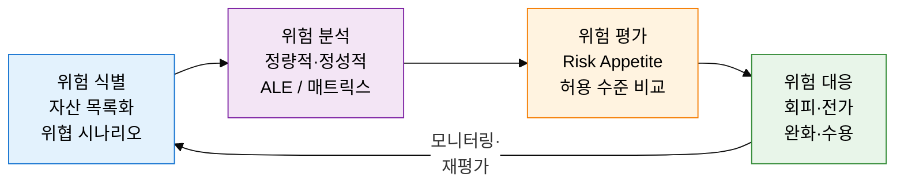
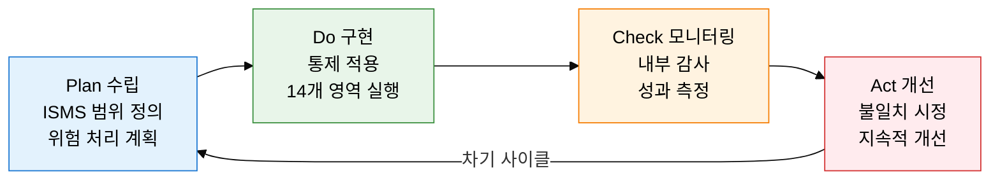

## 1. 위험 식별·분석·평가·대응의 보안 위험 관리 체계, 보안 위험 관리의 개요

**정의**: 위협·취약성·자산 가치를 종합적으로 분석하여 위험을 식별·평가·대응하는 정보보안 관리 프레임워크.
- Risk = Threat × Vulnerability × Asset Value 공식으로 위험을 정량화
- 정량적(ALE 기반) 및 정성적(위험 매트릭스) 분석 기법 병행 적용
- ISO/IEC 27001 PDCA 사이클과 결합하여 지속적 개선 체계 구축

**특징**:
- **선제적 대응**: 침해 발생 전 위험을 식별하고 비용 효율적 통제를 선택
- **정량화 가능**: ALE = SLE × ARO 공식으로 투자 대비 효과(ROI) 산출 가능
- **유연한 대응 전략**: 회피·전가·완화·수용 4가지 전략으로 상황별 최적 대응

---

## 2. 보안 위험 관리의 핵심 구성 체계

### 가. 위험 관리 4단계 프로세스

| 대응 전략 | 정의 | 예시 | 적용 조건 |
|---|---|---|---|
| **회피(Avoidance)** | 위험을 유발하는 활동 자체를 중단 | 위험 시스템 폐기, 서비스 종료 | 위험이 허용 수준을 크게 초과할 때 |
| **전가(Transfer)** | 위험의 재정적 책임을 제3자에게 이전 | 사이버보험 가입, 외주 계약 | 위험 발생 빈도는 낮으나 영향이 클 때 |
| **완화(Mitigation)** | 보안 통제를 적용해 위험 수준 감소 | 방화벽, 암호화, 접근통제 구현 | 비용 대비 효과가 있을 때 |
| **수용(Acceptance)** | 잔여 위험을 인지하고 그대로 수용 | 위험 수용 문서화, 경영진 승인 | 위험이 허용 수준 이내이거나 대응 비용이 과도할 때 |

---

### 나. ISO/IEC 27001 정보보안 관리체계

| 통제 영역 | 주요 통제 | 목적 |
|---|---|---|
| **정보보안 정책** | 정책 문서화, 경영진 승인 및 검토 | 조직 전반의 보안 방향성 수립 |
| **인적 자원 보안** | 입사 전 심사, 보안 교육, 퇴직 절차 | 내부자 위협 예방 및 보안 인식 제고 |
| **접근 통제** | 최소 권한, 계정 관리, 특권 계정 통제 | 비인가 접근으로 인한 정보 유출 차단 |
| **암호화** | 암호화 정책, 키 관리 절차 수립 | 저장·전송 데이터의 기밀성·무결성 보장 |
| **업무 연속성(BCP/DR)** | RTO·RPO 정의, 재해복구 계획 수립·훈련 | 사고 발생 시 핵심 업무의 신속한 복구 |

---

## 3. 보안 위험 관리 도입의 기대효과 및 활용 방안

| 구분 | 주요 기대효과 | 활용 및 실무 적용 방안 |
|---|---|---|
| **전략적** | 경영진의 위험 인식 제고 및 의사결정 지원 | ALE 기반 보안 투자 우선순위 결정, 이사회 보고 체계 구축 |
| **운영적** | 보안 사고 예방 및 침해 시 피해 최소화 | 위험 레지스터 운영, 분기별 위험 재평가 프로세스 적용 |
| **기술적** | ISO 27001 인증 취득으로 고객·파트너 신뢰 확보 | PDCA 기반 ISMS 구축, 내부 감사 및 경영 검토 정례화 |
| **규제 대응** | 개인정보보호법·정보보호법 등 법적 의무 충족 | 위험 처리 계획(RTP) 문서화, 규제 기관 제출 근거 마련 |
