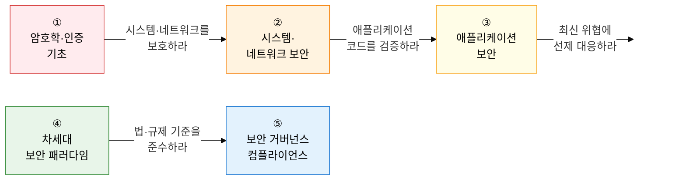

보안은 **"정보 자산을 위협으로부터 어떻게 체계적으로 보호할 것인가"** 라는 질문에 대한 종합적 답변입니다.  
암호학의 수학적 기반부터 Zero Trust·클라우드·AI 기반 차세대 보안, ISMS-P 거버넌스 체계까지 정보보안 전 영역을 다룹니다.

## 학습 로드맵 — 5단계 흐름

---

## ① 암호학 및 인증 기초

> **"모든 보안 기술의 수학적 뼈대"** 입니다.  
> AES/RSA 알고리즘 원리, PKI 신뢰 체계, 전자서명 부인방지 원리는 반드시 손으로 그릴 수 있어야 합니다.

| 순서 | 토픽 | 핵심 키워드 | 중요도 |
|:---:|---|---|:---:|
| 1 | [대칭키 암호화](01-cryptography/symmetric-crypto) | AES-128/256, ECB·CBC·CTR·GCM 운영 모드, SEED·ARIA·LEA | ★★★ |
| 2 | [비대칭키 암호화](01-cryptography/asymmetric-crypto) | RSA 소인수분해, ECC 타원곡선, DH 키 교환, 하이브리드 암호 | ★★★ |
| 3 | [해시 함수 및 디지털 서명](01-cryptography/hash-digital-signature) | SHA-2/SHA-3, HMAC, 전자서명 부인방지, Rainbow Table | ★★★ |
| 4 | [PKI 인증 체계](01-cryptography/pki) | X.509 인증서, CA 계층, CRL·OCSP, 인증서 수명주기 | ★★★ |
| 5 | [인증 프로토콜](01-cryptography/authentication) | OTP, Kerberos, OAuth 2.0·OIDC, MFA, Zero Trust 인증 | ★★☆ |

**→ 핵심 학습법**: 대칭키·비대칭키·해시의 **용도 차이**(기밀성/키교환/무결성)를 한 줄로 설명하고, PKI 인증서 발급부터 검증까지 흐름을 CA·RA·OCSP 역할과 함께 그려보세요.

---

## ② 시스템 및 네트워크 보안

> **"경계 방어부터 전송 계층 암호화까지"** 를 다룹니다.  
> 방화벽 5세대 진화, SSL/TLS 핸드셰이크, DDoS·APT 공격 유형은 서술형 빈출 주제입니다.

| 순서 | 토픽 | 핵심 키워드 | 중요도 |
|:---:|---|---|:---:|
| 6 | [방화벽·IDS·WAF·VPN](02-network-security/firewall-ids-waf-vpn) | 패킷필터링·SPI·NGFW, 오탐·미탐, WAF OWASP 룰셋, SSL VPN | ★★★ |
| 7 | [SSL/TLS·IPsec](02-network-security/ssl-tls-ipsec) | TLS 1.3 핸드셰이크, ECDHE 전방비밀성, IPsec AH·ESP·IKE | ★★★ |
| 8 | [사이버 공격 기법](02-network-security/attack-techniques) | DDoS(볼류메트릭·프로토콜·L7), APT 킬체인, 랜섬웨어 | ★★★ |
| 9 | [무선·모바일 보안](02-network-security/wireless-mobile-security) | WPA3, 802.1X EAP, 이블트윈·KRACK, MDM·MAM, 5G 보안 | ★★☆ |

**→ 핵심 학습법**: TLS 1.3 핸드셰이크 **0-RTT·1-RTT 차이**와 전방비밀성 보장 이유, IPsec 터널·전송 모드의 **헤더 위치 차이**를 다이어그램으로 그릴 수 있어야 합니다.

---

## ③ 애플리케이션 보안

> **"코드와 개발 프로세스 수준의 보안"** 을 다룹니다.  
> OWASP Top 10 취약점 원리, Secure SDLC 3대 방법론, SAST/DAST 비교는 고빈출 서술형 주제입니다.

| 순서 | 토픽 | 핵심 키워드 | 중요도 |
|:---:|---|---|:---:|
| 10 | [OWASP 웹 취약점](03-application-security/owasp-web-vulnerabilities) | SQL Injection, XSS Stored·Reflected·DOM, CSRF, IDOR, SSRF | ★★★ |
| 11 | [Secure SDLC](03-application-security/secure-sdlc) | MS-SDL, Seven Touchpoints, CLASP, STRIDE, DREAD | ★★★ |
| 12 | [시큐어코딩·SAST/DAST](03-application-security/secure-coding-sast-dast) | 행안부 7대 취약점, SAST·DAST·IAST·RASP, DevSecOps | ★★★ |

**→ 핵심 학습법**: SQL Injection·XSS·CSRF 각각의 **공격 벡터·방어 방법을 대비**하여 암기하고, SAST vs DAST의 **분석 시점(정적/동적)·오탐율·속도** 차이를 표로 정리하세요.

---

## ④ 차세대 및 현대적 보안 패러다임

> **"클라우드·AI 시대의 보안 아키텍처 표준"** 입니다.  
> Zero Trust 3대 원칙, CNAPP 4대 도구(CWPP·CSPM·CASB), SBOM EO 14028 배경은 최신 빈출 주제입니다.

| 순서 | 토픽 | 핵심 키워드 | 중요도 |
|:---:|---|---|:---:|
| 13 | [제로 트러스트](04-modern-security/zero-trust) | Never Trust Always Verify, SDP, ZTNA, 마이크로 세그멘테이션 | ★★★ |
| 14 | [클라우드 보안 아키텍처](04-modern-security/cloud-security) | 공동 책임 모델, CWPP·CSPM·CASB·CNAPP, SASE·SSE | ★★★ |
| 15 | [AI와 보안](04-modern-security/ai-security) | SOAR·UEBA 자동화, 적대적 공격(Evasion·Poisoning), LLM 프롬프트 인젝션 | ★★☆ |
| 16 | [공급망 보안·SBOM](04-modern-security/supply-chain-sbom) | SCA, CVE/CVSS, SPDX·CycloneDX, EO 14028, 오픈소스 취약점 | ★★★ |

**→ 핵심 학습법**: Zero Trust의 **"명시적 검증·최소 권한·침해 가정"** 3원칙과 전통 경계 보안의 차이점을 비교 설명하고, SASE가 SD-WAN+SSE를 어떻게 통합하는지 아키텍처를 그려보세요.

---

## ⑤ 보안 거버넌스 및 컴플라이언스

> **"보안 관리 체계와 법·제도적 준수"** 를 다룹니다.  
> ISMS-P 3영역 102개 통제항목, CSAP 등급제, 개인정보 3구분 체계는 반드시 외워야 합니다.

| 순서 | 토픽 | 핵심 키워드 | 중요도 |
|:---:|---|---|:---:|
| 17 | [보안 위험 관리](05-governance-compliance/risk-management) | 위험 식별·분석·평가·대응, ALE=SLE×ARO, ISO 27001 PDCA, BCP/DR | ★★★ |
| 18 | [ISMS-P 및 CSAP 인증](05-governance-compliance/isms-p-csap) | ISMS-P 102개 통제항목(관리·보호·개인정보), CSAP 상·중·하 등급 | ★★★ |
| 19 | [개인정보보호법 및 PIA](05-governance-compliance/privacy-law-pia) | 개인정보·가명정보·익명정보, K-익명성·차분프라이버시, PIA, 마이데이터 | ★★★ |

**→ 핵심 학습법**: ISMS-P 3개 영역(관리체계 16·보호대책 64·개인정보 22 = 합계 102개)을 숫자와 함께 암기하고, 개인정보 3구분(식별 가능→가명→익명)을 **보호법 적용 여부 및 활용 목적**과 연계하여 정리하세요.

---

## 기술사 시험 전략

| 출제 패턴 | 핵심 대응 전략 |
|---|---|
| **알고리즘 원리 서술** | RSA 소인수분해, ECC 타원곡선, SHA-3 스펀지 구조를 수식 없이 한국어로 설명 |
| **비교 문제** | 대칭키 vs 비대칭키, SAST vs DAST, IDS vs IPS vs WAF, TLS vs IPsec 비교표 암기 |
| **공격·방어 쌍** | 각 공격(SQL Injection·XSS·DDoS·APT)에 대한 탐지·방어 기법을 쌍으로 정리 |
| **최신 트렌드** | Zero Trust SDP 구현, CNAPP 통합 보안, SBOM EO 14028, LLM 프롬프트 인젝션 |
| **법·제도 연계** | ISMS-P 의무 대상(매출 100억·이용자 100만), 개인정보보호법 가명정보 활용 요건 |
