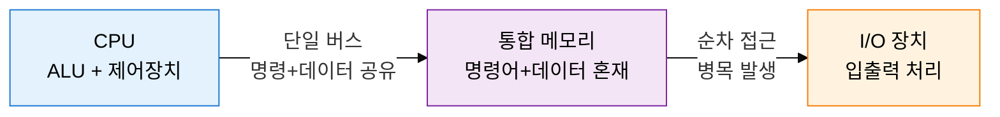
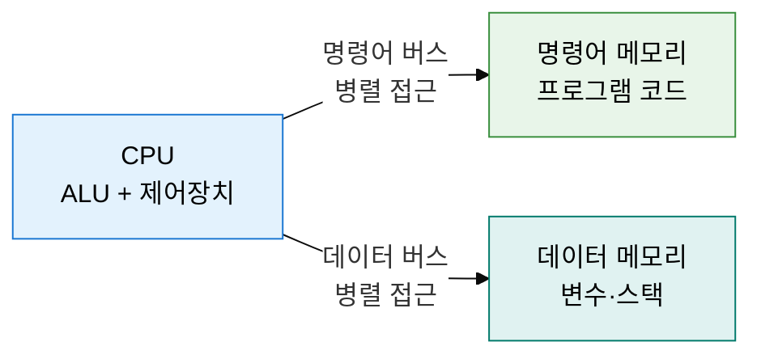
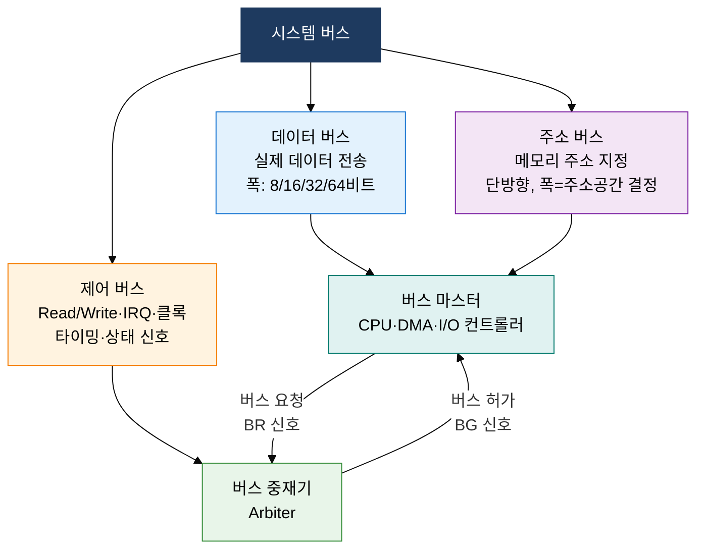

## 1. 프로그램 내장 방식으로 범용 컴퓨팅을 실현, 컴퓨터 시스템 기본 구조의 개요

**정의**: CPU·메모리·입출력 장치를 시스템 버스로 연결하고 프로그램 내장 방식으로 명령을 처리하는 디지털 컴퓨터의 하드웨어 구성 체계.
- 폰 노이만 구조는 명령어와 데이터를 동일 메모리·버스에서 처리하는 단순 범용 모델
- 하버드 구조는 명령어 메모리와 데이터 메모리를 분리하여 병렬 접근 성능을 극대화
- 시스템 버스(데이터·주소·제어)는 모든 구성 요소의 통신 통로이며 버스 중재 방식이 병목을 결정

**특징**:
- **프로그램 내장(Stored Program)**: 명령어를 메모리에 저장하여 소프트웨어 교체만으로 컴퓨터 기능 변경 가능
- **버스 중심 연결**: 표준화된 시스템 버스 구조로 CPU·메모리·I/O 장치 간 데이터 교환 일원화
- **폰 노이만 병목(Von Neumann Bottleneck)**: 명령어와 데이터가 동일 버스를 공유해 메모리 대역폭이 성능 한계 결정

---

## 2. 컴퓨터 시스템 기본 구조의 핵심 구성 체계

### 가. 폰 노이만 vs 하버드 아키텍처 비교

| 비교 항목 | 폰 노이만 아키텍처 | 하버드 아키텍처 |
|---|---|---|
| **메모리 구조** | 명령어·데이터 통합 메모리 | 명령어·데이터 분리 메모리 |
| **버스 구조** | 단일 버스 (명령+데이터 공유) | 이중 버스 (명령/데이터 독립) |
| **처리 방식** | 명령 fetch 중 데이터 접근 불가 | 명령 fetch와 데이터 접근 동시 가능 |
| **성능** | 병목 발생, 설계 단순 | 병목 제거, 하드웨어 복잡도 증가 |
| **자기 수정 코드** | 가능 (명령어도 데이터로 처리) | 불가 (명령어·데이터 분리) |
| **주요 적용** | x86·ARM 범용 CPU, PC·서버 | AVR·PIC 마이크로컨트롤러, DSP, 캐시 내부 |

---

### 나. 시스템 버스 구조 및 버스 중재(Arbitration) 방식

| 버스 중재 방식 | 동작 원리 | 장점 | 단점 | 적용 예시 |
|---|---|---|---|---|
| **데이지 체인(Daisy Chain)** | BG 신호를 직렬로 전파, 먼저 받은 장치가 버스 선점 | 구현 단순, 하드웨어 비용 저렴 | 우선순위 고정, 후순위 기아(Starvation) 발생 | ISA 버스, 초기 I/O |
| **중앙 집중식(Centralized)** | 중재기가 요청 수집 후 우선순위 결정·허가 발급 | 유연한 우선순위 정책, 공정성 보장 가능 | 중재기 병목, 단일 장애점 | PCI 버스, 메모리 컨트롤러 |
| **분산 자체 선택(Distributed)** | 모든 장치가 버스 상태 모니터링 후 자율 선택 | 중재기 불필요, 고신뢰성 | 프로토콜 복잡, 동시 요청 충돌 처리 필요 | IEEE 1394, CAN 버스 |
| **폴링(Polling)** | CPU가 주기적으로 장치 요청 상태 순차 조회 | 우선순위 동적 변경 용이 | CPU 오버헤드, 응답 지연 | 임베디드, 레거시 I/O |

---

## 3. 컴퓨터 시스템 기본 구조 도입의 기대효과 및 활용 방안

| 구분 | 주요 기대효과 | 활용 및 실무 적용 방안 |
|---|---|---|
| **설계 최적화** | 아키텍처 선택(폰 노이만/하버드)으로 성능·비용·전력 최적 균형 달성 | 임베디드 시스템은 변형 하버드(캐시 분리) 적용, 범용 서버는 폰 노이만 유지 |
| **성능 향상** | 버스 폭·클록·중재 방식 개선으로 메모리 대역폭 병목 완화 | DDR5·PCIe 5.0 고속 버스 도입, 캐시 계층 설계로 폰 노이만 병목 우회 |
| **신뢰성 확보** | 버스 중재 방식 선택으로 데드락·기아 현상 방지 및 실시간 응답 보장 | RTOS 환경에서 우선순위 기반 중앙 집중식 중재, CAN 버스로 차량 실시간 제어 |
| **확장성 관리** | 표준 버스 프로토콜(PCIe·USB·I2C)로 이기종 장치 연결 용이 | PCIe Gen5 기반 GPU·NVMe 확장, I2C·SPI로 IoT 센서 모듈 통합 |
