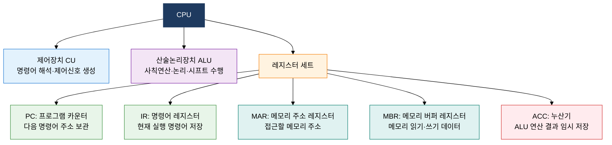
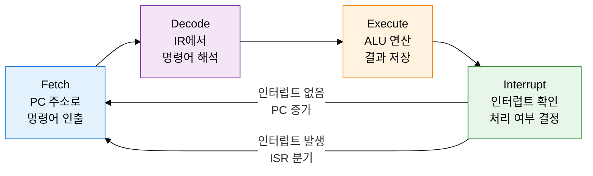
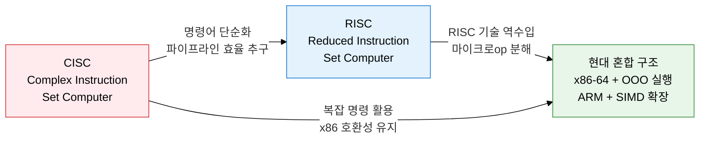

## 1. Fetch-Decode-Execute 사이클로 프로그램을 실행하는 중앙처리장치, CPU 구조 및 동작 원리의 개요

**정의**: ALU·제어장치·레지스터 세트로 구성되어 메모리에서 명령어를 인출·해석·실행하는 컴퓨터의 중앙 연산 처리 장치.
- 명령어 사이클(Fetch-Decode-Execute-Interrupt)을 반복 수행하여 프로그램을 순차 실행
- PC·IR·MAR·MBR 등 특수 목적 레지스터가 명령어 처리 흐름을 제어
- CISC는 복잡 명령어로 코드 밀도 향상, RISC는 단순 명령어로 파이프라이닝 효율 극대화

**특징**:
- **폰 노이만 실행 모델**: 메모리에서 명령어를 순차 인출하고 내부 상태(레지스터)를 갱신하는 사이클 반복 구조
- **레지스터 기반 고속 접근**: 메모리 대비 수백 배 빠른 레지스터에서 피연산자를 직접 처리해 지연 최소화
- **CISC·RISC 이분화**: 마이크로코드 기반 복잡 명령(x86 CISC)과 하드와이어드 단순 명령(ARM RISC) 두 설계 철학이 공존

---

## 2. CPU 구조 및 동작 원리의 핵심 구성 체계

### 가. CPU 내부 구성요소 및 명령어 사이클 4단계

| 사이클 단계 | 동작 내용 | 관련 레지스터 | 제어 신호 |
|---|---|---|---|
| **Fetch (인출)** | PC가 가리키는 주소의 명령어를 메모리에서 IR로 적재, PC 증가 | PC, MAR, MBR, IR | 메모리 Read, MAR←PC, IR←MBR |
| **Decode (해석)** | 제어장치가 IR의 연산코드(opcode)·피연산자(operand) 분석 | IR, CU 내부 디코더 | 제어신호 생성, 피연산자 주소 계산 |
| **Execute (실행)** | ALU가 연산 수행, 결과를 레지스터·메모리에 저장 | ACC, 범용 레지스터, MBR | ALU 제어, 결과 Write |
| **Interrupt (인터럽트)** | 외부·내부 인터럽트 확인, 발생 시 PC를 ISR 주소로 변경 | PC, PSW(상태 레지스터) | 인터럽트 플래그 확인, 분기 처리 |

---

### 나. CISC vs RISC 비교

| 비교 항목 | CISC | RISC |
|---|---|---|
| **명령어 수** | 수백~수천 개 복잡 명령어 | 수십~100여 개 단순 명령어 |
| **명령어 길이** | 가변 길이 (1~17바이트) | 고정 길이 (4바이트) |
| **실행 사이클** | 명령어별 1~수십 클록 | 대부분 1클록 (단일 사이클) |
| **메모리 접근** | 메모리-레지스터 연산 가능 | Load/Store 명령만 메모리 접근 |
| **파이프라이닝** | 가변 명령어로 파이프라인 구현 어려움 | 고정 길이로 파이프라인 최적화 용이 |
| **레지스터 수** | 소수 (x86: 8~16개) | 다수 (RISC-V: 32개, ARM: 31개) |
| **컴파일러 부담** | 낮음 (복잡 명령 직접 사용) | 높음 (명령어 조합으로 구현) |
| **대표 구조** | Intel x86·x86-64, AMD | ARM·RISC-V·MIPS·SPARC |

---

## 3. CPU 구조 및 동작 원리 도입의 기대효과 및 활용 방안

| 구분 | 주요 기대효과 | 활용 및 실무 적용 방안 |
|---|---|---|
| **설계 최적화** | CISC·RISC 아키텍처 특성 이해로 목적에 맞는 프로세서 선택 가능 | 고성능 서버는 x86-64, 저전력 모바일·IoT는 ARM Cortex-M 적용 |
| **성능 분석** | 명령어 사이클 단계별 병목 식별로 CPI 최소화 전략 수립 | 캐시 미스·분기 오예측 분석 도구(perf, VTune)로 핫스팟 제거 |
| **소프트웨어 최적화** | 레지스터·명령어 구조 이해로 컴파일러 최적화 및 어셈블리 튜닝 | 컴파일러 최적화 플래그(-O2/-O3), 인라인 어셈블리로 임계 경로 가속 |
| **임베디드 개발** | 마이크로컨트롤러 레지스터 맵·인터럽트 벡터 직접 제어로 실시간 응답 구현 | RTOS(FreeRTOS) + ARM Cortex-M 인터럽트 우선순위 설계, 배터리 절약을 위한 슬립 모드 제어 |
