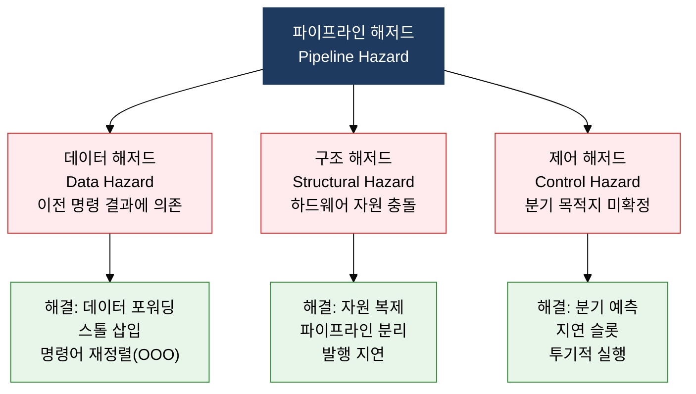
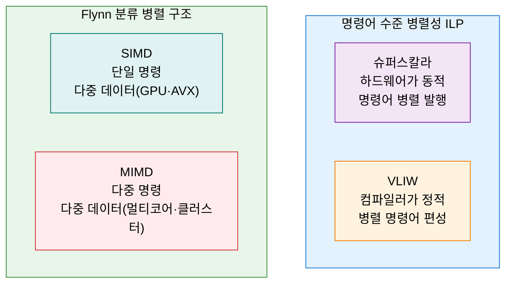

## 1. 명령어 실행을 겹쳐 처리량을 극대화, 병렬 처리 및 프로세서 성능 향상의 개요

**정의**: 명령어 실행 단계를 중첩(파이프라이닝)하거나 복수 연산 장치를 동시 가동(슈퍼스칼라·VLIW)하여 단위 시간당 처리 명령 수(IPC)를 높이는 프로세서 설계 기법.
- 파이프라이닝은 명령어를 Fetch·Decode·Execute·Write-Back 등 단계로 분할해 여러 명령을 동시 진행
- 슈퍼스칼라는 실행 유닛을 복수 탑재해 매 사이클 복수 명령 발행, VLIW는 컴파일러가 병렬 명령어를 정적 편성
- Flynn 분류(SISD·SIMD·MISD·MIMD)는 데이터·명령어 스트림 수로 병렬 컴퓨터 구조를 체계적으로 분류

**특징**:
- **파이프라인 해저드 관리**: 데이터·구조·제어 해저드를 포워딩·스톨·분기 예측으로 억제해 실질 IPC 유지
- **명령어 수준 병렬성(ILP)**: 슈퍼스칼라·비순서 실행(OOO)·레지스터 리네이밍으로 하드웨어가 의존성 없는 명령을 자동 병렬화
- **데이터 수준 병렬성(DLP)**: SIMD 확장(SSE·AVX·NEON)으로 벡터 연산을 단일 명령으로 처리해 멀티미디어·AI 워크로드 가속

---

## 2. 병렬 처리 및 프로세서 성능 향상의 핵심 구성 체계

### 가. 파이프라이닝 개념 및 3대 해저드와 해결 방안

| 해저드 종류 | 발생 원인 | 구체적 예시 | 주요 해결 방안 |
|---|---|---|---|
| **데이터 해저드(RAW)** | 이전 명령 결과를 다음 명령이 읽기 전에 Write-Back 미완료 | `ADD R1, R2, R3` 직후 `MOV R4, R1` — R1 값 아직 미확정 | 데이터 포워딩(파이프라인 우회), 파이프라인 스톨(Bubble), 비순서 실행 |
| **데이터 해저드(WAW·WAR)** | 쓰기-쓰기·쓰기 후 읽기 순서 역전 | 비순서 실행 시 후발 명령이 먼저 레지스터에 기록 | 레지스터 리네이밍(Renaming), 재순서 버퍼(ROB) |
| **구조 해저드** | 동일 하드웨어 자원(메모리·FPU 등)을 동시 요청 | IF 단계와 MEM 단계가 동시에 단일 메모리 포트 접근 | 명령어·데이터 캐시 분리, 실행 유닛 복제, 발행 지연 |
| **제어 해저드** | 분기 명령어의 목적지 주소 계산 전 다음 명령어 인출 진행 | `JNZ label` 실행 중 분기 방향 미결정으로 잘못된 명령 인출 | 분기 예측(BTB·BHT), 투기적 실행, 지연 분기(Delay Slot) |

---

### 나. 슈퍼스칼라·VLIW·슈퍼파이프라인 비교 및 Flynn 분류

| 구분 | 슈퍼스칼라 | VLIW | 슈퍼파이프라인 |
|---|---|---|---|
| **병렬화 주체** | 하드웨어(동적 스케줄링) | 컴파일러(정적 스케줄링) | 하드웨어(단계 세분화) |
| **발행 방식** | 매 사이클 복수 명령 동적 선택 | 1개 긴 명령어에 복수 연산 패킹 | 단일 명령을 더 많은 단계로 분할 |
| **해저드 처리** | 하드웨어가 의존성 검사·스톨 삽입 | 컴파일러가 사전 NOP 패딩 | 단계 증가로 분기 패널티 증가 |
| **하드웨어 복잡도** | 높음 (OOO, ROB, 스케줄러) | 낮음 (단순 다중 실행 유닛) | 중간 (단계 세분화 레지스터 추가) |
| **대표 제품** | Intel Core, AMD Ryzen | Intel Itanium, DSP | ARM Cortex-A 일부, 초기 MIPS |

| Flynn 분류 | 명령 스트림 | 데이터 스트림 | 특징 | 대표 예시 |
|---|---|---|---|---|
| **SISD** | 단일 | 단일 | 순차 처리, 전통적 단일 코어 | 단일 코어 x86, 초기 CPU |
| **SIMD** | 단일 | 다중 | 벡터 연산, GPU 셰이더·미디어 처리 | GPU(NVIDIA), Intel AVX, ARM NEON |
| **MISD** | 다중 | 단일 | 동일 데이터에 다른 연산, 결함 허용 | 우주선·항공 결함 허용 시스템 |
| **MIMD** | 다중 | 다중 | 완전 독립 병렬 처리, 범용 병렬 컴퓨팅 | 멀티코어 CPU, 클러스터, SMP |

---

## 3. 병렬 처리 및 프로세서 성능 향상 도입의 기대효과 및 활용 방안

| 구분 | 주요 기대효과 | 활용 및 실무 적용 방안 |
|---|---|---|
| **처리량 향상** | 파이프라이닝·슈퍼스칼라로 클록 속도 증가 없이 IPC 향상, 전력 효율 개선 | Intel Core의 OOO 슈퍼스칼라 활용, 코드 의존성 최소화 컴파일 최적화(-O3, LTO) |
| **해저드 최소화** | 분기 예측·데이터 포워딩으로 파이프라인 스톨 감소, 실질 성능 향상 | 분기 집약 코드 루프 언롤링, 프로파일 기반 최적화(PGO)로 예측 적중률 향상 |
| **데이터 병렬화** | SIMD 명령어로 벡터 연산 단일 사이클 처리, AI·멀티미디어 가속 | AVX-512 활용 딥러닝 추론 가속, GPGPU(CUDA·OpenCL)로 SIMD 대규모 행렬 연산 |
| **확장성 설계** | MIMD 멀티코어·클러스터 구조로 스레드 수준 병렬성(TLP) 수평 확장 | OpenMP·MPI 기반 병렬 프로그래밍, Kubernetes 클러스터로 MIMD 분산 워크로드 관리 |
