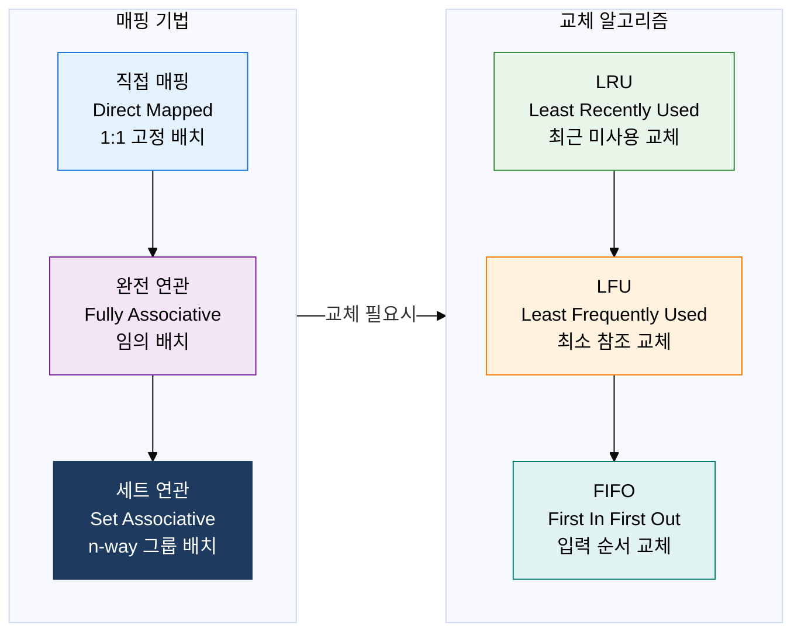
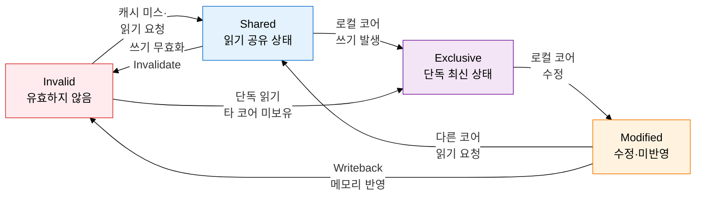

## 1. CPU-메모리 속도 격차를 지역성 원리로 극복하는 고속 버퍼, 캐시 메모리의 개요

**정의**: CPU와 주기억장치 사이에 위치하여 시간·공간 지역성을 활용함으로써 평균 메모리 접근 시간을 단축하는 고속 소용량 버퍼 메모리.
- L1(코어 내부, 수 KB)·L2(코어 근방, 수백 KB)·L3(공유, 수 MB)의 다단 계층으로 구성
- 히트율(Hit Rate) 향상을 위해 매핑 기법, 교체 알고리즘, 쓰기 정책을 최적화
- 멀티코어 환경에서 캐시 일관성(Cache Coherence) 유지가 정확성의 핵심 요건

**특징**:
- **지역성 활용**: 시간적 지역성(최근 참조 재접근)·공간적 지역성(인접 데이터 프리패치)으로 히트율 극대화
- **계층 분리**: 용량·속도·비용의 트레이드오프를 L1~L3 계층으로 분산하여 최적 균형 실현
- **일관성 보장**: MESI 프로토콜로 멀티코어 간 공유 데이터의 정합성을 하드웨어 수준에서 유지

---

## 2. 캐시 메모리의 핵심 구성 체계

### 가. 캐시 매핑 기법 및 교체 알고리즘

| 구분 | 직접 매핑 | 완전 연관 | 세트 연관 |
|---|---|---|---|
| **배치 방식** | 주소 mod 캐시 크기로 고정 | 빈 라인 어디든 배치 가능 | 지정 세트 내 임의 배치 |
| **하드웨어 복잡도** | 낮음 (비교기 1개) | 높음 (병렬 비교기 전체) | 중간 (세트 내 비교기) |
| **충돌 가능성** | 높음 (동일 라인 경합) | 없음 | 낮음 |
| **성능** | 구현 단순, 충돌 미스 多 | 히트율 최고, 비용 최고 | 현실적 최선 균형 |
| **교체 알고리즘** | 고정 라인으로 불필요 | LRU·LFU·FIFO 적용 | LRU·FIFO 적용 |
| **실제 적용** | 구형 L1 캐시 | TLB·소형 캐시 | 현대 L1~L3 캐시 표준 |

| 교체 알고리즘 | 선택 기준 | 장점 | 단점 |
|---|---|---|---|
| **LRU** | 시간적 지역성 높은 워크로드 | 실제 히트율 최우수 | 타임스탬프 추적 오버헤드 |
| **LFU** | 참조 빈도 편중 워크로드 | 인기 데이터 보존 | 초기 캐시 오염(Cold Start) |
| **FIFO** | 구현 단순성 우선 환경 | 최소 하드웨어 비용 | Belady 이상 현상 발생 |

---

### 나. 캐시 일관성 MESI 프로토콜 및 쓰기 정책

| MESI 상태 | 캐시 라인 상태 | 메모리 동기화 | 타 코어 복사본 |
|---|---|---|---|
| **Modified** | 수정됨, 최신 데이터 보유 | 미반영 (Dirty) | 없음 |
| **Exclusive** | 수정 없음, 최신 보유 | 동일 (Clean) | 없음 |
| **Shared** | 수정 없음, 최신 보유 | 동일 (Clean) | 1개 이상 존재 |
| **Invalid** | 유효하지 않음 | 해당 없음 | 해당 없음 |

| 구분 | Write-Through | Write-Back | 비고 |
|---|---|---|---|
| **동작 방식** | 캐시 쓰기 즉시 메모리 반영 | 캐시만 수정, 교체 시 반영 | Dirty Bit 유무 차이 |
| **일관성** | 항상 메모리와 동기 | 캐시-메모리 불일치 허용 | MESI Modified 상태 활용 |
| **버스 트래픽** | 모든 쓰기마다 발생 | 교체(Eviction) 시만 발생 | Write-Back이 대역폭 절약 |
| **구현 복잡도** | 단순 | Dirty Bit 관리 필요 | Write-Back이 복잡 |
| **적합 환경** | 소형 임베디드·I/O 버퍼 | 범용 CPU L1~L3 캐시 | 현대 CPU 표준은 Write-Back |

---

## 3. 캐시 메모리 최적화 도입의 기대효과 및 활용 방안

| 구분 | 주요 기대효과 | 활용 및 실무 적용 방안 |
|---|---|---|
| **성능 향상** | L1 캐시 히트 시 1~4 사이클, DRAM 대비 100배 이상 속도 향상 | n-way 세트 연관 캐시 크기 최적화, 루프 타일링으로 공간 지역성 극대화 |
| **일관성 보장** | MESI 프로토콜로 멀티코어 데이터 정합성 하드웨어 자동 보장 | False Sharing 회피를 위한 캐시 라인 정렬 패딩, NUMA 아키텍처 캐시 토폴로지 설계 |
| **에너지 효율** | Write-Back 정책으로 메모리 버스 트래픽 최소화, 전력 소비 감소 | 서버 CPU 프리패처 설정 최적화, 캐시 친화적 데이터 구조(AoS→SoA) 전환 |
| **시스템 확장성** | L3 공유 캐시와 일관성 프로토콜 조합으로 코어 수 증가에도 성능 유지 | Last-Level Cache 미스율 모니터링, PMU 카운터 기반 캐시 성능 프로파일링 |
