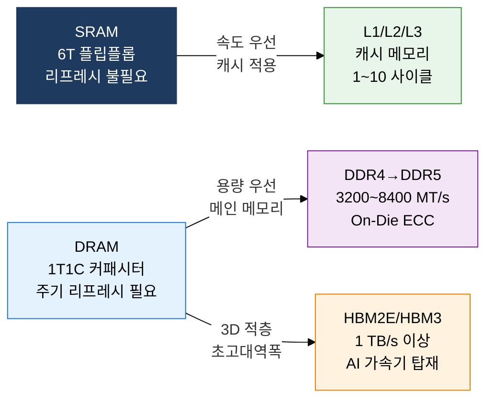
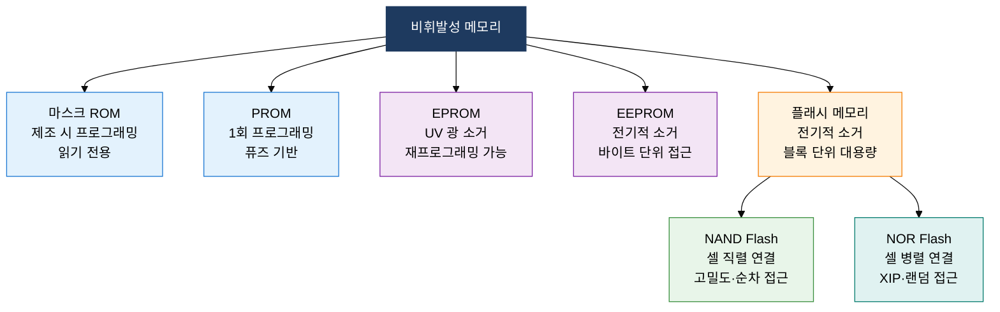

## 1. 휘발성·비휘발성 반도체 메모리 기술의 진화와 고대역폭 혁신, 주기억장치의 개요

**정의**: CPU가 직접 주소 지정하여 프로그램과 데이터를 저장하는 반도체 기반 기억장치로, 휘발성(SRAM·DRAM)과 비휘발성(ROM·Flash) 유형으로 구분되는 주기억장치 기술 체계.
- SRAM은 플립플롭 회로로 고속 동작하며 캐시에, DRAM은 커패시터 기반으로 주기억장치에 사용
- DDR5는 64 Gbps 이상 대역폭, HBM은 3D 적층으로 1 TB/s급 대역폭을 실현
- NAND 플래시는 SSD·스토리지에, NOR 플래시는 펌웨어·임베디드 코드 실행에 활용

**특징**:
- **용도별 최적화**: 속도 우선(SRAM→캐시), 용량 우선(DRAM→주기억), 비휘발성(Flash→저장) 계층 특화
- **기술 진화**: 셀 구조 미세화(DDR4→DDR5), 3D 적층(HBM), 다중 레벨 셀(MLC/TLC/QLC)로 밀도·성능 향상
- **전력 균형**: 저전압 동작(LPDDR5)과 고대역폭 아키텍처(HBM) 병행으로 모바일·AI 서버 양 극단 지원

---

## 2. 주기억장치의 핵심 구성 체계

### 가. SRAM vs DRAM 구조 비교 및 고성능 DRAM 진화

| 구분 | SRAM | DRAM | 비고 |
|---|---|---|---|
| **셀 구조** | 6개 트랜지스터 플립플롭 | 1 트랜지스터 + 1 커패시터 | SRAM이 셀 면적 6배 |
| **리프레시** | 불필요 | 수 ms마다 주기 리프레시 | DRAM 소비 전력 증가 요인 |
| **접근 속도** | 0.5~2 ns | 10~50 ns | SRAM 약 10~20배 빠름 |
| **집적도** | 낮음 (대용량 불가) | 높음 (수십 GB 가능) | DRAM이 주기억장치 표준 |
| **용도** | L1~L3 캐시, 레지스터 | 메인 메모리 | 계층별 역할 분리 |

| 구분 | DDR4 | DDR5 | HBM3 |
|---|---|---|---|
| **데이터 레이트** | 1600~3200 MT/s | 3200~8400 MT/s | 819 GB/s 이상 |
| **전압** | 1.2 V | 1.1 V | 1.2 V |
| **ECC** | 선택적 | On-Die ECC 기본 | ECC 내장 |
| **채널** | 64비트 단일 | 32비트 듀얼 채널 | 1024비트 광폭 |
| **주요 용도** | 범용 서버·PC | 차세대 서버·AI | GPU·AI 가속기 |

---

### 나. ROM 종류 및 NAND vs NOR 플래시 메모리 구조 비교

| 구분 | NAND Flash | NOR Flash | 비고 |
|---|---|---|---|
| **셀 연결** | 직렬(Series) 연결 | 병렬(Parallel) 연결 | NAND가 면적 효율 우수 |
| **접근 방식** | 페이지 단위 순차 읽기 | 바이트 단위 랜덤 읽기 | NOR는 XIP 지원 |
| **쓰기 단위** | 페이지(4~16 KB) | 바이트 단위 가능 | NAND 쓰기 전 소거 필요 |
| **소거 단위** | 블록(128~512 KB) | 블록(64~128 KB) | NAND 블록이 더 큼 |
| **집적도·비용** | 높음 (저비용 대용량) | 낮음 (고비용 소용량) | NAND가 GB당 비용 절감 |
| **내구성** | 1만~10만 P/E 사이클 | 10만~100만 P/E 사이클 | NOR가 내구성 우수 |
| **주요 용도** | SSD, eMMC, UFS, USB | 펌웨어, BIOS, MCU 코드 | 용도별 명확히 분리 |

---

## 3. 주기억장치 기술 도입의 기대효과 및 활용 방안

| 구분 | 주요 기대효과 | 활용 및 실무 적용 방안 |
|---|---|---|
| **성능 향상** | DDR5 전환으로 메모리 대역폭 2배 이상 확보, 병목 해소 | AI 학습 서버 DDR5 듀얼 채널 구성, 데이터베이스 서버 대용량 DRAM 확장 |
| **AI 가속** | HBM3 탑재로 GPU 메모리 대역폭 1 TB/s 이상 달성 | NVIDIA H100·AMD MI300X HBM 활용 LLM 추론 서버, AI 추론 전용 가속기 설계 |
| **스토리지 신뢰성** | NAND 웨어 레벨링·ECC로 SSD 수명·신뢰성 확보 | NVMe SSD TLC/QLC 계층화 스토리지, 임베디드 시스템 NOR Flash 펌웨어 업데이트 설계 |
| **전력 효율** | LPDDR5·HBM 저전압 설계로 모바일·엣지 전력 최적화 | 스마트폰·엣지 AI 디바이스 LPDDR5X 적용, 데이터센터 메모리 전력 밀도 관리 |
