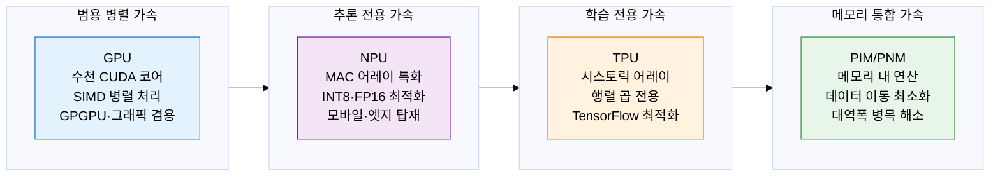
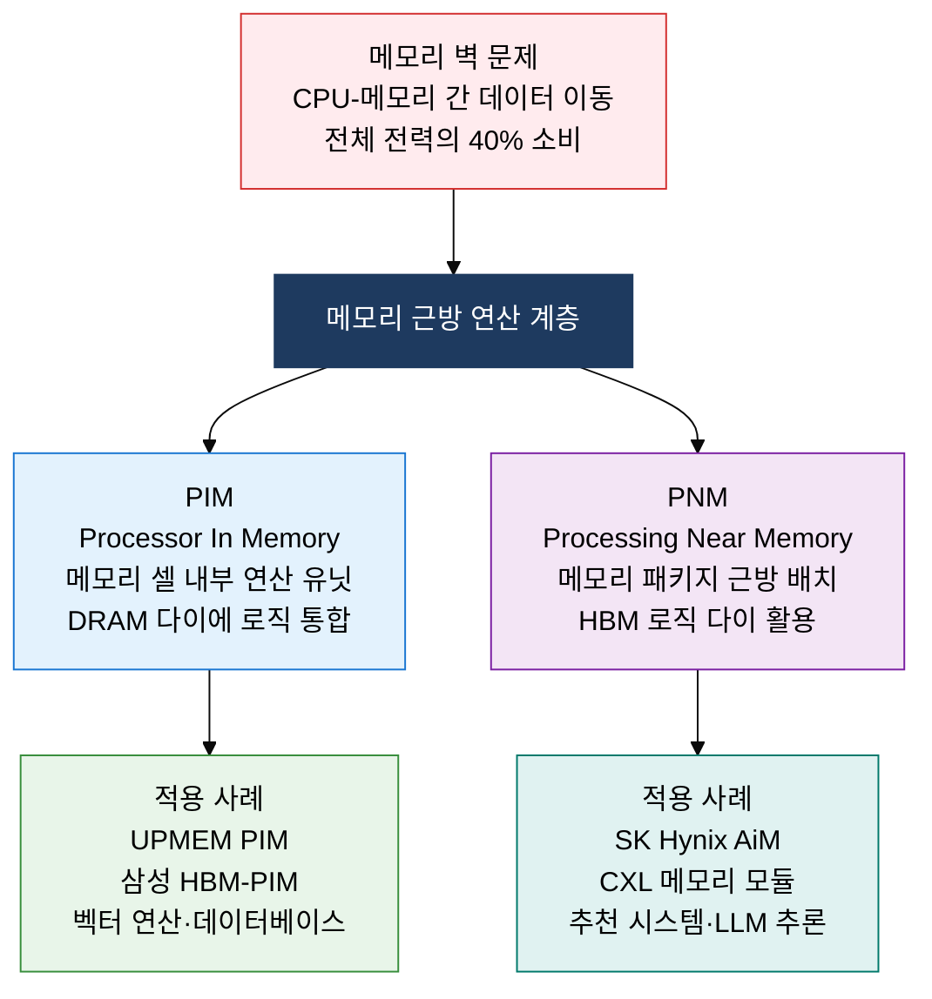

## 1. 병렬 행렬 연산과 메모리 근방 처리로 AI 추론·학습을 가속하는, AI 반도체의 개요

**정의**: 딥러닝 행렬 연산·추론을 특화 가속하기 위해 대규모 병렬 연산 유닛과 고대역폭 메모리를 결합한 도메인 특화 반도체 아키텍처.
- GPU는 수천 개 CUDA/Shader 코어로 GPGPU 범용 병렬 연산, NPU는 MAC 어레이로 추론 전용 최적화
- TPU는 Google이 설계한 행렬 곱 전용 시스토릭 어레이로 TensorFlow 워크로드 최적 처리
- PIM/PNM은 메모리 내부 또는 근방에 연산 유닛을 배치하여 데이터 이동 병목을 근본적으로 해소

**특징**:
- **대규모 병렬성**: 수천~수만 개 경량 연산 유닛으로 DNN 레이어 병렬 처리, CPU 대비 수백 배 처리량
- **메모리 최적화**: HBM·LPDDR5 고대역폭 메모리와 온칩 SRAM 버퍼 결합으로 메모리 대역폭 병목 완화
- **에너지 효율**: 도메인 특화 설계로 불필요한 컨트롤 로직 제거, TOPS/W(Tera OPS per Watt) 극대화

---

## 2. AI 반도체의 핵심 구성 체계

### 가. GPU vs NPU vs TPU 아키텍처 비교

| 구분 | GPU | NPU | TPU | 비고 |
|---|---|---|---|---|
| **연산 단위** | FP32/FP16 SIMD 코어 | INT8/FP16 MAC 어레이 | BF16 시스토릭 어레이 | 정밀도-효율 트레이드오프 |
| **최적화 대상** | 학습·추론·그래픽 범용 | 추론 전용 경량화 | 대규모 행렬 곱 학습 | 용도별 특화 설계 |
| **메모리** | HBM2E/HBM3 (80 GB+) | LPDDR5 (수 GB) | HBM (16~32 GB/칩) | 용량·대역폭 차이 |
| **전력** | 300~700 W | 수~수십 W | 수백 W | NPU가 에너지 효율 최고 |
| **대표 제품** | NVIDIA H100, AMD MI300X | Apple ANE, Qualcomm Hexagon | Google TPU v4/v5 | 서버·모바일·클라우드 분리 |
| **TOPS/W** | 수십 TOPS/W | 수백 TOPS/W | 중간 | NPU 모바일 압도적 효율 |

---

### 나. PIM 및 PNM 원리와 메모리 대역폭 병목 해결

| 구분 | 기존 아키텍처 | PIM | PNM | 비고 |
|---|---|---|---|---|
| **연산 위치** | CPU/GPU 내부 | DRAM 셀 내부 | 메모리 패키지 근방 | 거리에 따라 구분 |
| **데이터 이동** | CPU-메모리 버스 왕복 | 이동 최소화 | 대폭 감소 | 메모리 대역폭 절약 |
| **대역폭 활용** | 외부 버스 대역폭 제한 | 내부 메모리 대역폭 활용 | HBM 내부 대역폭 활용 | 10~100배 향상 |
| **구현 난이도** | 기존 방식 | DRAM 공정에 로직 통합 | 별도 다이 적층 | PNM이 구현 현실적 |
| **전력 절감** | 기준 | 데이터 이동 전력 60~80% 절감 | 40~60% 절감 | LLM 추론 효과 큼 |
| **대표 기술** | DDR5 시스템 | 삼성 HBM-PIM, UPMEM | SK Hynix AiM, CXL PNM | 상용화 진행 중 |

---

## 3. AI 반도체 도입의 기대효과 및 활용 방안

| 구분 | 주요 기대효과 | 활용 및 실무 적용 방안 |
|---|---|---|
| **학습 가속** | GPU 클러스터 병렬 처리로 LLM 학습 시간을 수 주에서 수 일로 단축 | NVIDIA H100 NVLink 클러스터 구성, MegatronLM 텐서 병렬 학습, Mixed Precision 학습 파이프라인 |
| **추론 효율** | NPU INT8 양자화로 CPU 대비 추론 처리량 10~100배 향상, 전력 90% 절감 | 온디바이스 AI NPU 추론 엔진(TFLite·ONNX), 엣지 서버 NPU 클러스터 추론 배포 |
| **메모리 병목 해소** | PIM/PNM으로 추천 시스템·LLM 추론의 메모리 대역폭 병목 근본 해결 | CXL 메모리 확장 서버 구성, HBM-PIM 기반 임베딩 테이블 조회 가속, AiM 기반 그래프 신경망 |
| **에너지 절감** | 도메인 특화 가속기 조합으로 데이터센터 AI 워크로드 전력 밀도 최적화 | CPU+GPU+NPU 이기종 컴퓨팅 오케스트레이션, PUE 개선을 위한 가속기 워크로드 스케줄링 |
