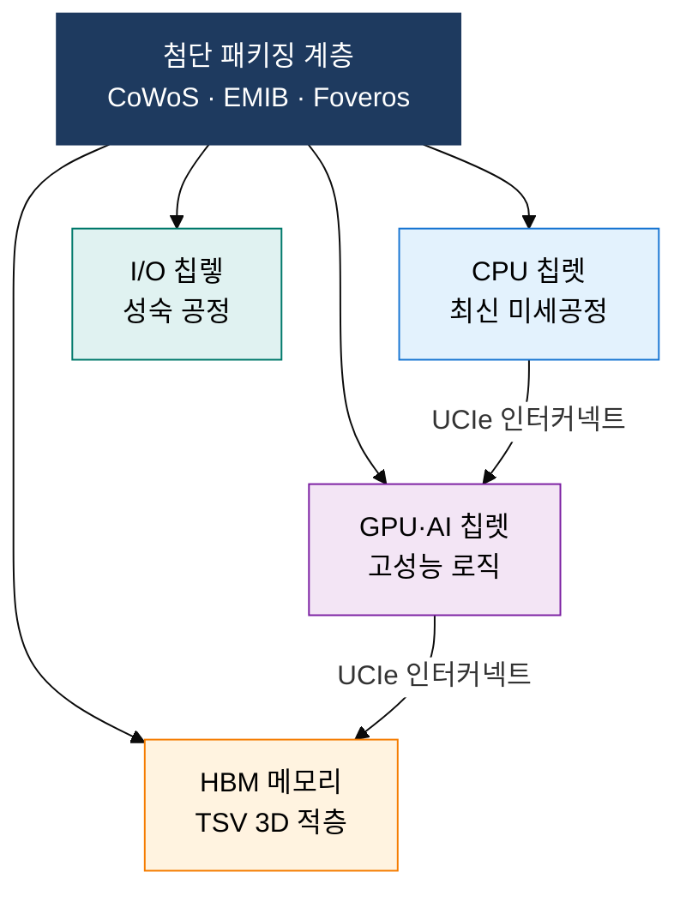

## 1. 단일 다이 한계를 이기종 집적으로 돌파하는 차세대 반도체, 칩렛·뉴로모픽 컴퓨팅의 개요

**정의**: 단일 다이의 수율·비용 한계를 극복하기 위해 기능별로 분리된 칩렛을 첨단 패키징으로 결합하고, 뇌의 스파이킹 메커니즘을 모방하여 이벤트 기반 초저전력 연산을 실현하는 차세대 반도체 아키텍처.
- 칩렛은 UCIe 표준 인터커넥트와 TSV·CoWoS 3D 패키징으로 칩 간 대역폭을 극대화
- 뉴로모픽은 SNN(스파이킹 뉴럴 네트워크)으로 이벤트 발생 시에만 연산하여 에너지를 절감
- AI 추론·엣지 IoT·자율주행 등 실시간 저전력 처리가 필수인 응용 분야에 최적화

**특징**:
- **이기종 집적**: 로직·메모리·아날로그 등 서로 다른 공정 노드의 다이를 하나의 패키지에 결합
- **뇌 모방 처리**: 뉴런-시냅스 구조를 하드웨어로 구현하여 스파이크 발생 시에만 전력 소비
- **확장성·재사용**: 칩렛 단위로 설계·검증·재조합이 가능하여 개발 기간 단축 및 비용 절감

---

## 2. 칩렛·뉴로모픽 컴퓨팅의 핵심 구성 체계

### 가. 칩렛(Chiplet) 기술 및 3D 패키징 구조

| 구분 | 전통 SoC | 칩렛(Chiplet) |
|---|---|---|
| **수율** | 다이 면적 증가로 수율 급락 | 소형 다이 분할로 수율 대폭 향상 |
| **비용** | 단일 최신 공정 전체 적용으로 고비용 | 기능별 최적 공정 선택으로 비용 절감 |
| **이기종 집적** | 동일 공정 내 통합만 가능 | CPU·GPU·HBM·아날로그 혼합 집적 |
| **대표 제품** | 퀄컴 Snapdragon (초기 통합 SoC) | AMD Zen 4 (CCD+IOD), Intel Meteor Lake |

---

### 나. 뉴로모픽(Neuromorphic) 컴퓨팅 구조 및 폰 노이만 비교

| 구분 | 폰 노이만 아키텍처 | 뉴로모픽 아키텍처 |
|---|---|---|
| **처리 방식** | 클럭 동기식 순차 연산 | 이벤트 비동기 스파이킹 처리 |
| **메모리 구조** | CPU·메모리 분리 (폰 노이만 병목) | 뉴런-시냅스 인메모리 연산 일체화 |
| **에너지 효율** | 항상 전력 소비, 비효율 | 스파이크 발생 시에만 전력 소비 |
| **적용 분야** | 범용 컴퓨팅·배치 AI 학습 | 엣지 AI·센서 처리·로봇 제어 |
| **대표 칩** | Intel Xeon, NVIDIA A100 | Intel Loihi 2, IBM TrueNorth |

---

## 3. 칩렛·뉴로모픽 컴퓨팅 도입의 기대효과 및 활용 방안

| 구분 | 주요 기대효과 | 활용 및 실무 적용 방안 |
|---|---|---|
| **설계 효율** | 기능별 최적 공정 선택으로 수율·비용 동시 개선 | AMD·Intel 방식의 칩렛 분리 설계 도입, UCIe 표준 기반 멀티벤더 칩렛 생태계 활용 |
| **고대역폭 메모리** | HBM+TSV 3D 적층으로 메모리 대역폭 수 TB/s 달성 | AI 가속기·HPC 시스템에 CoWoS 패키징 적용, GPU-HBM 근접 배치로 지연 최소화 |
| **초저전력 AI** | SNN 이벤트 기반 처리로 기존 GPU 대비 수십~수백 배 에너지 절감 | IoT 센서·웨어러블·자율주행 엣지 디바이스에 뉴로모픽 추론 엔진 탑재 |
| **기술 융합** | 칩렛 패키징 내 뉴로모픽 타일 혼합 집적으로 용도별 최적 연산 구성 | 이기종 칩렛 설계에 뉴로모픽 코어 추가, AI SOC·로봇 제어 SoC 차세대 플랫폼 구축 |
