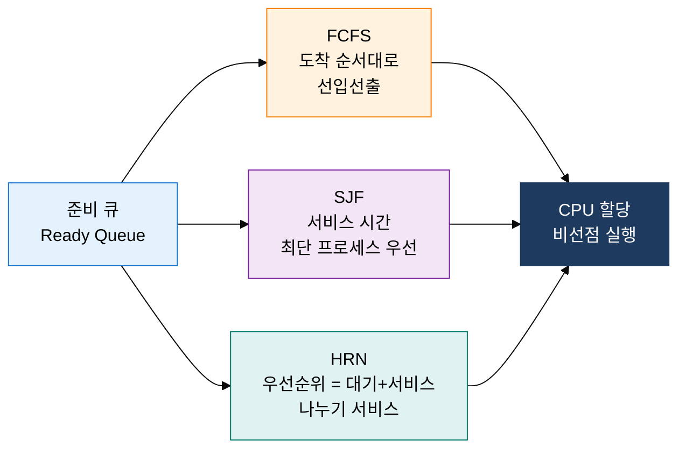
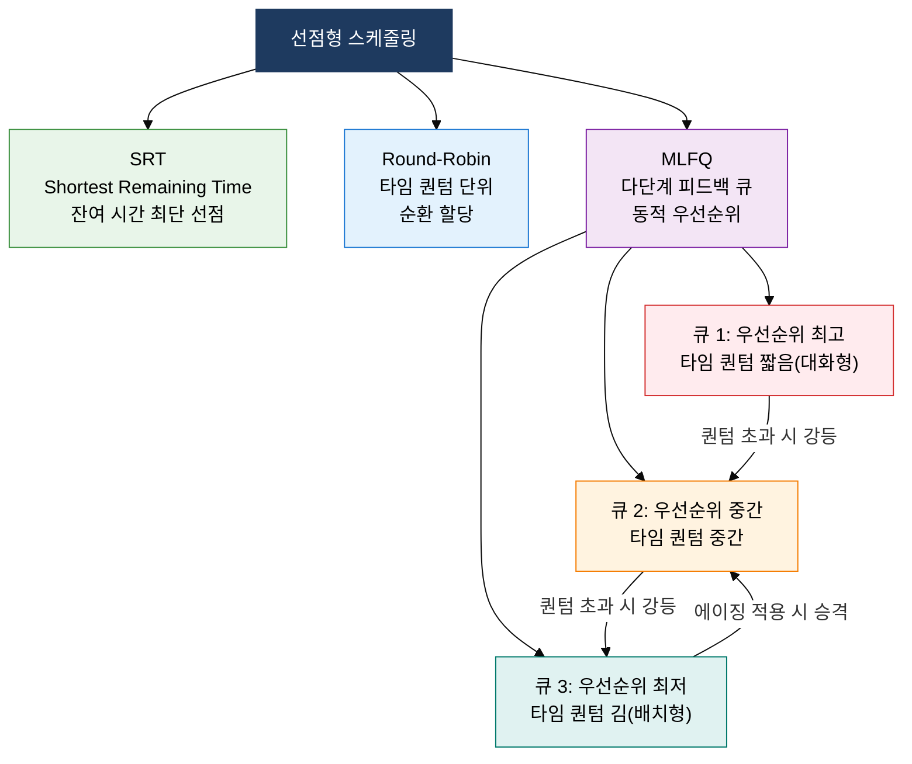

## 1. 프로세스 대기 시간을 최소화하고 CPU 효율을 극대화하는 정책 설계, CPU 스케줄링의 개요

**정의**: 준비 큐(Ready Queue)에 있는 프로세스들에게 CPU를 어떤 순서와 방식으로 할당할지 결정하는 운영체제 핵심 정책으로, 비선점형과 선점형 두 계열로 구분.
- 스케줄링 기준 지표: CPU 활용률(Utilization), 처리량(Throughput), 반환 시간(Turnaround Time), 대기 시간(Waiting Time), 응답 시간(Response Time)
- 비선점형은 실행 중인 프로세스가 자발적으로 CPU를 반납할 때까지 교체 불가
- 선점형은 우선순위나 타임 퀀텀을 근거로 실행 중인 프로세스에서 CPU를 강제 회수 가능

**특징**:
- **알고리즘 다양성**: FCFS·SJF·HRN·SRT·RR·MLFQ 등 환경과 목적에 따라 최적 알고리즘 선택
- **기아 현상 관리**: 장기 대기 프로세스에 에이징(Aging) 기법을 적용해 우선순위를 점진적으로 상향
- **계층적 피드백**: MLFQ는 과거 CPU 사용 이력을 반영해 프로세스 특성(CPU 집약·I/O 집약)에 적응

---

## 2. CPU 스케줄링의 핵심 구성 체계

### 가. 비선점형 스케줄링: FCFS·SJF·HRN

| 알고리즘 | 선택 기준 | 기아 현상 | 오버헤드 | 적합 환경 | 비고 |
|---|---|---|---|---|---|
| **FCFS** | 도착 시간 순서(선입선출) | 없음 | 매우 낮음 | 배치 처리 시스템 | 호위 효과(Convoy Effect): 긴 작업이 짧은 작업을 대기시킴 |
| **SJF** | 서비스 시간(CPU Burst)이 가장 짧은 프로세스 우선 | 발생(긴 작업 무한 대기) | 낮음 | 대화형 시스템, 평균 대기 최소화 | 최적 알고리즘이나 서비스 시간 예측 불가 |
| **HRN** | 우선순위 = (대기 시간 + 서비스 시간) / 서비스 시간 | 없음(에이징 내장) | 중간 | SJF 기아 현상 보완이 필요한 환경 | 대기 시간이 길수록 우선순위 자동 상승 |

---

### 나. 선점형 스케줄링: SRT·Round-Robin·MLFQ 및 다단계 피드백 큐

| 알고리즘 | 선택 기준 | 기아 현상 | 오버헤드 | 타임 퀀텀 | 적합 환경 |
|---|---|---|---|---|---|
| **SRT** | 잔여 서비스 시간이 가장 짧은 프로세스 선점 | 발생(긴 작업 무한 대기) | 중간(잦은 선점) | 없음(이벤트 기반) | 응답 시간 최소화, 대화형 |
| **Round-Robin** | 타임 퀀텀(q) 만료 시 다음 프로세스로 강제 전환 | 없음 | 퀀텀 크기에 비례 | 10~100ms 권장 | 시분할 시스템, 공정성 중시 환경 |
| **MLFQ** | 프로세스가 CPU를 많이 쓰면 낮은 큐로 강등, I/O 완료 시 높은 큐로 복귀 | 에이징으로 방지 | 높음(큐 간 이동 관리) | 큐마다 상이(상위 짧음) | 범용 OS(Linux CFS 기반), 혼합 워크로드 |
| **타임 퀀텀 선택** | 너무 작으면 문맥 교환 오버헤드 급증, 너무 크면 FCFS에 근접 | - | 퀀텀 크기에 반비례 | 경험적으로 80% 프로세스 한 퀀텀 내 완료 수준 | 프로세스 평균 CPU Burst 분포 분석 후 결정 |

---

## 3. CPU 스케줄링 적용의 기대효과 및 활용 방안

| 구분 | 주요 기대효과 | 활용 및 실무 적용 방안 |
|---|---|---|
| **성능** | 적절한 알고리즘 선택으로 평균 대기 시간·반환 시간 단축 및 CPU 활용률 극대화 | 워크로드 특성 분석(CPU 집약 vs I/O 집약) 후 SJF·MLFQ 적용, 간트 차트로 성능 시각화 |
| **공정성** | Round-Robin과 에이징 기법으로 모든 프로세스에 합리적인 CPU 기회 보장 | Linux의 CFS(Completely Fair Scheduler)는 가상 실행 시간 기반 공정 분배, nice 값으로 우선순위 조정 |
| **응답성** | 선점형 MLFQ로 대화형 프로세스를 상위 큐에 유지, 사용자 체감 응답 속도 향상 | 실시간 시스템(RTOS)에서 Rate-Monotonic·EDF 알고리즘 적용, 데드라인 기반 우선순위 보장 |
| **확장성** | 멀티코어 환경에서 CPU 친화도(Affinity)·부하 균등(Load Balancing) 결합으로 선형 확장 | Linux `taskset`·`sched_setaffinity`로 스레드-코어 고정 바인딩, NUMA 인식 스케줄링으로 메모리 지연 최소화 |
