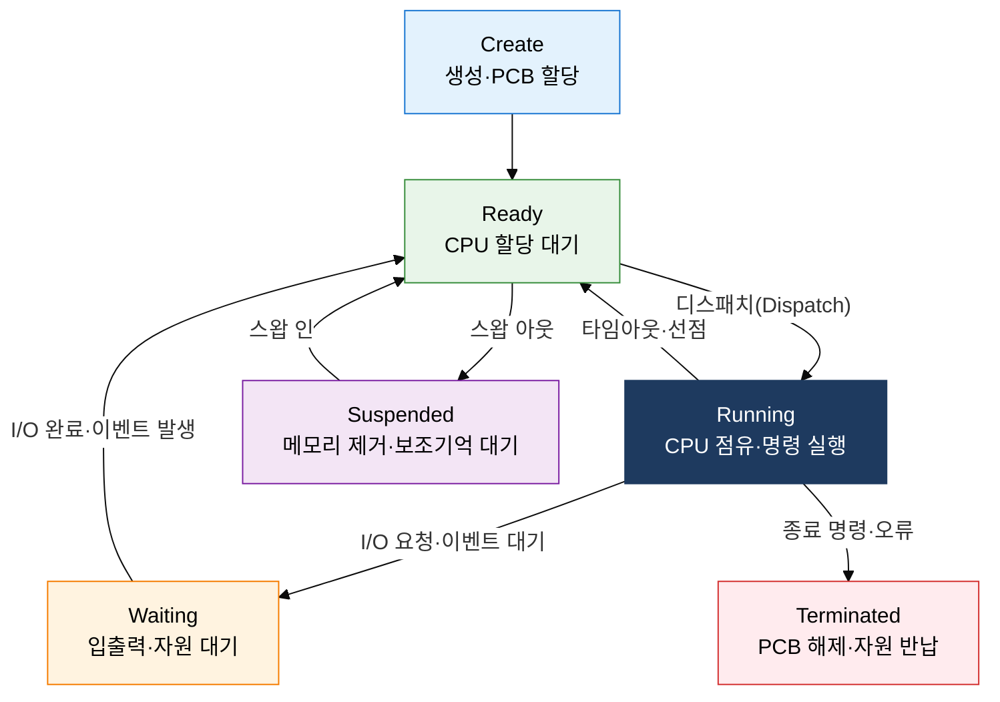

## 1. 실행 단위의 상태·자원 정보를 PCB로 관리하는 OS 핵심 기법, 프로세스 관리의 개요

**정의**: 운영체제가 PCB(Process Control Block)를 통해 각 프로세스의 상태·레지스터·자원 정보를 추적하고, 상태 전이 규칙에 따라 CPU 사용을 제어하는 핵심 관리 기법.
- 프로세스는 실행 중인 프로그램의 인스턴스로, 독립된 메모리 공간(코드·데이터·스택·힙)을 보유
- PCB는 프로세스 ID, 상태, PC(Program Counter), 레지스터 집합, 메모리 맵, 입출력 정보를 포함
- 운영체제는 문맥 교환(Context Switching)을 통해 CPU를 여러 프로세스에게 시분할 제공

**특징**:
- **상태 기반 제어**: Create·Ready·Running·Waiting·Suspended·Terminated 6단계 전이로 프로세스 생명주기를 명확히 정의
- **PCB 중심 추상화**: 모든 프로세스 정보를 PCB 하나에 집약하여 OS 커널이 일관된 인터페이스로 관리
- **투명한 자원 보호**: 독립 메모리 공간과 권한 모드(User/Kernel)로 프로세스 간 침범을 차단

---

## 2. 프로세스 관리의 핵심 구성 체계

### 가. PCB 구조 및 프로세스 상태 전이 6단계

| 상태 | 설명 | 전이 조건 | PCB 위치 |
|---|---|---|---|
| **Create** | 프로세스 생성, PCB 초기화 | fork() / exec() 호출 | 생성 큐 |
| **Ready** | CPU 할당을 기다리는 실행 준비 상태 | 생성 완료, I/O 완료, 타임아웃 | 준비 큐(Ready Queue) |
| **Running** | CPU를 점유하여 명령어 실행 중 | 스케줄러의 디스패치 | CPU 레지스터 |
| **Waiting** | I/O 완료 또는 이벤트 발생 대기 | I/O 요청, 세마포어 대기 | 대기 큐(Wait Queue) |
| **Suspended** | 메모리 부족으로 디스크에 스왑 아웃 | 스왑 아웃(메모리 부족) | 스왑 공간 |
| **Terminated** | 실행 완료, PCB 해제 및 자원 반납 | 정상 종료, 강제 kill | 좀비 상태(부모 수거 전) |

---

### 나. 문맥 교환(Context Switching) 메커니즘과 오버헤드 감소 방안

| 구분 | 설명 | 오버헤드 원인 / 감소 방안 |
|---|---|---|
| **직접 비용** | PCB 저장·복원 시 레지스터 전체를 메모리에 읽고 쓰는 시간 | 레지스터 개수 최소화, HW 문맥 교환 지원(x86 TSS) 활용 |
| **간접 비용 - TLB 플러시** | 프로세스 교환 시 TLB(Translation Lookaside Buffer) 무효화 → 캐시 미스 급증 | ASID(Address Space ID) 태그 사용으로 TLB 선택적 보존 |
| **간접 비용 - 캐시 오염** | 새 프로세스 실행 시 L1/L2 캐시에 유효한 데이터가 없어 콜드 미스 발생 | 스레드 활용(같은 프로세스 내 전환), CPU 친화도(Affinity) 설정 |
| **감소 전략** | 문맥 교환 빈도 자체를 줄이는 설계 적용 | 타임 퀀텀 확대, 코루틴·비동기 I/O로 블로킹 최소화, 스레드 풀 운용 |

---

## 3. 프로세스 관리 적용의 기대효과 및 활용 방안

| 구분 | 주요 기대효과 | 활용 및 실무 적용 방안 |
|---|---|---|
| **안정성** | PCB 기반 격리로 프로세스 간 메모리 침범 차단, 시스템 크래시 최소화 | 마이크로서비스 각 서비스를 독립 프로세스로 배포하여 장애 전파 억제 |
| **성능** | 문맥 교환 오버헤드 분석으로 타임 퀀텀·스케줄링 정책 최적화 가능 | `/proc/[pid]/status` 모니터링, perf·strace로 문맥 교환 횟수 측정 후 튜닝 |
| **자원 효율** | 상태 전이 기반 스케줄링으로 CPU 유휴 시간 최소화 및 다중 프로그래밍 실현 | 컨테이너 환경에서 cgroup으로 프로세스별 CPU·메모리 할당량 제어 |
| **진단·디버깅** | PCB의 레지스터·스택 정보로 코어 덤프 분석 및 교착 상태 탐지 가능 | GDB 코어 덤프 분석, `ps -elf`·`top`으로 프로세스 상태 실시간 추적 |
