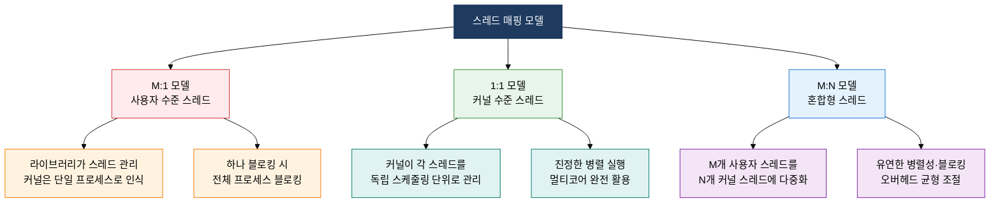

## 1. 프로세스보다 가벼운 실행 단위로 병렬성을 높이는 기법, 스레드 모델의 개요


**정의**: 하나의 프로세스 내에서 코드·데이터·힙을 공유하되 스택과 레지스터만 독립적으로 보유하는 경량 실행 단위(Light-Weight Process)로, 동시성과 병렬성을 효율적으로 구현하는 기법.
- 스레드는 프로세스보다 생성·문맥 교환 비용이 낮아 고빈도 동시 작업에 적합
- 공유 메모리 접근으로 IPC(프로세스 간 통신) 없이 데이터 교환이 가능하나 동기화 문제 발생 가능
- 멀티코어 환경에서 1:1 스레드 모델은 진정한 병렬 실행(true parallelism)을 제공

**특징**:
- **경량성**: 스택·레지스터만 독립 보유, 프로세스 생성 대비 생성·소멸 비용이 수십 배 낮음
- **자원 공유**: 같은 주소 공간 내 코드·데이터·힙·파일 디스크립터를 공유하여 통신 비용 최소화
- **모델 선택성**: 사용자 수준(M:1), 커널 수준(1:1), 혼합형(M:N) 모델로 환경별 최적 병렬성 실현

---

## 2. 스레드 모델 및 멀티스레딩의 핵심 구성 체계

### 가. 프로세스 vs 스레드 구조 비교 및 멀티스레딩 장단점

```mermaid
%%{init: { 'theme': 'base', 'themeVariables': { 'edgeLabelBackground': '#fff' }}}%%
flowchart TD
    subgraph PROC["프로세스 구조"]
        direction LR
        PA["프로세스 A<br/>코드·데이터·힙·스택"] PB["프로세스 B<br/>코드·데이터·힙·스택"]
    end
    subgraph THRD["멀티스레드 프로세스 구조"]
        direction LR
        SH["공유 자원<br/>코드·데이터·힙·파일"] --> T1["스레드 1<br/>스택·레지스터"]
        SH --> T2["스레드 2<br/>스택·레지스터"]
        SH --> T3["스레드 3<br/>스택·레지스터"]
    end
    style PROC fill:#FFEBEE,stroke:#D32F2F
    style THRD fill:#E8F5E9,stroke:#388E3C
    style PA fill:#FFF3E0,stroke:#F57C00,color:#000
    style PB fill:#FFF3E0,stroke:#F57C00,color:#000
    style SH fill:#E3F2FD,stroke:#1976D2,color:#000
    style T1 fill:#F3E5F5,stroke:#7B1FA2,color:#000
    style T2 fill:#F3E5F5,stroke:#7B1FA2,color:#000
    style T3 fill:#F3E5F5,stroke:#7B1FA2,color:#000
```

| 비교 항목 | 프로세스 | 스레드 |
|---|---|---|
| **메모리 공간** | 독립(코드·데이터·힙·스택 각각 별도) | 코드·데이터·힙 공유, 스택만 독립 |
| **생성 비용** | 높음(fork + 메모리 복사 또는 COW) | 낮음(스택 공간만 새로 할당) |
| **문맥 교환 비용** | 높음(TLB 플러시, 주소 공간 교체) | 낮음(같은 주소 공간 내 전환, TLB 유지 가능) |
| **통신 방법** | IPC 필요(파이프·소켓·공유 메모리) | 힙·전역 변수 직접 접근(동기화 필요) |
| **장애 격리** | 한 프로세스 오류가 타 프로세스에 영향 없음 | 한 스레드 오류(예: 세그폴트)가 전체 프로세스 종료 가능 |
| **병렬 실행** | 멀티코어에서 각각 독립 실행 | 1:1 모델에서만 진정한 병렬 실행 가능 |
| **동기화 복잡도** | 낮음(독립 메모리) | 높음(경쟁 조건·데드락 주의) |

---

### 나. 스레드 모델 3종 비교: M:1, 1:1, M:N



| 모델 | 매핑 방식 | 장점 | 단점 | 적용 예시 |
|---|---|---|---|---|
| **M:1 (사용자 수준)** | M개 사용자 스레드 → 1개 커널 스레드 | 커널 개입 없이 빠른 전환, 이식성 높음 | 하나 블로킹 시 전체 블로킹, 멀티코어 미활용 | POSIX Green Threads, 초기 Java 스레드 |
| **1:1 (커널 수준)** | 사용자 스레드 1개 → 커널 스레드 1개 | 진정한 병렬 실행, 개별 블로킹 허용 | 스레드 수 증가 시 커널 자원 고갈, 생성 비용 높음 | Linux pthreads, Windows Thread, Java 현행 |
| **M:N (혼합형)** | M개 사용자 스레드 → N개 커널 스레드(M≥N) | 병렬성과 유연성 균형, 블로킹 개별 처리 | 구현 복잡도 높음, 스케줄러 두 계층 관리 필요 | Go goroutine, Erlang 프로세스, Solaris |

---

## 3. 스레드 모델 적용의 기대효과 및 활용 방안

| 구분 | 주요 기대효과 | 활용 및 실무 적용 방안 |
|---|---|---|
| **성능** | 프로세스 대비 낮은 생성·전환 비용으로 처리량 향상 및 응답 지연 감소 | 웹 서버(Apache·Nginx)에서 요청당 스레드 할당, 스레드 풀로 생성 비용 절감 |
| **병렬성** | 멀티코어 CPU의 코어를 1:1 모델로 완전 활용하여 계산 집약 작업 가속 | JVM 기반 서버에서 ForkJoinPool 활용, 행렬 연산·이미지 처리 병렬 분배 |
| **자원 효율** | 공유 메모리로 IPC 불필요, 메모리 풋프린트 절감 및 데이터 일관성 유지 간소화 | Go 언어 goroutine(M:N)으로 수만 개 동시 연결 처리, 채널로 안전한 통신 구현 |
| **유지보수** | 스레드 모델 명확화로 동기화 정책 수립 용이, 경쟁 조건·데드락 원인 구조적 차단 | synchronized·ReentrantLock·Atomic 클래스로 임계구역 보호, 스레드 분석 도구(jstack) 활용 |
