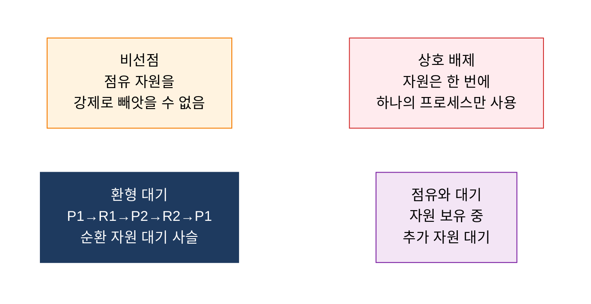

## 1. 프로세스들이 서로의 자원을 무한 대기, 교착 상태의 개요

**정의**: 두 개 이상의 프로세스가 서로 상대방이 점유한 자원을 무한정 대기하여 어느 프로세스도 실행을 진행하지 못하는 상태.
- 상호배제·점유대기·비선점·환형대기 4가지 필요조건이 모두 동시에 성립할 때 발생
- 자원 할당 그래프(Resource Allocation Graph)에 사이클이 존재하면 교착 상태 가능성 탐지
- 예방(Prevention), 회피(Avoidance), 탐지(Detection), 회복(Recovery) 4가지 해결 전략으로 대응

**특징**:
- **필요충분 조건**: 4가지 조건 중 하나라도 제거하면 교착 상태를 원천 예방할 수 있음
- **동적 발생**: 자원 요청 순서와 할당 타이밍에 따라 런타임에 비결정적으로 발생
- **전략별 트레이드오프**: 예방은 자원 이용률 저하, 회피는 사전 정보 요구, 탐지·회복은 오버헤드 감수

---

## 2. 교착 상태의 핵심 구성 체계

### 가. 교착 상태 4대 발생 조건

| 조건 | 설명 | 자원 할당 그래프 표현 |
|---|---|---|
| **상호 배제** | 자원은 공유 불가, 한 프로세스가 독점 사용 중이면 다른 프로세스는 대기해야 함 | 자원 노드에 단일 인스턴스 표시 |
| **점유와 대기** | 최소 하나의 자원을 보유한 채 다른 프로세스가 점유한 자원을 추가로 요청하며 대기 | 프로세스→자원 요청 간선 존재, 동시에 할당 간선도 존재 |
| **비선점** | 프로세스가 자발적으로 반납하기 전까지 OS가 자원을 강제로 빼앗을 수 없음 | 할당 간선이 자원 반납 전까지 유지 |
| **환형 대기** | P1이 R1 보유·R2 대기, P2가 R2 보유·R1 대기처럼 프로세스-자원 간 순환 대기 사슬 형성 | 자원 할당 그래프에 사이클(Cycle) 존재 |

---

### 나. 교착 상태 해결 방안 4가지 비교

| 비교 항목 | 예방 | 회피 | 탐지 | 회복 |
|---|---|---|---|---|
| **핵심 원리** | 4대 조건 중 하나를 시스템 설계 시 제거 | 자원 할당 전 안전 상태(Safe State) 여부 검사 후 할당 | 교착 상태 발생 허용 후 주기적으로 탐지 | 탐지 후 프로세스 종료 또는 자원 선점으로 해소 |
| **대표 기법** | 환형 대기 제거(자원 번호 순 요청), 점유 대기 제거(일괄 요청) | 은행가 알고리즘(Banker's Algorithm), 자원 할당 그래프 알고리즘 | 자원 할당 그래프 사이클 검출, 대기 그래프(Wait-for Graph) | 프로세스 강제 종료, 체크포인트 롤백, 자원 선점 후 재할당 |
| **사전 정보 요구** | 불필요 | 최대 자원 요청량(Max) 사전 선언 필요 | 불필요 | 불필요(탐지 결과 기반 대응) |
| **자원 이용률** | 낮음(과도한 제약) | 중간(안전 상태 이하로 할당 제한) | 높음(제약 없이 할당 허용) | 높음(탐지 후에만 개입) |
| **오버헤드** | 낮음 | 중간(매 할당마다 안전성 검사) | 중간(주기적 탐지 비용) | 높음(롤백·재시작 비용) |
| **적용 환경** | 단순 임베디드·실시간 시스템 | 자원 수·프로세스 수가 적은 시스템 | 범용 OS, 데이터베이스 | DB 트랜잭션 롤백, 클러스터 자원 관리 |

---

## 3. 교착 상태 관리의 기대효과 및 활용 방안

| 구분 | 주요 기대효과 | 활용 및 실무 적용 방안 |
|---|---|---|
| **안정성** | 교착 상태 원천 차단 또는 신속 복구로 시스템 무중단 운영 보장 | RDBMS 교착 상태 탐지(InnoDB wait-for graph), 트랜잭션 자동 롤백으로 데이터 무결성 유지 |
| **성능** | 회피·탐지 전략으로 예방 대비 자원 이용률 향상, 처리량 증가 | 은행가 알고리즘 기반 클라우드 자원 스케줄러 구현, 컨테이너 CPU·메모리 한도 설정 |
| **신뢰성** | 체크포인트·롤백 회복 메커니즘으로 장애 발생 시 최소 데이터 손실 | 분산 시스템(Kubernetes, Zookeeper) 리더 선출 타임아웃으로 교착 상태 자동 해소 |
| **설계 품질** | 자원 번호 순 획득 규칙, 락 계층 구조 도입으로 환형 대기 설계 시 제거 | 코드 리뷰에 락 획득 순서 정적 분석 도구(ThreadSanitizer, Helgrind) 통합 적용 |
