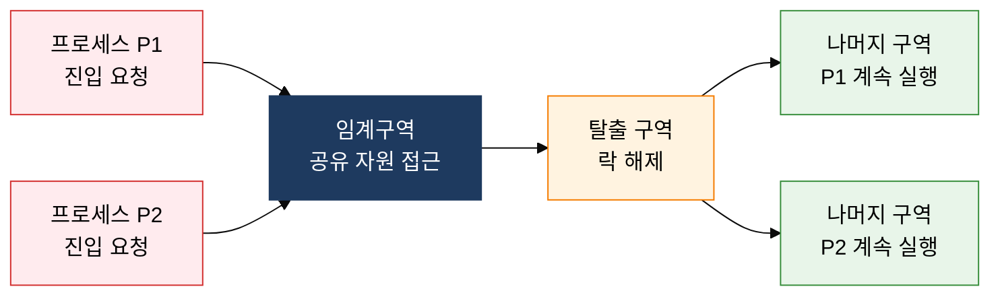

## 1. 공유 자원 경쟁을 원자적 상호배제로 해결, 프로세스 동기화의 개요


**정의**: 둘 이상의 프로세스·스레드가 공유 자원에 동시 접근할 때 발생하는 경쟁 조건을 임계구역 보호 메커니즘으로 제어하여 데이터 일관성을 보장하는 운영체제 기법.
- 임계구역(Critical Section)이란 공유 자원을 읽거나 쓰는 코드 영역으로, 한 번에 하나의 프로세스만 진입 가능해야 함
- 하드웨어 지원(Test-And-Set, Compare-And-Swap) 및 소프트웨어 구조물(뮤텍스·세마포어·모니터)로 구현
- 동기화 부재 시 경쟁 조건(Race Condition), 기아 상태(Starvation), 교착 상태(Deadlock)로 이어질 수 있음

**특징**:
- **원자성 보장**: 임계구역 진입·탈출을 원자적 하드웨어 명령어로 구현하여 인터리빙 차단
- **계층적 추상화**: 하드웨어 명령어 → 스핀락 → 세마포어 → 모니터 순으로 추상 수준 상승
- **공정성·성능 균형**: 대기 방식(바쁜 대기 vs 블록킹)과 우선순위 정책을 통해 처리량과 응답성 조율

---

## 2. 프로세스 동기화의 핵심 구성 체계

### 가. 임계 구역 문제 및 해결 조건



| 조건·기법 | 설명 | 위반 시 문제 |
|---|---|---|
| **상호 배제** | 한 프로세스가 임계구역 실행 중이면 다른 프로세스는 진입 불가 | 데이터 불일치, 경쟁 조건 |
| **진행** | 임계구역에 있는 프로세스가 없을 때, 진입 대기 중인 프로세스 중 하나가 유한 시간 내 진입해야 함 | 불필요한 블록킹, 처리 지연 |
| **제한된 대기** | 임계구역 진입 요청 후 다른 프로세스가 진입할 수 있는 횟수에 상한이 있어야 함 | 기아 상태, 무한 대기 |
| **Test-And-Set** | 메모리 값을 읽고 1로 세팅하는 원자적 하드웨어 명령어, 스핀락 구현에 사용 | 바쁜 대기(Busy Waiting) 발생 가능 |
| **Compare-And-Swap** | 기대값과 현재값을 비교해 같을 때만 교환하는 원자적 명령어, Lock-Free 구조의 기반 | ABA 문제 발생 가능 |

---

### 나. 뮤텍스 vs 세마포어 vs 모니터 비교

```mermaid
%%{init: { 'theme': 'base', 'themeVariables': { 'edgeLabelBackground': '#fff' }}}%%
flowchart TD
    subgraph R1["　"]
        direction LR
        A["뮤텍스<br/>이진 락, 소유권 있음<br/>획득한 스레드만 해제"] B["이진 세마포어<br/>값 0·1, 소유권 없음<br/>다른 스레드 해제 가능"]
    end
    subgraph R2["　"]
        direction LR
        C["카운팅 세마포어<br/>값 N, 다중 자원 관리<br/>P(wait)·V(signal) 연산"] D["모니터<br/>고수준 추상화<br/>조건변수 wait·signal"]
    end
    style R1 fill:none,stroke:none
    style R2 fill:none,stroke:none
    style A fill:#E3F2FD,stroke:#1976D2,color:#000
    style B fill:#F3E5F5,stroke:#7B1FA2,color:#000
    style C fill:#FFF3E0,stroke:#F57C00,color:#000
    style D fill:#E8F5E9,stroke:#388E3C,color:#000
```

| 비교 항목 | 뮤텍스 | 세마포어 | 모니터 |
|---|---|---|---|
| **소유권** | 획득한 스레드만 해제 가능 | 소유권 없음, 누구나 V 연산 가능 | 모니터 내부에서 자동 관리 |
| **자원 수** | 단일 자원(이진 상태) | 단일(이진) 또는 다중(카운팅) | 단일 임계구역(복수 조건변수 가능) |
| **사용 범위** | 스레드 간 상호배제 | 프로세스 간 동기화·자원 계수 | 같은 언어·런타임 내 클래스 수준 |
| **언어 지원** | POSIX pthread_mutex | POSIX sem_t, System V | Java synchronized, C# lock |
| **구현 복잡도** | 낮음 | 중간(P·V 순서 주의) | 낮음(컴파일러가 락 삽입 자동화) |
| **오용 위험** | 데드락(중첩 획득) | 세마포어 역전(P·V 순서 오류) | 조건변수 lost-wakeup |

---

## 3. 프로세스 동기화 도입의 기대효과 및 활용 방안

| 구분 | 주요 기대효과 | 활용 및 실무 적용 방안 |
|---|---|---|
| **안전성** | 경쟁 조건 제거로 공유 데이터 일관성 보장, 시스템 비정상 종료 예방 | DB 트랜잭션 격리 수준과 연계, 멀티스레드 서버의 공유 큐·캐시 접근에 뮤텍스 적용 |
| **성능** | 세마포어·카운팅 기법으로 동시 접속 수 제한, 자원 포화 방지 | 커넥션 풀·스레드 풀 크기 제한에 카운팅 세마포어 활용, 적정 동시성 레벨 튜닝 |
| **생산성** | 모니터·언어 수준 동기화로 락 획득·해제 자동화, 개발 오류 최소화 | Java synchronized/ReentrantLock, Python threading.Lock으로 안전한 공유 상태 관리 |
| **확장성** | Lock-Free·CAS 기반 비차단 자료구조로 고성능 병렬 처리 달성 | java.util.concurrent, C++ std::atomic 활용하여 핫 경로의 락 경합 제거 |
