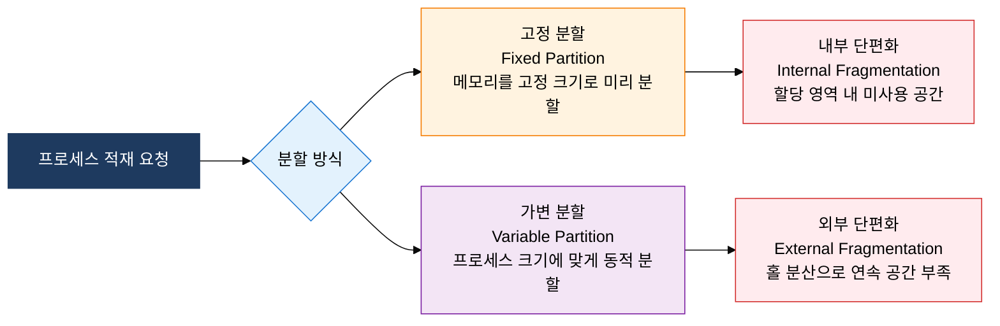
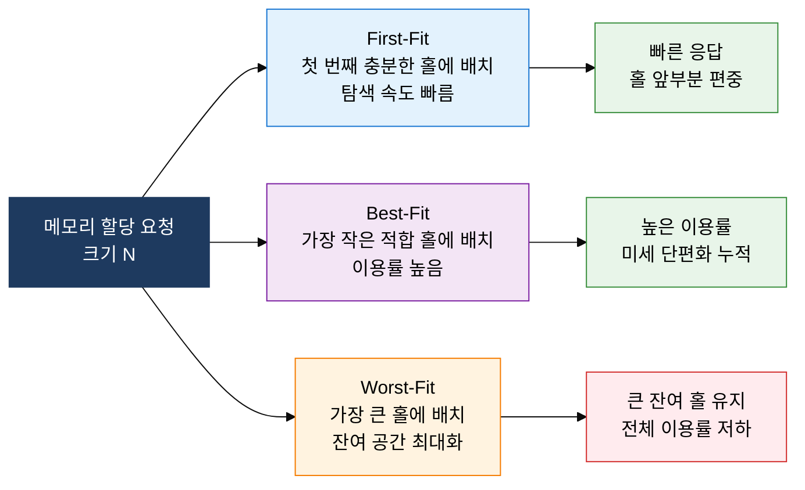

## 1. 단편화를 최소화하는 연속 할당과 배치 전략, 물리 메모리 관리의 개요

**정의**: 물리 메모리를 고정 또는 가변 크기로 분할하고, 배치 전략으로 단편화를 최소화하여 다중 프로세스의 동시 적재를 효율화하는 운영체제 메모리 관리 기법.
- 고정 분할은 내부 단편화, 가변 분할은 외부 단편화를 유발하므로 트레이드오프 분석이 필요
- First-Fit·Best-Fit·Worst-Fit 배치 전략은 실행 시간과 메모리 이용률 간 상충 관계를 가짐
- 외부 단편화가 심화되면 압축(Compaction)으로 연속 가용 공간을 재확보할 수 있으나 오버헤드 발생

**특징**:
- **이중 단편화 구조**: 고정 분할의 내부 단편화와 가변 분할의 외부 단편화는 서로 다른 낭비 원인을 가지며 기법 선택의 기준이 됨
- **배치 전략 다양성**: First-Fit(속도 우선), Best-Fit(이용률 우선), Worst-Fit(잔여 공간 최대화)으로 시스템 목표에 따라 선택
- **압축을 통한 복원**: 가변 분할에서 외부 단편화가 누적될 경우 압축 기법으로 홀(Hole)을 통합하여 연속 공간 확보

---

## 2. 물리 메모리 관리의 핵심 구성 체계

### 가. 연속 할당 기법: 고정 분할 vs 가변 분할

| 구분 | 고정 분할 (Fixed Partition) | 가변 분할 (Variable Partition) |
|---|---|---|
| **분할 방식** | 부팅 시 메모리를 고정 크기 파티션으로 미리 분리 | 프로세스 크기에 맞게 요청 시 동적으로 분할 |
| **단편화 유형** | 내부 단편화 — 파티션 크기 > 프로세스 크기인 잔여 공간 낭비 | 외부 단편화 — 작은 홀이 분산되어 연속 공간 부족 |
| **관리 복잡도** | 낮음 — 파티션 테이블로 단순 관리 | 높음 — 가용 홀 리스트(Free List) 유지 필요 |
| **메모리 이용률** | 낮음 — 파티션 크기와 프로세스 크기 불일치 시 낭비 심화 | 높음 — 프로세스 크기에 맞게 할당하여 낭비 최소화 |
| **다중 프로그래밍** | 파티션 수로 제한됨 | 메모리 총량 내에서 유동적으로 수용 |
| **대표 사용 환경** | 초기 IBM OS/360, 임베디드 RTOS | 현대 범용 운영체제(Unix, Linux) |

---

### 나. 메모리 배치 전략 3종 비교 및 압축(Compaction)

| 전략 | 탐색 방식 | 실행 시간 | 메모리 이용률 | 단편화 정도 | 특징 및 사용 기준 |
|---|---|---|---|---|---|
| **First-Fit** | 홀 리스트 앞에서 첫 번째 충분한 홀 선택 | O(n) — 평균 빠름 | 중간 | 중간 — 앞쪽 홀 편중 | 구현 단순, 일반적 범용 환경에 적합 |
| **Best-Fit** | 크기 차이가 가장 작은 홀 선택 | O(n) — 전체 탐색 | 높음 | 높음 — 미세 잔여 홀 누적 | 메모리 절약 중요 시 선택, 압축 빈도 증가 |
| **Worst-Fit** | 가장 큰 홀에 배치 | O(n) — 전체 탐색 | 낮음 | 낮음 — 큰 잔여 홀 유지 | 큰 프로세스 수용 예비 공간 확보 목적 |
| **압축(Compaction)** | 분산된 홀을 메모리 한쪽으로 통합 재배치 | O(n) — 프로세스 이동 오버헤드 큼 | 향상 | 제거 | 외부 단편화 해소, 실행 중 프로세스 이동 필요 |

---

## 3. 물리 메모리 관리 기법 도입의 기대효과 및 활용 방안

| 구분 | 주요 기대효과 | 활용 및 실무 적용 방안 |
|---|---|---|
| **메모리 이용률** | 가변 분할 + Best-Fit 적용으로 단편화 최소화 및 메모리 낭비 감소 | 프로세스 크기 분포 분석 후 배치 전략 선택, 주기적 압축 스케줄링 |
| **시스템 응답성** | First-Fit의 빠른 탐색으로 메모리 할당 지연 최소화 | 실시간 시스템에서 First-Fit 채택, 홀 리스트 정렬 기반 O(1) 탐색 최적화 |
| **다중 프로그래밍** | 가변 분할로 다양한 크기의 프로세스를 동시 수용하여 CPU 이용률 향상 | 메모리 크기별 프로세스 분류, 할당 실패 시 대기 큐 관리 정책 수립 |
| **운영 안정성** | 단편화 모니터링과 압축 자동화로 장기 운영 중 메모리 고갈 예방 | 가용 메모리 임계치 기반 자동 압축 트리거, 메모리 사용 추이 대시보드 운영 |
