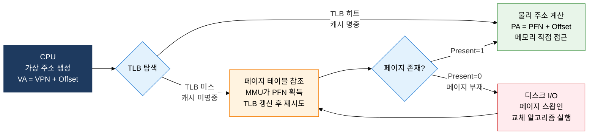
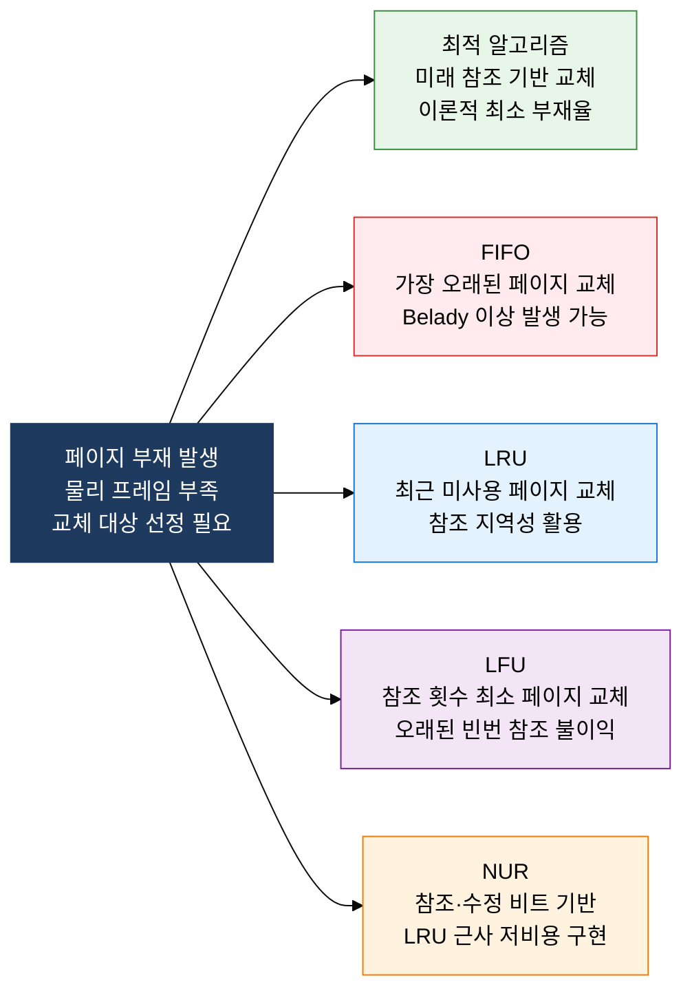

## 1. 물리 메모리 한계를 초월해 프로세스를 실행하는 주소 추상화, 가상 메모리의 개요

**정의**: 프로세스에게 물리 메모리보다 큰 논리 주소 공간을 제공하고, MMU와 페이지 교체 알고리즘으로 실제 실행을 투명하게 지원하는 운영체제의 메모리 추상화 기법.
- 페이징은 고정 크기 페이지로, 세그멘테이션은 가변 크기 논리 단위로 주소 공간을 분리하여 관리
- TLB(Translation Lookaside Buffer)로 페이지 테이블 참조 속도를 높여 주소 변환 오버헤드를 최소화
- 페이지 교체 정책의 품질이 페이지 부재율과 스래싱 발생 여부를 직접 결정함

**특징**:
- **투명한 주소 추상화**: 프로세스는 물리 메모리 구조를 몰라도 연속적인 가상 주소 공간을 사용하므로 개발 편의성 극대화
- **요구 페이징(Demand Paging)**: 실제로 접근하는 페이지만 물리 메모리에 적재하여 초기 로딩 시간과 메모리 점유를 최소화
- **교체 알고리즘 다양성**: FIFO·LRU·LFU·NUR·최적 알고리즘으로 페이지 부재율과 구현 복잡도 간 트레이드오프 관리

---

## 2. 가상 메모리의 핵심 구성 체계

### 가. 페이징 기법과 TLB 주소 변환

| 구분 | 페이징 (Paging) | 세그멘테이션 (Segmentation) |
|---|---|---|
| **분할 단위** | 고정 크기 페이지(보통 4KB) | 가변 크기 논리 단위(코드·스택·힙 등) |
| **단편화** | 내부 단편화 — 마지막 페이지 잔여 공간 낭비 | 외부 단편화 — 세그먼트 간 홀 발생 |
| **주소 변환** | VPN(Virtual Page Number) → PFN(Physical Frame Number) | 세그먼트 번호 + 오프셋 → Base + Limit 검사 |
| **보호·공유** | 페이지 단위 접근 권한(R/W/X) 설정 용이 | 논리 단위별 보호로 의미론적 접근 제어 |
| **TLB 효과** | 페이지 테이블 참조를 캐시로 단축, 히트 시 1 사이클 내 변환 | 세그먼트 디스크립터 캐싱으로 변환 속도 개선 |
| **현대 OS 채택** | x86-64, ARM 등 대부분의 현대 아키텍처 기본 채택 | x86 세그먼트 레지스터(보안·보호 목적 일부 유지) |

---

### 나. 페이지 교체 알고리즘 및 스래싱 방지

| 알고리즘 | 교체 기준 | 페이지 부재율 | 구현 복잡도 | 한계 및 특이사항 |
|---|---|---|---|---|
| **최적(Optimal)** | 가장 나중에 참조될 페이지 | 최저 — 이론적 하한 | 구현 불가(미래 참조 필요) | 다른 알고리즘 성능 비교 기준으로 사용 |
| **FIFO** | 메모리에 가장 오래 있던 페이지 | 높음 | 낮음 — 큐로 단순 구현 | Belady 이상 — 프레임 증가 시 부재율 증가 가능 |
| **LRU** | 가장 오랫동안 사용되지 않은 페이지 | 낮음 | 중간 — 타임스탬프·스택 필요 | 참조 지역성 우수 활용, 하드웨어 지원 필요 |
| **LFU** | 참조 횟수가 가장 적은 페이지 | 중간 | 중간 — 카운터 유지 필요 | 초기 집중 참조 페이지가 이후에도 유리한 불공정 발생 |
| **NUR** | 참조 비트(R)·수정 비트(M) 조합 최솟값 | LRU 근사 | 낮음 — 2비트로 구현 | LRU의 실용적 근사, 현대 OS에서 Clock 알고리즘으로 구현 |

**스래싱(Thrashing) 원인 및 방지 대책**

| 구분 | 내용 |
|---|---|
| **스래싱 정의** | 페이지 부재가 과다 발생하여 CPU가 페이지 교체에만 소비되고 실제 작업이 중단되는 현상 |
| **발생 원인** | 다중 프로그래밍 수준 과다 — 각 프로세스에 할당된 프레임이 워킹 세트보다 작을 때 발생 |
| **워킹 세트(Working Set)** | 프로세스가 일정 시간 창(Window Δ) 내 참조한 페이지 집합 — 워킹 세트만큼 프레임 보장 시 스래싱 방지 |
| **PFF(Page Fault Frequency)** | 페이지 부재율을 측정하여 상한 초과 시 프레임 추가, 하한 미달 시 프레임 회수로 동적 조절 |

---

## 3. 가상 메모리 및 페이지 교체 도입의 기대효과 및 활용 방안

| 구분 | 주요 기대효과 | 활용 및 실무 적용 방안 |
|---|---|---|
| **주소 공간 확장** | 물리 메모리 용량 한계를 초월한 대용량 프로세스 실행 가능 | 스왑 영역 크기 최적화, mmap 기반 파일 메모리 매핑으로 I/O 효율화 |
| **성능 최적화** | TLB 히트율 향상으로 주소 변환 오버헤드 최소화 및 응답 속도 개선 | 페이지 크기 튜닝(HugePage 적용), TLB 커버리지 확대로 히트율 99% 이상 유지 |
| **안정성 보장** | LRU·NUR 교체 알고리즘으로 페이지 부재율 최소화 및 스래싱 방지 | 워킹 세트 모니터링 기반 프레임 동적 할당, PFF 임계치 자동 조정 정책 적용 |
| **프로세스 격리** | 가상 주소 공간 분리로 프로세스 간 메모리 침범 원천 차단 | 페이지 테이블 보호 비트 설정, ASLR(주소 공간 무작위화) 적용으로 보안 강화 |
