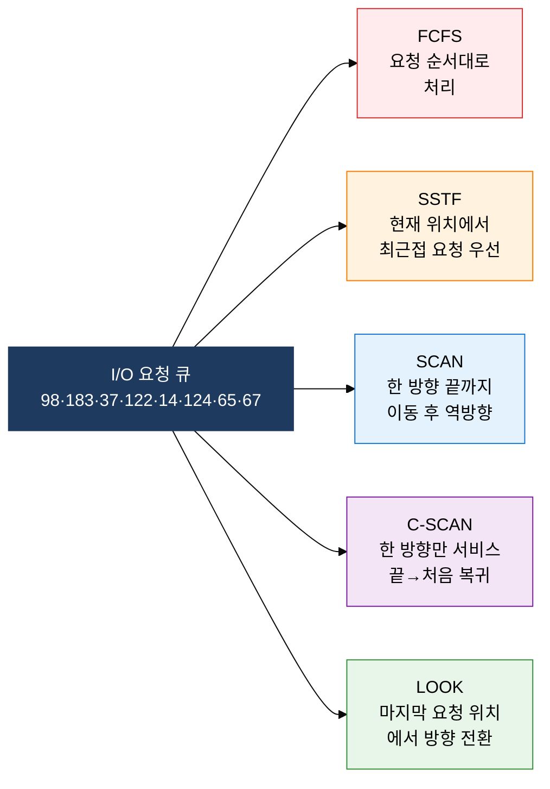
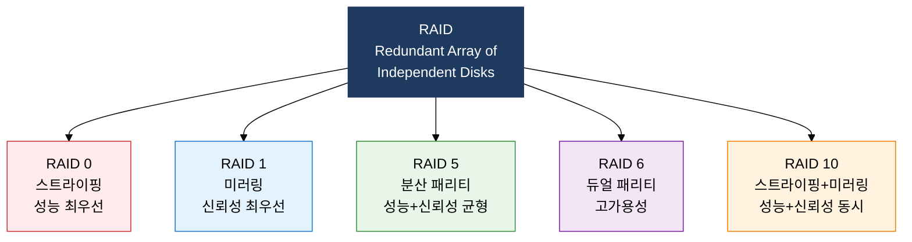

## 1. 헤드 이동 최소화로 I/O 성능 극대화, 디스크 스케줄링 및 RAID의 개요

**정의**: 디스크 헤드 이동 순서를 최적화하는 스케줄링 알고리즘과 복수의 디스크를 논리적으로 결합하는 RAID 기술로 I/O 성능과 신뢰성을 동시에 향상시키는 저장장치 관리 기법.
- 디스크 스케줄링은 대기 중인 I/O 요청의 처리 순서를 결정하여 평균 탐색 시간을 최소화
- RAID는 스트라이핑·미러링·패리티 조합으로 성능·용량·신뢰성 간의 트레이드오프를 설계에 반영
- 서버·스토리지 시스템 설계 시 워크로드 특성(읽기 중심·쓰기 중심·혼합)에 따라 레벨 선택이 필요

**특징**:
- **탐색 시간 중심 최적화**: 회전 지연·전송 시간 중 가장 큰 비중을 차지하는 탐색 시간을 알고리즘으로 단축
- **RAID 병렬성**: 복수 디스크에 데이터를 분산하여 단일 디스크 대비 처리량을 레벨에 따라 N배 향상
- **장애 허용(Fault Tolerance)**: 패리티·미러링으로 디스크 1~2개 장애 시에도 데이터 무손실 복구 보장

---

## 2. 디스크 스케줄링 및 RAID의 핵심 구성 체계

### 가. 디스크 스케줄링 알고리즘 5종 비교

| 알고리즘 | 처리 방식 | 평균 탐색 시간 | 공정성 | 기아 현상 | 특징 |
|---|---|---|---|---|---|
| **FCFS** | 요청 도착 순서대로 처리 | 가장 큼 | 높음 | 없음 | 구현 단순, 성능 최하 |
| **SSTF** | 현재 헤드 위치 최근접 요청 우선 | 작음 | 낮음 | 발생 가능 | 처리량 높으나 외곽 실린더 기아 위험 |
| **SCAN** | 한 방향 끝까지 후 역방향 반복 | 중간 | 중간 | 없음 | 엘리베이터 알고리즘, 양끝 대기 시간 차이 존재 |
| **C-SCAN** | 단방향 서비스 후 처음으로 복귀 | 중간 | 높음 | 없음 | SCAN 대비 대기 시간 균등화, 복귀 이동 오버헤드 |
| **LOOK** | 마지막 요청 위치에서 방향 전환 | 작음 | 중간 | 없음 | SCAN 개선형, 불필요한 끝단 이동 제거 |

---

### 나. RAID 레벨별 구조 및 특징

| RAID 레벨 | 최소 디스크 수 | 가용 용량 | 신뢰성 | 읽기 성능 | 쓰기 성능 | 주요 용도 |
|---|---|---|---|---|---|---|
| **RAID 0** | 2개 | N개 전체 | 없음 (단일 장애 전체 손실) | 매우 높음 | 매우 높음 | 영상 편집, 임시 데이터 |
| **RAID 1** | 2개 | N/2 | 1개 디스크 장애 허용 | 높음 | 중간 | OS 디스크, 부팅 볼륨 |
| **RAID 5** | 3개 | N-1개 | 1개 디스크 장애 허용 | 높음 | 중간 | 파일 서버, NAS |
| **RAID 6** | 4개 | N-2개 | 2개 디스크 동시 장애 허용 | 높음 | 낮음 | 대용량 아카이브, 백업 |
| **RAID 10** | 4개 | N/2 | 미러 쌍당 1개 장애 허용 | 매우 높음 | 높음 | DB 서버, 고성능 트랜잭션 |

---

## 3. 디스크 스케줄링 및 RAID 도입의 기대효과 및 활용 방안

| 구분 | 주요 기대효과 | 활용 및 실무 적용 방안 |
|---|---|---|
| **성능** | LOOK·SSTF 적용으로 평균 탐색 시간 30~50% 단축, RAID 0/10으로 I/O 처리량 향상 | DB 서버에 RAID 10, 순차 접근이 많은 로그 서버에 RAID 5와 SCAN 알고리즘 조합 |
| **신뢰성** | RAID 5·6 패리티로 디스크 장애 시 데이터 무손실 복구, RAID 6는 2개 동시 장애 허용 | 미션 크리티컬 시스템에 RAID 6 적용, 핫 스페어 디스크 상시 대기로 자동 재구성 |
| **가용성** | 핫스왑·핫스페어 지원으로 무중단 디스크 교체, 서비스 연속성 보장 | SAN·NAS 스토리지에 RAID 컨트롤러 이중화, 배터리 백업 캐시로 쓰기 성능 보완 |
| **비용 최적화** | 워크로드 특성에 맞는 RAID 레벨 선택으로 불필요한 디스크 비용 절감 | 개발·테스트 환경은 RAID 0(저비용 고성능), 운영 환경은 RAID 5·10으로 계층별 스토리지 설계 |
