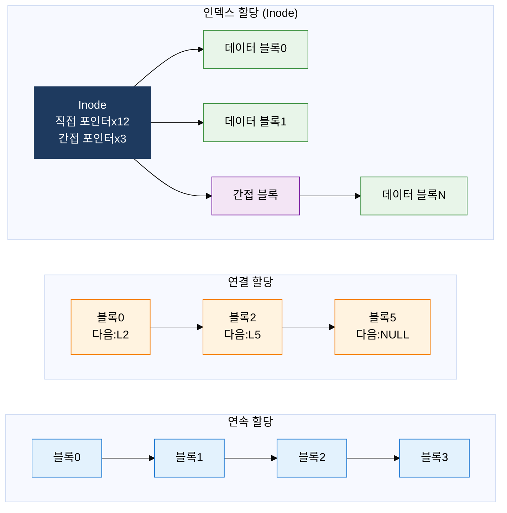
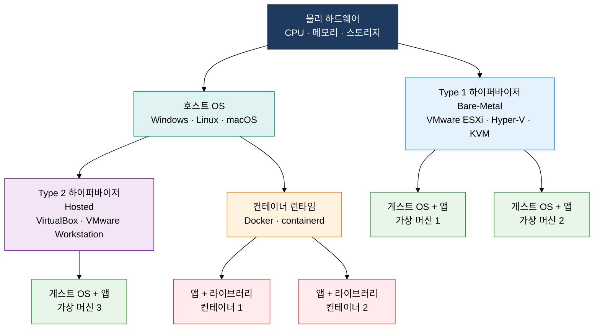

## 1. 파일 할당과 하이퍼바이저·컨테이너로 자원 효율 극대화, 파일 시스템 및 가상화의 개요

**정의**: 디스크 공간을 파일에 효율적으로 배분하는 파일 할당 방식과 단일 물리 서버에서 복수의 독립된 실행 환경을 제공하는 가상화 기술로 스토리지 활용도와 인프라 효율성을 높이는 시스템 소프트웨어 기법.
- 파일 할당 방식은 연속·연결·인덱스 세 가지로 구분되며 접근 패턴과 단편화 허용 여부에 따라 선택
- 하이퍼바이저는 하드웨어 자원을 직접 또는 호스트 OS를 통해 가상 머신에 제공하는 방식으로 동작
- 컨테이너는 OS 커널을 공유하면서 네임스페이스·cgroups로 격리하여 하이퍼바이저 대비 오버헤드 최소화

**특징**:
- **할당 유연성**: 연속 할당의 고속 접근, 연결 할당의 단편화 해소, Inode 인덱스 할당의 임의 접근 효율을 목적에 맞게 선택
- **격리와 공유의 균형**: 하이퍼바이저는 강한 하드웨어 수준 격리를, 컨테이너는 프로세스 수준 격리로 경량화를 각각 실현
- **이식성**: 컨테이너 이미지는 환경 의존성을 패키징하여 개발-테스트-운영 간 일관된 실행 환경 보장

---

## 2. 파일 시스템 및 가상화의 핵심 구성 체계

### 가. 파일 할당 방식 3종 비교

| 할당 방식 | 원리 | 순차 접근 | 임의 접근 | 외부 단편화 | 내부 단편화 | 대표 사용 |
|---|---|---|---|---|---|---|
| **연속 할당** | 파일을 연속된 블록에 저장, 시작 블록+길이로 위치 표현 | 매우 빠름 | 빠름 | 발생 | 없음 | CD-ROM, 초기 파일 시스템 |
| **연결 할당** | 각 블록이 다음 블록 포인터 보유, FAT로 발전 | 빠름 | 느림 | 없음 | 포인터 공간 낭비 | FAT16·FAT32 |
| **인덱스 할당** | Inode에 포인터 집중 관리, 직접·단일·이중·삼중 간접 포인터 | 빠름 | 빠름 | 없음 | 소량 낭비 | ext2·ext4, NTFS, HFS+ |

---

### 나. 가상화 유형 비교: 하이퍼바이저 vs 컨테이너

| 구분 | Type 1 하이퍼바이저 | Type 2 하이퍼바이저 | 컨테이너(Docker) |
|---|---|---|---|
| **동작 방식** | 하드웨어 직접 제어, OS 없이 구동 | 호스트 OS 위에서 동작 | 호스트 OS 커널 공유, 네임스페이스·cgroups 격리 |
| **격리 수준** | 하드웨어 수준 강한 격리 | OS 수준 격리 | 프로세스 수준 경량 격리 |
| **오버헤드** | 낮음 (5% 미만) | 높음 (10~20%) | 매우 낮음 (1~2%) |
| **부팅 시간** | 수십 초 | 수분 | 수 초 이내 |
| **이식성** | VM 이미지 단위 (수GB) | VM 이미지 단위 (수GB) | 컨테이너 이미지 (수십MB~수백MB) |
| **대표 제품** | VMware ESXi, KVM, Hyper-V | VirtualBox, VMware Workstation | Docker, Podman, containerd |
| **주요 용도** | 데이터센터 서버 가상화 | 개발·테스트 환경 | 마이크로서비스, CI/CD 파이프라인 |

---

## 3. 파일 시스템 및 가상화 도입의 기대효과 및 활용 방안

| 구분 | 주요 기대효과 | 활용 및 실무 적용 방안 |
|---|---|---|
| **스토리지 효율** | Inode 기반 인덱스 할당으로 단편화 최소화, 대용량 파일 임의 접근 속도 향상 | ext4·XFS 파일 시스템 채택, 저널링 활성화로 비정상 종료 시 데이터 일관성 보장 |
| **인프라 밀도** | Type 1 하이퍼바이저로 물리 서버 1대에 수십 VM 운영, 서버 이용률 70% 이상 달성 | VMware vSphere·KVM 기반 프라이빗 클라우드 구축, vMotion·Live Migration으로 무중단 VM 이전 |
| **배포 민첩성** | 컨테이너 이미지 재사용으로 배포 시간 단축, 환경 불일치 문제 제거 | Docker + Kubernetes 기반 CI/CD 파이프라인 구성, Helm Chart로 애플리케이션 표준 배포 자동화 |
| **보안·격리** | VM은 강한 격리로 멀티테넌트 환경 보안 강화, 컨테이너는 네임스페이스로 서비스 간 충돌 방지 | 민감 워크로드는 Type 1 하이퍼바이저 VM 격리, 일반 마이크로서비스는 컨테이너로 경량 배포 |
