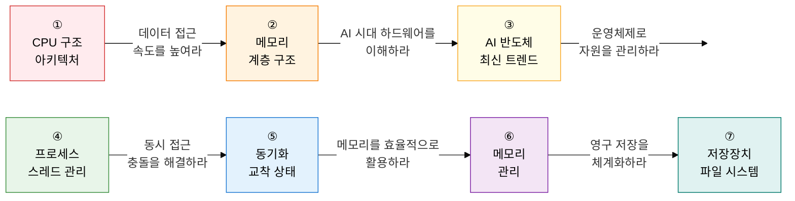

컴퓨터구조·OS는 **"하드웨어의 물리적 제어부터 커널의 소프트웨어적 메커니즘까지"** 를 유기적으로 연결하는 기반 기술 영역입니다.  
CPU·메모리·I/O 아키텍처부터 스케줄링·가상메모리·동기화까지, AI 반도체와 클라우드 가상화의 근간이 되는 핵심 원리를 체계적으로 다룹니다.

## 학습 로드맵 — 7단계 흐름

---

## ① 컴퓨터 시스템 아키텍처 및 CPU 구조

> **"컴퓨터 하드웨어의 핵심인 연산·제어 장치와 성능 향상 메커니즘"** 을 다룹니다.  
> 폰 노이만 vs 하버드 아키텍처, 명령어 사이클 4단계, 파이프라이닝 해저드는 서술형 빈출 주제입니다.

| 순서 | 토픽 | 핵심 키워드 | 중요도 |
|:---:|---|---|:---:|
| 1 | [컴퓨터 시스템 기본 구조](01-cpu-architecture/computer-system-architecture) | 폰 노이만 vs 하버드, 데이터·주소·제어 버스, 버스 중재(Arbitration) | ★★☆ |
| 2 | [CPU 구조 및 동작 원리](01-cpu-architecture/cpu-structure) | ALU·CU·레지스터(PC·IR·MAR·MBR), Fetch-Decode-Execute-Interrupt, CISC vs RISC | ★★★ |
| 3 | [병렬 처리 및 프로세서 성능 향상](01-cpu-architecture/parallel-processing) | 파이프라이닝, 데이터·구조·제어 해저드, 슈퍼스칼라·VLIW, Flynn 분류(SIMD·MIMD) | ★★★ |

**→ 핵심 학습법**: 명령어 사이클 4단계(Fetch→Decode→Execute→Interrupt)를 레지스터(PC→IR→MAR→MBR) 흐름으로 연결하고, 파이프라이닝 해저드 3종과 각 해결 방안(포워딩·분기 예측·버블)을 쌍으로 암기하세요.

---

## ② 메모리 계층 구조 및 최적화

> **"속도와 용량의 트레이드오프를 해결하는 메모리 시스템"** 을 다룹니다.  
> 캐시 매핑 3종, MESI 프로토콜 4가지 상태, Write-Through vs Write-Back은 고빈출 서술 주제입니다.

| 순서 | 토픽 | 핵심 키워드 | 중요도 |
|:---:|---|---|:---:|
| 4 | [캐시 메모리 구조 및 최적화](02-memory/cache-memory) | 직접·연관·세트 연관 매핑, LRU·LFU·FIFO 교체, MESI 일관성, Write-Through vs Write-Back | ★★★ |
| 5 | [주기억장치 및 차세대 메모리](02-memory/main-memory) | SRAM vs DRAM, DDR5·HBM 고성능, NAND vs NOR 플래시 | ★★☆ |

**→ 핵심 학습법**: 캐시 3종 매핑의 **충돌 미스 발생 원인**을 그림으로 이해하고, MESI 프로토콜 상태 전이(Modified→Exclusive→Shared→Invalid)를 다중 프로세서 시나리오와 함께 설명하세요.

---

## ③ 고성능 컴퓨터 및 최신 반도체 트렌드

> **"AI·빅데이터 시대의 하드웨어 혁신 기술"** 입니다.  
> GPU GPGPU vs NPU 차이, 칩렛 수율 이점, PIM 메모리 대역폭 한계 해결은 최신 빈출 주제입니다.

| 순서 | 토픽 | 핵심 키워드 | 중요도 |
|:---:|---|---|:---:|
| 6 | [AI 반도체 및 가속기](03-advanced-hardware/ai-semiconductor) | GPU·GPGPU, NPU·TPU 행렬 연산 최적화, PIM·PNM 메모리 근방 연산 | ★★★ |
| 7 | [칩렛 및 뉴로모픽 컴퓨팅](03-advanced-hardware/chiplet-neuromorphic) | UCIe·3D 패키징·TSV, SNN 스파이킹 뉴럴 네트워크, 이벤트 기반 처리 | ★★☆ |

**→ 핵심 학습법**: GPU(병렬 행렬 연산) vs NPU(딥러닝 전용 MAC 유닛) vs TPU(구글 텐서 최적화)의 **연산 단위·메모리 구조 차이**를 표로 비교하고, 칩렛이 수율을 개선하는 원리를 설명하세요.

---

## ④ 프로세스 및 스레드 관리

> **"OS 커널이 한정된 자원에서 멀티태스킹을 실현하는 핵심 메커니즘"** 입니다.  
> 프로세스 상태 전이 6단계, CPU 스케줄링 알고리즘(HRN 공식 포함), MLFQ 동작 원리는 서술형 빈출 주제입니다.

| 순서 | 토픽 | 핵심 키워드 | 중요도 |
|:---:|---|---|:---:|
| 8 | [프로세스 관리](04-process-thread/process) | PCB 구조, 상태 전이(Create·Ready·Running·Waiting·Terminated·Suspended), 문맥 교환 | ★★★ |
| 9 | [스레드 모델 및 멀티스레딩](04-process-thread/thread) | 사용자·커널 수준 스레드, 멀티스레딩 모델(M:1·1:1·M:N) | ★★★ |
| 10 | [CPU 스케줄링 알고리즘](04-process-thread/cpu-scheduling) | FCFS·SJF·HRN(비선점), SRT·RR·MLFQ(선점), 기아 현상·에이징 | ★★★ |

**→ 핵심 학습법**: HRN 우선순위 공식 `(대기시간+서비스시간)/서비스시간`을 수치 예시로 계산해보고, MLFQ의 **타임 퀀텀 소진 시 하위 큐 이동 원리**를 단계별로 설명하세요.

---

## ⑤ 병행 제어 및 교착 상태

> **"멀티스레드 환경의 데이터 경쟁과 자원 독점 문제 해결"** 을 다룹니다.  
> 뮤텍스·세마포어·모니터 비교, 교착 상태 4대 조건, 은행가 알고리즘 Safe State는 반드시 암기해야 합니다.

| 순서 | 토픽 | 핵심 키워드 | 중요도 |
|:---:|---|---|:---:|
| 11 | [프로세스 동기화 메커니즘](05-concurrency-deadlock/synchronization) | 임계구역(상호배제·진행·제한대기), 뮤텍스 vs 세마포어(P·V 연산) vs 모니터, 경쟁 조건 | ★★★ |
| 12 | [교착 상태 (Deadlock)](05-concurrency-deadlock/deadlock) | 발생 4조건(상호배제·점유대기·비선점·환형대기), 예방·회피(은행가 알고리즘)·탐지·회복 | ★★★ |

**→ 핵심 학습법**: 뮤텍스(소유권 있음, 1개 자원)와 세마포어(카운팅, N개 자원)의 차이를 **식당 열쇠 vs 주차장 티켓** 비유로 정리하고, 은행가 알고리즘 Safe State 판별을 숫자 예시로 직접 계산하세요.

---

## ⑥ 메모리 관리

> **"제한된 물리 메모리를 효율적으로 분배하고 가상으로 확장하는 기술"** 입니다.  
> TLB를 통한 페이지 주소 변환 흐름, LRU 교체 알고리즘, 스래싱과 워킹 세트는 시험 핵심 주제입니다.

| 순서 | 토픽 | 핵심 키워드 | 중요도 |
|:---:|---|---|:---:|
| 13 | [물리 메모리 관리 기법](06-memory-management/physical-memory) | 고정·가변 분할, 내부·외부 단편화, First-Fit·Best-Fit·Worst-Fit | ★★☆ |
| 14 | [가상 메모리 및 페이지 교체](06-memory-management/virtual-memory) | 페이징·TLB·세그멘테이션, Page Fault 처리, FIFO·LRU·NUR·최적 교체, 스래싱·워킹 세트 | ★★★ |

**→ 핵심 학습법**: 가상 주소(페이지 번호+오프셋) → TLB 히트/미스 → 페이지 테이블 → 물리 주소 변환 과정을 **필드 단위**로 그리고, 스래싱 발생 원인(다중 프로그래밍 도 증가 → CPU 이용률 역설적 감소)을 그래프로 설명하세요.

---

## ⑦ 저장장치 및 파일 시스템

> **"물리적 비휘발성 저장 매체 관리와 가상화 기술"** 을 다룹니다.  
> RAID 레벨별 용량·신뢰성 계산, Unix Inode 3단계 간접 포인터, 하이퍼바이저 vs 컨테이너 비교는 빈출 서술 주제입니다.

| 순서 | 토픽 | 핵심 키워드 | 중요도 |
|:---:|---|---|:---:|
| 15 | [디스크 스케줄링 및 RAID](07-storage-filesystem/disk-scheduling-raid) | FCFS·SSTF·SCAN·C-SCAN·LOOK, RAID 0·1·5·6·10(스트라이핑·미러링·패리티) | ★★★ |
| 16 | [파일 시스템 및 가상화](07-storage-filesystem/filesystem-virtualization) | 연속·연결·인덱스 할당(Unix Inode), Type 1·2 하이퍼바이저, 컨테이너(Docker) 격리 | ★★★ |

**→ 핵심 학습법**: RAID 5의 **사용 가능 용량 = (N-1)/N × 전체** 공식을 디스크 수별로 계산하고, 컨테이너(OS 커널 공유)와 VM(하이퍼바이저 위 Guest OS)의 **격리 수준·부팅 속도·보안** 차이를 비교하세요.

---

## 기술사 시험 전략

| 출제 패턴 | 핵심 대응 전략 |
|---|---|
| **동작 프로세스** | 명령어 사이클·페이지 부재·문맥 교환을 Step-by-Step 레지스터 흐름으로 서술 |
| **비교 문제** | CISC vs RISC, 뮤텍스 vs 세마포어, Type 1 vs Type 2 vs 컨테이너, RAID 레벨 비교표 암기 |
| **수식·수치 제시** | HRN 공식, RAID 용량 계산, 가상 주소→물리 주소 변환 필드 계산 |
| **최신 트렌드** | NPU·PIM 메모리 병목 해결, 칩렛 수율 이점, 뉴로모픽 SNN 이벤트 기반 처리 |
| **원인·해결 쌍** | 파이프라이닝 해저드→해결책, 스래싱→워킹 세트, 교착 상태→은행가 알고리즘 |
