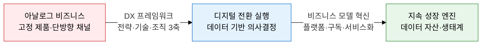
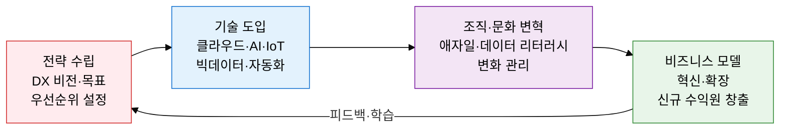
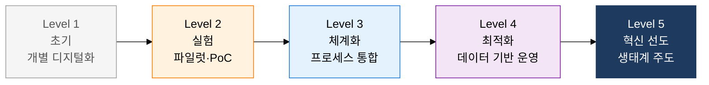

## 1. 기술 도입이 아닌 비즈니스 모델 재창조, 디지털 전환의 개요

**정의**: 디지털 기술을 활용하여 비즈니스 모델·프로세스·고객 경험을 근본적으로 재창조함으로써 지속 가능한 경쟁 우위를 확보하는 전략적 전환 활동.
- 단순 IT 시스템 도입이 아닌 조직 문화·운영 방식·수익 구조의 총체적 변화를 포함
- Servitization(서비스화)·구독 경제·플랫폼·데이터 수익화의 4대 비즈니스 모델 혁신 유형으로 구체화
- 디지털 성숙도 모델(DMM) 5단계로 현재 위치를 진단하고 단계별 역량 개발 로드맵을 수립

**특징**:
- **전략·기술·조직 3축 통합**: 전략 방향 없는 기술 도입, 변화 관리 없는 디지털화는 모두 실패 원인이 됨
- **비즈니스 모델 재정의**: 기존 제품 판매 방식을 서비스·구독·플랫폼 모델로 전환하여 반복 수익 창출
- **데이터가 핵심 자산**: 디지털 전환의 최종 목표는 데이터를 수집·분석·수익화하는 데이터 경제 참여

---

## 2. 디지털 전환의 핵심 구성 체계

### 가. DX 추진 프레임워크 및 비즈니스 모델 혁신 유형

| 혁신 유형 | 정의 | 핵심 메커니즘 | 대표 사례 |
|---|---|---|---|
| **Servitization (서비스화)** | 제품 판매에서 결과·성과 기반 서비스 제공으로 전환 | 센서·IoT로 제품 상태 모니터링 후 결과 보장 계약 | GE Aviation 엔진 시간당 과금, 롤스로이스 Power-by-the-Hour |
| **구독 경제** | 일회성 구매 대신 월정액·연간 구독으로 반복 수익 확보 | 고객 락인·데이터 축적·개인화 서비스 고도화 | Adobe Creative Cloud, Microsoft 365, 넷플릭스 |
| **플랫폼 비즈니스** | 공급자와 수요자를 연결하는 디지털 생태계 운영 | 네트워크 효과로 참여자 증가 시 가치 지수 증가 | Amazon Marketplace, 카카오택시, 에어비앤비 |
| **데이터 수익화** | 수집된 데이터를 분석·판매·광고·맞춤 추천으로 수익화 | 데이터 파이프라인 구축 및 AI 모델 활용 | Google 광고, 금융사 마이데이터 서비스 |

---

### 나. 디지털 성숙도 모델 5단계 및 평가 기준

| 평가 영역 | Level 1 초기 | Level 2 실험 | Level 3 체계화 | Level 4 최적화 | Level 5 혁신 선도 |
|---|---|---|---|---|---|
| **전략·리더십** | IT를 비용으로 인식 | DX 파일럿 프로젝트 추진 | DX 전략 공식 수립 | DX KPI 경영 목표 연계 | DX로 산업 패러다임 주도 |
| **기술·인프라** | 레거시 시스템 중심 | 클라우드 일부 도입 | 클라우드·API 통합 | AI·자동화 운영 내재화 | 플랫폼 생태계 외부 개방 |
| **데이터·분석** | 데이터 사일로·수작업 | 데이터 수집 시작 | 통합 데이터 플랫폼 | 실시간 분석·예측 모델 | 데이터 상품화·수익 창출 |
| **조직·문화** | 변화 저항·IT 부서 고립 | 애자일 팀 일부 실험 | 전사 애자일 확산 | 데이터 리터러시 전 직원 | 혁신 문화·외부 협업 생태계 |

---

## 3. 디지털 전환 도입의 기대효과 및 활용 방안

| 구분 | 주요 기대효과 | 활용 및 실무 적용 방안 |
|---|---|---|
| **전략적** | 새로운 수익 모델 창출로 기존 사업 의존도 탈피 및 성장 동력 확보 | DMM 진단으로 현재 수준 파악 후 3년 단위 DX 로드맵 수립 |
| **운영적** | 프로세스 자동화·AI 도입으로 운영 비용 절감 및 품질 일관성 향상 | RPA·클라우드 도입 우선순위를 가치사슬 분석으로 결정, ROI 측정 |
| **고객 경험** | 디지털 채널 통합과 개인화 서비스로 고객 만족도·재구매율 상승 | 구독 모델 전환 시 해지율(Churn Rate)·LTV를 핵심 KPI로 관리 |
| **조직·문화** | 데이터 기반 의사결정 문화 정착으로 직관적 판단 오류 감소 | 전 직원 데이터 리터러시 교육 프로그램 운영, 애자일 OKR 도입 |
