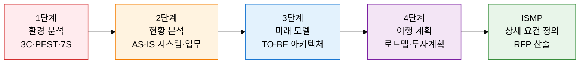
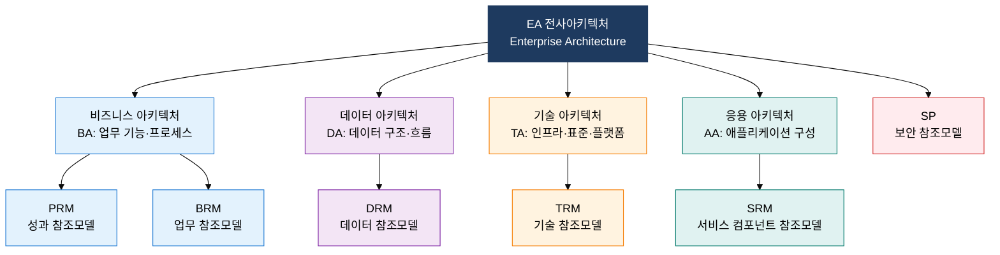

## 1. IT 투자 방향을 체계적으로 설계하는 중장기 청사진, ISP·EA의 개요

**정의**: 조직의 중장기 정보화 방향을 4단계 절차로 수립하는 ISP와, 비즈니스·데이터·기술·응용 아키텍처를 6대 참조모델로 체계화하는 EA를 결합한 IT 전략 기획 방법론.
- ISP(Information Strategy Planning)는 3~5년 중장기 IT 마스터플랜을 수립하는 전략 기획 활동
- ISMP(Information System Master Plan)는 ISP 이후 개별 시스템 구축의 상세 요건을 정의하는 후속 단계
- EA(Enterprise Architecture)는 조직 전체 IT 자산을 4대 아키텍처 관점으로 통합 관리하는 거버넌스 프레임워크

**특징**:
- **단계적 계층 구조**: ISP(전략) → ISMP(요건) → 시스템 구축(실행)의 3계층으로 의사결정 위험을 분산
- **참조모델 표준화**: EA 6대 참조모델이 중복 개발을 방지하고 시스템 간 상호운용성을 확보
- **공공·대기업 필수 적용**: 행정기관 정보화 사업 착수 전 EA 기반 ISP·ISMP 수행을 법령으로 의무화

---

## 2. ISP·ISMP·EA의 핵심 구성 체계

### 가. ISP 추진 절차 4단계 및 ISMP 차이

| 비교 항목 | ISP (정보전략기획) | ISMP (정보시스템 마스터플랜) |
|---|---|---|
| **목적** | 중장기 IT 투자 방향 및 우선순위 수립 | 개별 시스템 구축을 위한 상세 요건 정의 |
| **기간** | 3~5년 중장기 전략 관점 | 단위 사업별 1~2년 실행 관점 |
| **주요 산출물** | IT 마스터플랜, 아키텍처 청사진, 로드맵 | 기능 요건 정의서, RFP, 사업 제안요청서 |
| **분석 기법** | 3C·PEST·7S·SWOT·AS-IS/TO-BE | 업무 기능 분해(BFD), 데이터 흐름도(DFD) |
| **수행 주체** | 경영진·IT 전략팀·외부 컨설팅 | IT 기획팀·발주 담당자·시스템 분석가 |
| **법령 근거** | 전자정부법 시행령 제71조 | 정보시스템 감리 기준(행안부) |

---

### 나. EA 4대 아키텍처 및 6대 참조모델

| 참조모델 | 영문명 | 관련 아키텍처 | 주요 내용 및 역할 |
|---|---|---|---|
| **PRM** | Performance Reference Model | BA | 성과 목표·측정 지표 체계, IT 투자 성과 연계 |
| **BRM** | Business Reference Model | BA | 기관 업무 기능 분류 체계, 업무 중복 제거 기준 |
| **SRM** | Service Component Reference Model | AA | 공통 서비스 컴포넌트 분류, 재사용 서비스 식별 |
| **DRM** | Data Reference Model | DA | 공통 데이터 표준·메타데이터, 데이터 공유 기준 |
| **TRM** | Technical Reference Model | TA | 기술 표준·인프라 규격, 상호운용성 기준 정의 |
| **SP** | Security Profile | 전 영역 | 아키텍처 전 계층의 보안 요건·통제 기준 적용 |

---

## 3. ISP·ISMP·EA 도입의 기대효과 및 활용 방안

| 구분 | 주요 기대효과 | 활용 및 실무 적용 방안 |
|---|---|---|
| **전략적** | IT 투자 우선순위 명확화로 중복 투자 및 불필요한 시스템 구축 방지 | 연간 정보화 예산 편성 시 ISP 로드맵을 기준으로 사업 타당성 심사 |
| **아키텍처** | EA 참조모델 기반 표준화로 시스템 간 상호운용성 및 재사용성 향상 | 신규 시스템 도입 전 TRM·SRM 적합성 검토 의무화, 중복 시스템 통폐합 |
| **거버넌스** | ISMP 상세 요건 정의로 발주-납품 간 요건 불일치 및 분쟁 최소화 | RFP 작성 시 ISMP 산출물 의무 첨부, 감리 체크리스트 연계 |
| **보안·품질** | SP 참조모델 전 계층 적용으로 아키텍처 설계 단계부터 보안 내재화 | DevSecOps 파이프라인에 EA 보안 참조모델 체크포인트 통합 |
