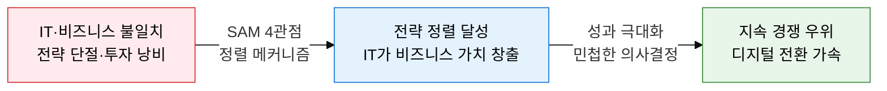
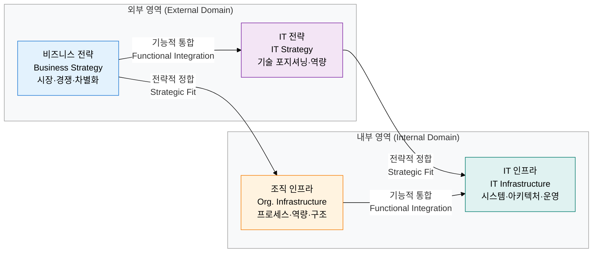
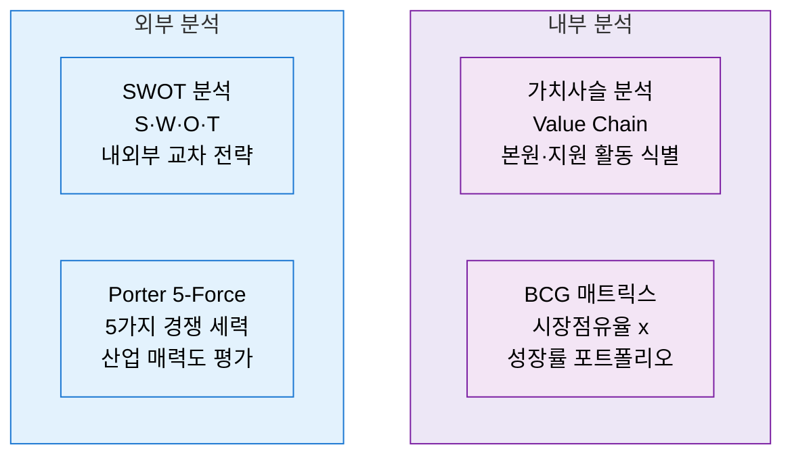

## 1. IT와 비즈니스 목표를 4대 관점으로 동기화, 전략 정렬의 개요

**정의**: 비즈니스 전략·IT 전략·조직 인프라·IT 인프라의 4대 관점을 정렬하여 IT 투자가 경영 목표에 직접 기여하도록 하는 전략 관리 프레임워크.
- MIT Sloan 연구진이 제시한 SAM(Strategic Alignment Model)을 핵심 이론 기반으로 활용
- SWOT·Porter 5-Force·가치사슬·BCG 매트릭스 등 경영 전략 분석 도구와 연계하여 환경 진단 수행
- 전략 정렬 수준이 높을수록 IT ROI가 향상되고 디지털 전환 성공률이 높아짐

**특징**:
- **이중 정렬 구조**: 비즈니스·IT 간 전략적 정합성(Strategic Fit)과 외부·내부 환경의 기능적 통합(Functional Integration)을 동시 추구
- **양방향 주도권**: IT가 비즈니스를 선도하거나 비즈니스가 IT를 추동하는 정렬 유형을 조직 상황에 맞게 선택 가능
- **경영 분석 도구 연계**: SWOT·Porter·가치사슬·BCG를 단계별로 조합하여 내·외부 환경을 다각도로 진단

---

## 2. IT·비즈니스 전략 정렬의 핵심 구성 체계

### 가. Strategic Alignment Model 4대 관점 및 정렬 유형

| 정렬 유형 | 주도 관점 | 정렬 방향 | 특징 및 적용 상황 |
|---|---|---|---|
| **전략적 실행** | 비즈니스 전략 | BS → OI → II | 가장 일반적, 비즈니스가 IT를 지시하는 하향식 |
| **기술 잠재력** | IT 전략 | IS → BS → OI | IT 혁신이 새 비즈니스 모델을 창출하는 상향식 |
| **경쟁 잠재력** | IT 전략 | IS → BS → II | 신기술로 경쟁 전략을 재정의 (디지털 전환 시) |
| **서비스 수준** | 조직 인프라 | OI → II → IS | 내부 IT 서비스 품질 향상 중심의 운영 정렬 |

---

### 나. 경영 전략 분석 도구 4종 비교

| 분석 도구 | 목적 | 분석 대상 | 핵심 산출물 | 활용 단계 |
|---|---|---|---|---|
| **SWOT** | 내·외부 요인 교차 전략 도출 | 강점·약점·기회·위협 | SO·ST·WO·WT 4대 전략 | 전략 수립 초기 방향 설정 |
| **Porter 5-Force** | 산업 구조 및 수익성 평가 | 기존 경쟁자·신규 진입·대체재·공급자·구매자 | 산업 매력도·경쟁 강도 지수 | 시장 진입 및 포지셔닝 결정 |
| **가치사슬 (Value Chain)** | 원가 우위·차별화 원천 파악 | 본원 활동(운영·물류·마케팅)·지원 활동(HR·인프라) | 핵심 역량 및 아웃소싱 후보 식별 | 운영 효율화·디지털화 우선순위 |
| **BCG 매트릭스** | 사업 포트폴리오 자원 배분 | 시장 성장률 × 상대적 시장점유율 | Star·Cash Cow·Question Mark·Dog 분류 | 투자·유지·철수 포트폴리오 결정 |

---

## 3. IT·비즈니스 전략 정렬 도입의 기대효과 및 활용 방안

| 구분 | 주요 기대효과 | 활용 및 실무 적용 방안 |
|---|---|---|
| **전략적** | IT 투자 우선순위가 비즈니스 목표와 직결되어 ROI 극대화 | 연간 IT 예산 편성 시 SAM 4관점 정렬 점검 체크리스트 적용 |
| **분석적** | SWOT·Porter·가치사슬 통합 분석으로 환경 인식 정확도 향상 | 신규 사업 진출·M&A 검토 시 4종 도구 순차 적용하여 의사결정 지원 |
| **운영적** | BCG 포트폴리오 기반 IT 자원 재배분으로 낭비 시스템 감소 | Cash Cow 시스템은 유지 최소화, Star 영역은 신규 투자 집중 |
| **조직적** | IT 부서와 사업 부서 간 공통 언어 형성으로 협업 문화 강화 | 분기별 IT-비즈니스 정렬 리뷰 회의 정례화, KPI 연계 성과 관리 |
